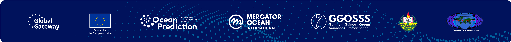

  

# SEA-FORWARD — Documentation

**Simple Educational Access for Forecast and Warning Developers**

This repository holds the source of the SEA-FORWARD documentation. The built documentation is published at **<https://sea-forward.readthedocs.io/en/latest/>**.

If you want to *use* SEA-FORWARD, go to the published site. This repository is for people who want to propose changes to it.

---

## What SEA-FORWARD is

SEA-FORWARD is an educational ocean forecasting system. It teaches a practitioner who understands oceanography, but has never built a forecasting system, to assemble one on an ordinary Linux machine: install the toolchain, compile the model, prepare the upstream data, configure a region, run a five-day forecast, and then post-process, validate and interpret the result.

There is no installer and no shortcut path. Every step is performed by the user and explained, because the point is not to produce a forecast but to understand each link in the chain that produces it.

The documentation is organised in twelve phases, from setting up a bare machine to the conceptual architecture, with a gallery of three African configurations — Canary, Inner Gulf of Guinea and Agulhas — and a toolkit of six Jupyter notebooks.

The software itself lives in a separate repository.

---

## Repository layout

| Path | Contents |
|---|---|
| `docs/` | The documentation pages, one directory per phase |
| `docs/phase1/` … `docs/phase12/` | Phases 1 to 12, from setup to architecture |
| `docs/regions/` | The region gallery: Canary, Inner Gulf of Guinea, Agulhas |
| `docs/notebooks/` | Notebook toolkit pages and the notebooks themselves |
| `docs/img/`, `docs/assets/`, `docs/videos/` | Figures, logos and screen captures |
| `mkdocs.yml` | Site configuration and navigation |
| `overrides/`, `custom.css`, `hooks.py`, `requirements.txt` | Theme, build hooks and dependencies |

---

## Reporting a problem or proposing a change

Open an issue, and include:

- the page address and the step number,
- what you did, what you expected, and what happened,
- the error text in full,
- your operating system and hardware.

Corrections to wording, commands or figures are welcome as pull requests against the default branch. Substantive changes to the teaching sequence are best raised as an issue first.

---

## Current version

The latest release is **v1.0.0**, published at <https://sea-forward.readthedocs.io/en/v1.0.0/>. The default branch continues to receive corrections between releases, and is published as `latest`.

---

## Project and funding

SEA-FORWARD is developed for the **[OPERA](https://www.unoceanprediction.org/en/opera-ocean-prediction-enhancement-regions-africa)** project (Ocean Prediction Enhancement in Regions of Africa), implemented by **[Mercator Ocean International](https://www.mercator-ocean.eu/)** as part of the activity of the **[OceanPrediction Decade Collaborative Centre](https://www.unoceanprediction.org/)**, and funded by the **European Union** through the [European Commission Directorate-General for International Partnerships](https://international-partnerships.ec.europa.eu/) (DG INTPA), under its programme to support Africa Regional Centres of Excellence (ArcX).

The system is developed by:

- **[ICMPA — UNESCO Chair of Mathematical Physics and Applications](http://cipma.net)**, [Université d'Abomey-Calavi](https://www.uac.bj/), Benin. The International Chair in Mathematical Physics and Applications became a UNESCO Chair in April 2006, and trains master's-level students across the full breadth of physical oceanography, from ocean dynamics to satellite observation, programming and numerical modelling.
- **[GGOSSS — Gulf of Guinea Ocean Sciences Summer School](https://events.unoceanprediction.org/gulf-of-guinea-ocean-sciences-summer-school-2026)**, an annual school in oceanographic and environmental sciences for students and early-career scientists from the French-speaking countries of the Gulf of Guinea, built around hands-on training in ocean observation, data analysis and numerical modelling.

---

## Built on the work of others

SEA-FORWARD stands on tools maintained by other communities, and uses data from operational services that have their own terms of use and citation requirements:

- **[CROCO](https://www.croco-ocean.org/)** — the ocean model at the core of the system
- **croco_pytools** — the preparation toolset for grids, initial conditions, boundaries, tides and rivers
- **[somisana-croco](https://github.com/SAEON/somisana-croco)** (SAEON) — routines in the SEA-FORWARD toolkit are adapted from this project
- **[Copernicus Marine Service](https://marine.copernicus.eu/)** — ocean analyses, forecasts, reanalyses and the validation references
- **[Copernicus Climate Data Store](https://cds.climate.copernicus.eu/) (ERA5)** and **NOAA GFS** — atmospheric forcing
- **ETOPO2**, **GSHHS**, **TPXO** and the **Dai & Trenberth** runoff climatology — bathymetry, coastline, tides and rivers

Each is acknowledged in the pages that use it, with the citation its authors ask for.

---

## Licence

See [`LICENSE`](LICENSE). Licensing terms for the SEA-FORWARD software and documentation are being finalised with Mercator Ocean International, to whom the intellectual property in this work transfers under the OPERA contract. This notice will be updated once those terms are settled.

---

  

## Contact

- Technical questions: **btchonang@fsu.edu**
- The team: **contact@ggosss.org**
- Community forum: <https://www.unoceanprediction.org/en/forum>
