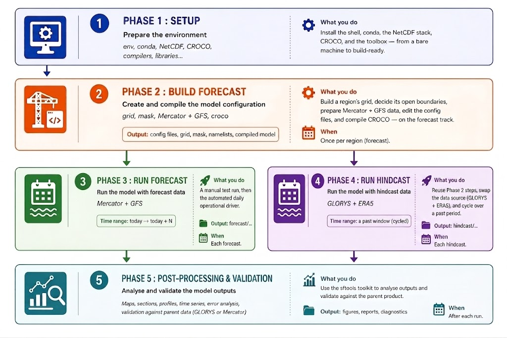

## Read them in order

| #   | Document                                                   | What you do                                                                                                                                       | When                        |
| --- | ---------------------------------------------------------- | ------------------------------------------------------------------------------------------------------------------------------------------------- | --------------------------- |
| 1   | [Setup](phase1/01_setup.md)                                | Install the shell, conda, the NetCDF stack, CROCO, and the toolbox — from a bare machine to build-ready.                                          | Once per machine.           |
| 2   | [Building a Forecast Config](phase2/02_forecast_config.md) | Build a region's grid, decide its open boundaries, prepare Mercator + GFS data, edit the config files, and compile CROCO — on the forecast track. | Once per region (forecast). |
| 3   | [Running a Forecast](phase3/03_forecast.md)                | A manual test run, then the automated daily operational driver.                                                                                   | Each forecast.              |
| 4   | [Running a Hindcast](phase4/04_hindcast.md)                | Reuse Phases 1–2's steps, swap the data source (GLORYS + ERA5), and cycle over a past period.                                                     | Each hindcast.              |
| 5   | [Analyse and validate](phase5/05_postprocessing.md)        | Use the `sftools` toolkit to analyse outputs and validate against the parent product.                                                             | After each run.             |

!!! note
    Phase 1 is a prerequisite for everything (once per computer). Phase 2 builds a **forecast** configuration for a region and Phase 3 runs it. Phase 4 (hindcast) reuses Phase 2's _steps_ but
    swaps the data source — it points back to Phase 2 rather than repeating it.

## Conventions used in these docs

- Commands are shown for the **Canary_12** example region (22°W–15.5°W, 14°N–24°N, 1/12°). Replace its numbers with your region's.
- `~/seaforward` is the repository root; `<you>` is your Linux username.
- ✅ after a step tells you what a correct result looks like.
- ⚠️ marks a place people commonly trip; read those twice.
