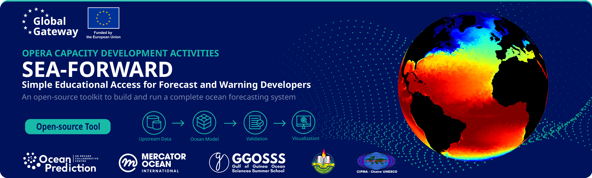
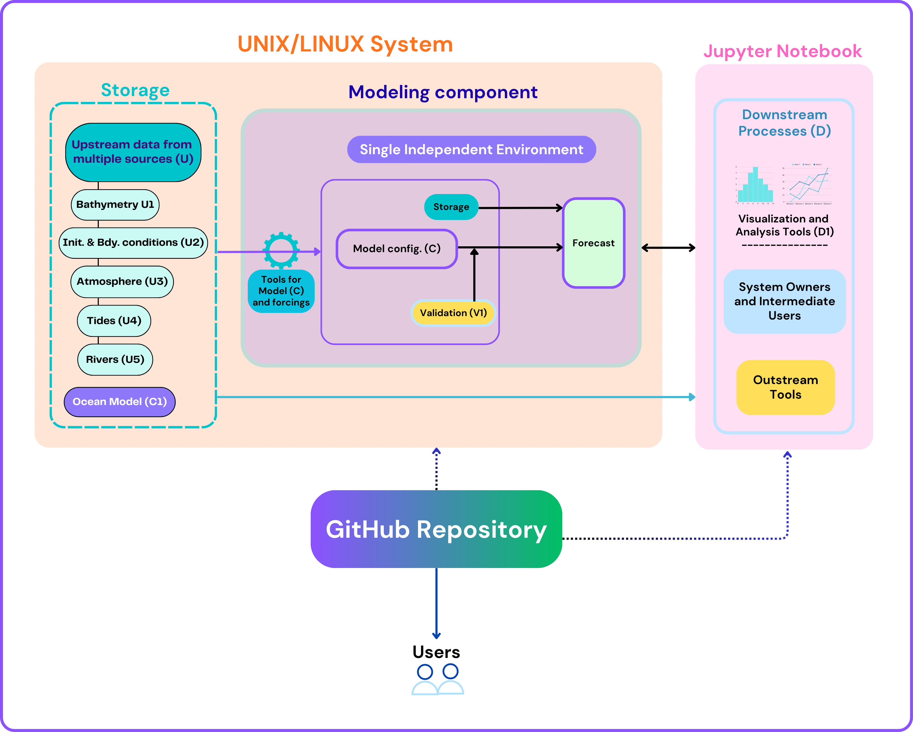
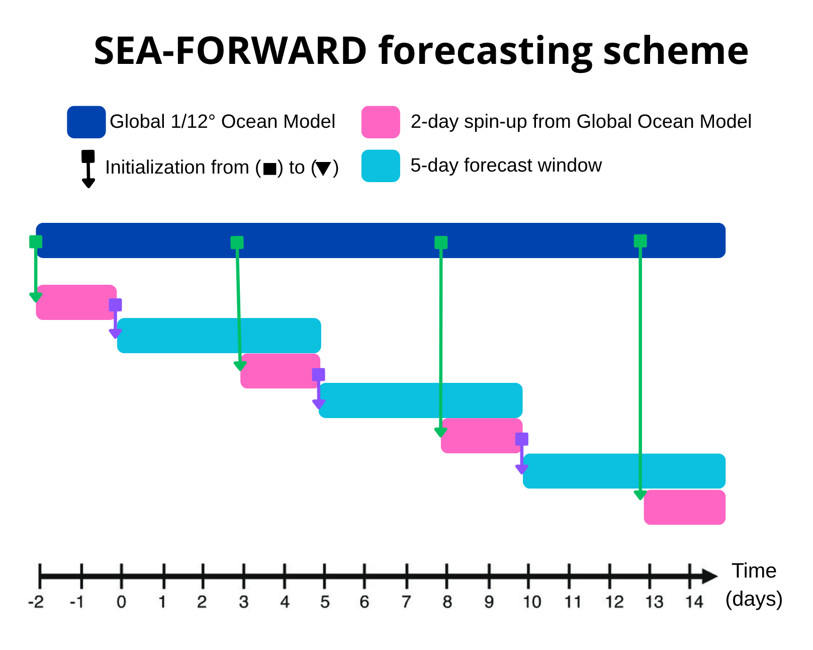
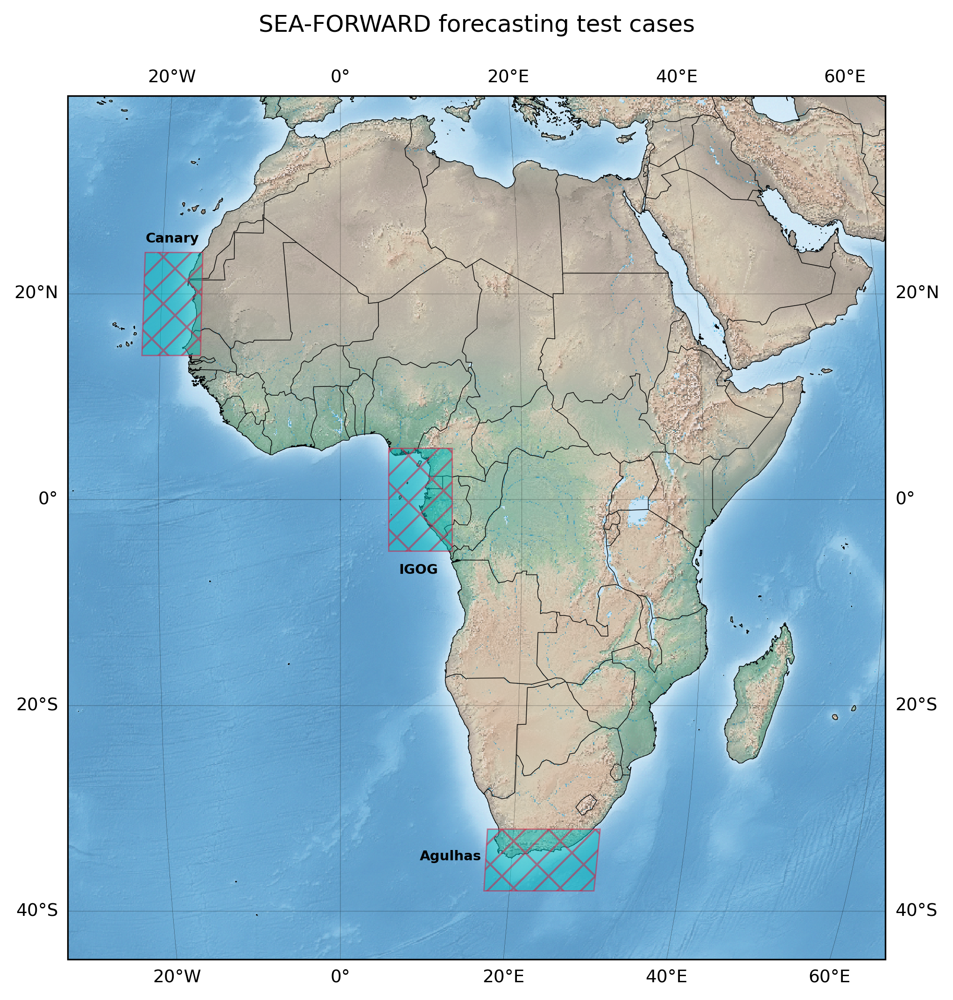

<!-- BANNER IMAGE GOES HERE -->
<!-- e.g.  -->

# SEA-FORWARD

SEA-FORWARD (**S**imple **E**ducational **A**ccess for **For**ecast and **War**ning **D**evelopers) is a free, open-source toolkit that teaches you to build and run a
complete ocean forecasting system on your own computer — from raw input data
through to a validated 5-day forecast you can plot and interpret. SEA-FORWARD implements the OceanPrediction-A architecture described in the figure below.

<figure style="text-align: center; margin: 20px 0;">
  
  <figcaption style="font-size: 1em; color: #555; margin-top: 8px; font-style: italic;">
    Implementation of the OceanPrediction-A architecture for the SEA-FORWARD system: a UNIX/Linux environment that holds the storage and modelling components, and Jupyter notebooks for downstream analysis, both distributed through a GitHub repository.
  </figcaption>
</figure>

The architecture runs entirely on your own machine, in two parts:

* **A UNIX/Linux environment** — holds the ocean model, the test configurations,
  the upstream data and the forecast output. This is where you set up, compile and run.
* **Jupyter notebooks** — the downstream side: analysis, visualisation, validation,
  sensitivity tests and guided exercises.

The **GitHub repository** distributes both, and provides version control.

SEA-FORWARD is aimed at practitioners who understand oceanography but have not yet built
or operated a forecasting system. Every step is explicit and manual by design:
there is no automated installer, because the goal is not just to produce a
forecast — it is to understand each link in the chain that produces it.

No supercomputer is required. SEA-FORWARD runs on commodity hardware.

## What you will build

A complete forecasting chain following the **OceanPrediction-A**
blueprint of the OceanPrediction DCC Architecture:

**Upstream data → Ocean model → Validation → Visualization**

| Layer                       | Process | In SEA-FORWARD                                                                                   |
| --------------------------- | ------- | ------------------------------------------------------------------------------------------------ |
| Upstream Data (U)           | U1–U5   | ETOPO2 bathymetry; Copernicus Marine Service (CMEMS) initial and boundary conditions; GFS or ERA5 atmospheric forcing; TPXO tides; Dai & Trenberth river discharge |
| Core Forecasting Engine (C) | C1      | The CROCO v2.0 ocean model, compiled from source                                                 |
| Verification & Analysis (V) | V1      | Automated validation against a canonical reference run (RMSE, bias, spatial correlation)         |
| Downstream Applications (D) | D1      | Jupyter notebooks for SST, SSH, currents, MLD and salinity, with guided exercises                |

The forecasting strategy follows [Tchonang et al. (2024)](https://journals.ametsoc.org/view/journals/atot/41/6/JTECH-D-23-0112.1.xml). Each cycle begins with a 2-day spin-up initialised from the global 1/12° CMEMS product — Mercator analysis-and-forecast for a forecast, GLORYS12v1 reanalysis for a hindcast — which lets the regional grid adjust dynamically. The 5-day forecast then starts from the spin-up's end state rather than from a fresh interpolation. Running one cycle gives a single 5-day forecast; cycles can be repeated on a schedule, stepping forward 2 days at a time, for continuous coverage.

## Regions

SEA-FORWARD includes three contrasting African test configurations, chosen
because each poses a different forecasting challenge:

- **Canary Upwelling System** (`Canary_12`) — one of the four major Eastern Boundary
  Upwelling Systems, driven by trade winds along Northwest Africa. Highly variable
  wind-driven coastal upwelling, mesoscale eddies and offshore filaments.
- **Inner Gulf of Guinea** (`IGOG_12`) — equatorial seasonal upwelling, sensitive to
  remote forcing from the Atlantic Niño and to coupled atmosphere-ocean feedbacks.
- **Agulhas Current System** (`Agulhas_12`) — the strongest western boundary current
  in the Southern Hemisphere, with large-amplitude meanders, retroflection and ring
  shedding.

See the [region gallery](phase6/06_regions.md) for the grid, boundaries and build
command for each.                                    |

## Requirements at a glance

- **Minimum:** 4-core CPU, 8 GB RAM, 50 GB free disk
- **Comfortable:** 8-core CPU, 16 GB RAM — a canonical 5-day forecast completes in under 30 minutes
- **OS:** Ubuntu 20.04+ (primary), CentOS 7+, macOS 12+; Windows via WSL2
- **You should know:** basic Linux and Python, and have a physical oceanography background
- **Time:** a user with that background should complete installation and a first run within one working day

The three test configurations are around 100 × 150 grid points and run comfortably on a
standard laptop or desktop. Larger domains scale roughly with the number of grid cells:
a 1/12° domain of about 270 × 170 points — three times the size — remains feasible on an
8-core desktop for runs of a few months, but writes output on the order of tens of gigabytes.

## Where to start

!!! tip "New here?"
    Read this page, then work through **[Phase 1 — Setup](phase1/01_setup.md)** to build
    the stack, and **[Phase 2](phase2/02_forecast_config.md)** to configure your first region.

| If you want to…                      | Go to                                            |
| ------------------------------------ | ------------------------------------------------ |
| Set up a machine from scratch        | [Phase 1 — Setup](phase1/01_setup.md)            |
| Configure a forecast                 | [Phase 2](phase2/02_forecast_config.md)          |
| Run forecasts, manually or automated | [Phase 3](phase3/03_forecast.md)                 |
| Build and run a hindcast             | [Phase 4](phase4/04_hindcast.md)                 |
| Post-process and validate results    | [Phase 5](phase5/05_postprocessing.md)           |
| Increase resolution — offline nest   | [Phase 7 — Nesting](phase7/07_nesting.md)        |
| Start from a ready-made region       | [Phase 6 — Region gallery](phase6/06_regions.md) |
| Increase resolution — AGRIF nest     | [Phase 8 — AGRIF nesting](phase8/08_agrif.md)    |
| Add tidal forcing                    | [Phase 10 — Tides](phase10/10_tides.md)          |
| Add river freshwater forcing         | [Phase 11 — Rivers](phase11/11_rivers.md)        |

## Context: the OPERA Capacity Development Activities

SEA-FORWARD is delivered under the **OPERA (Ocean Prediction Enhancement in Regions of Africa) Capacity Development Activities** — a 38-month work package led by the **ICMPA-UNESCO Chair** (Université d'Abomey-Calavi, Benin) and the **Gulf of Guinea Ocean Sciences Summer School (GGOSSS)**.

OPERA itself is a five-year project implemented by **Mercator Ocean International**,
funded by the **European Union** as part of the **Arc X programme**, and framed
within the **OceanPrediction Decade Collaborative Centre (DCC)**. Its purpose is
to strengthen regional, pan-African and international cooperation for the
development of ocean forecasting systems, services and applications.

The Capacity Development Activities serve three audiences — the general public,
intermediate-level practitioners, and advanced-level developers — structured around the
OceanPrediction DCC _virtuous loop_, which moves through four thematic periods:

1. Fundamentals of Ocean Forecasting
2. Building an Ocean Forecasting System
3. Operating an Ocean Forecasting Service
4. Applications and Digital Twins

**SEA-FORWARD sits in the second of these periods, aimed at the advanced-level
audience.** It implements OceanPrediction-A as a single deterministic run: one model,
one grid, no data assimilation, so the full value chain from upstream data to
downstream product stays visible without additional machinery.

## Partners

|                                 |                                                                                                                                      |
| ------------------------------- | ------------------------------------------------------------------------------------------------------------------------------------ |
| **Project owner / implementer** | Mercator Ocean International                                                                                                         |
| **Funder**                      | European Union — Arc X programme                                                                                                     |
| **Lead institutions**           | ICMPA-UNESCO Chair, Université d'Abomey-Calavi (Benin); Gulf of Guinea Ocean Sciences Summer School (GGOSSS)                         |
| **Framework**                   | OceanPrediction Decade Collaborative Centre (DCC)                                                                                    |
| **Ocean model**                 | CROCO — Coastal and Regional Ocean COmmunity model                                                                                   |
| **Data sources**                | Copernicus Marine Service; Copernicus Climate Data Store (ERA5); NCEP Global Forecast System (GFS); ETOPO2; TPXO tidal atlas; Dai & Trenberth river climatology |

## Learn more

- [OceanPrediction DCC Architecture Guide](https://doi.org/10.48670/oofsarchitecture) — Ocean Forecasting Co-Design Team (2024).
- [ETOOFS Guide](https://www.unoceanprediction.org/en/resources/etoofs-guide) — Alvarez-Fanjul et al. (2022).
- [Operational Readiness Level (ORL) Guide](https://www.unoceanprediction.org/en/resources/orl)
- [CROCO Ocean Engine](https://www.croco-ocean.org/)
- [CF Conventions v1.8](https://cfconventions.org)

## Citing and licence

SEA-FORWARD is released under an open-source licence, with input data and reference results archived on Zenodo with permanent DOIs. See the [LICENSE](https://github.com/opera-seaforward/seaforward_readthedoc/blob/main/LICENSE) file and the citation guidance in the repository.

<!-- TODO: confirm the Zenodo DOI and licence name once issued -->
