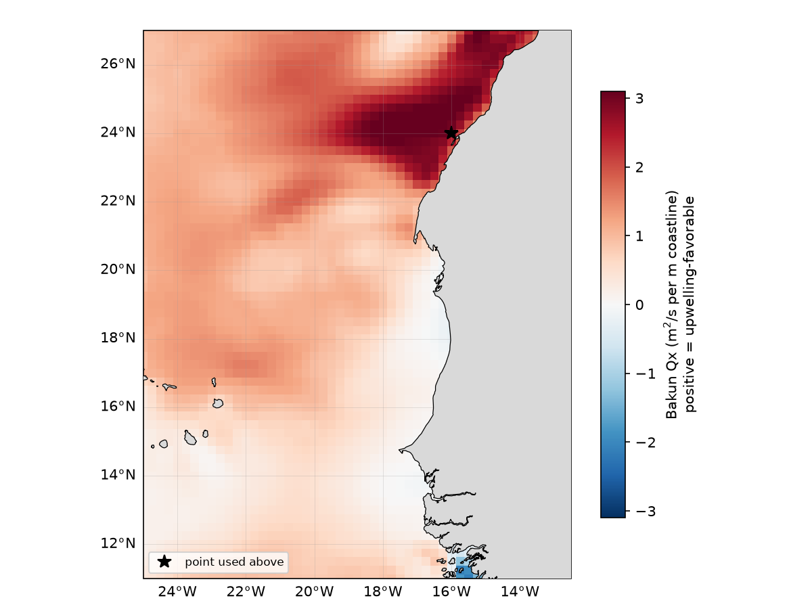

# 04 -- Guided exercises (DCC process **D1**)

**SEA-FORWARD** OceanPrediction-A toolkit

Scaffolded exercises for Step 5.2 of the operational workflow. Each exercise takes you from raw CROCO output to a physically meaningful coastal-ocean diagnostic, using only building blocks already in `sftools.postprocess`.

| Exercise | Concept | Relevance |
|---|---|---|
| 1 | Upwelling index (Bakun-style Ekman transport) | The cold-SST signal validated visually in `02_validation.ipynb` |
| 2 | Mixed-layer depth (temperature-threshold) | Standard ocean-forecasting diagnostic (ETOOFS Guide, IOC-UNESCO GOOS-275) |
| 3 | Coastal jet analysis | Cross-shore velocity section, jet core speed/depth |
| 4 | Eddy detection | Closed-contour identification on SSH |

**How to use this notebook.** Each exercise's main code cell has a working reference implementation *with the key physics lines commented, next to a `# TODO` explaining what that line does* -- read the TODO, then look at the line right below it. A short **Self-check** cell follows, with `assert`
statements confirming the result is physically sensible (right sign, right order of magnitude) -- if you modify the exercise (different point, different threshold, your own region), re-run the self-check to catch mistakes early.

*Why not blank-out the lines outright?* This shipped notebook must execute end-to-end without errors from a fresh kernel restart (QA requirement, Testing and Validation Plan Section 9.1) -- a literal fill-in-the-blank version would fail that by construction. If your course/workshop wants a
truly blanked student handout, generate one from this notebook by deleting the marked answer lines; this version is the instructor/reference copy.


```python
import sys, os
sys.path.insert(0, os.path.abspath(".."))

import numpy as np
import matplotlib.pyplot as plt
%matplotlib inline
from scipy.ndimage import maximum_filter, minimum_filter
import cartopy.crs as ccrs 
import cartopy.feature as cfeature
import sftools.postprocess as pp
import sftools.validation as val
import sftools.seaforward as sf
import _paths

CONFIG   = os.environ.get("SEAFORWARD_CONFIG", "Canary_12")
MAIN_DIR = os.environ.get("SEAFORWARD_MAIN_DIR", "~/seaforward/forecast/model-runs")
AVAILABLE_CYCLES = _paths.list_cycles(os.path.expanduser(MAIN_DIR), CONFIG)
print(f"forecast cycles found under {os.path.join(MAIN_DIR, CONFIG)}: {AVAILABLE_CYCLES}")

# >>> SET THIS to the cycle you want to run these exercises on, e.g. CYCLE = "20260711" <<<
# else select the last available cycle
CYCLE = os.environ.get("SEAFORWARD_CYCLE", AVAILABLE_CYCLES[-1] if AVAILABLE_CYCLES else "")

CROCO_HIS, REFERENCE, MAIN_DIR = _paths.get_paths(cycle=CYCLE, config=CONFIG, main_dir=MAIN_DIR)
YORIG = 2000   # forecast runs from the Copernicus Marine Forecast / Mercator anfc

print(f"Opening forecast cycle {CYCLE}")
print(f"  CROCO history: {CROCO_HIS}")

ds = pp.open_history(CROCO_HIS, Yorig=YORIG)
clon, clat, cmask = pp.lonlatmask(ds)
print(f"Grid: {clon.shape}, domain lon [{np.nanmin(clon):.2f}, {np.nanmax(clon):.2f}], "
     f"lat [{np.nanmin(clat):.2f}, {np.nanmax(clat):.2f}]")

LON0, LAT0 = None, None   #  <<<< precribe your lon, lat value here
if LON0 is None or LAT0 is None:
        j0p = ds.sizes['eta_rho'] // 2
        i0p = int(0.75 * ds.sizes['xi_rho'])
        # else choose point in the middle of the domain
        LON0, LAT0  = float(clon[j0p, i0p]), float(clat[j0p, i0p])

print(f"reference coastal point: ({LON0:.2f}, {LAT0:.2f})")
```

## Exercise 1 -- Upwelling index (Bakun-style Ekman transport)

Coastal upwelling occurs when alongshore wind drives an offshore Ekman transport, pulling cold, nutrient-rich subsurface water to the surface. The classic **Bakun upwelling index** quantifies this from the wind alone:

Qx = (rho_air * Cd * &#124;W&#124; * W_alongshore) / (rho_water * f)

where `W_alongshore` is the wind component *parallel to the coastline* (rotate the wind vector by the coastline orientation angle), `f` is the Coriolis parameter, and `Qx` is the cross-shore Ekman transport (m^2/s per unit coastline). A positive `Qx` means upwelling-favourable wind.

* **TODO(1a):** rotate the wind vector into along-/cross-shore components.
* **TODO(1b):** compute the Bakun transport.

In demo mode, the wind field is a synthetic due-south wind (`_demo_data.make_synthetic_wind`) -- with a real ERA5 `for_croco` archive, use `sftools.validation._load_wind(ERA5_DIR, date)` instead, and set `COAST_ANGLE_DEG` to your region's actual coastline orientation, e.g. from `docs/07_regions.md` or a `grid_bathy_map` plot.

First download **ERA5** data:
```python 
LON_MIN, LON_MAX = float(np.nanmin(clon)), float(np.nanmax(clon))
LAT_MIN, LAT_MAX = float(np.nanmin(clat)), float(np.nanmax(clat))
domain = f"{LON_MIN},{LON_MAX},{LAT_MIN},{LAT_MAX}"
# ERA5 domain (grid box + 2 deg margin)

start_m, end_m = ds.time[0].dt.strftime('%Y-%m').item(), ds.time[-1].dt.strftime('%Y-%m').item()

!python ../sftools/download/era5_for_exercise.py \
    --domain={domain} \
    --month_start {start_m} --month_end {end_m} \
    --outputDir ~/seaforward/forecast/model-runs/{CONFIG}/{CYCLE}/downloaded_data/ERA5 \
    --Yorig {YORIG}

```

Then proceed to calculation:
```python
RHO_AIR   = 1.22      # kg m-3
RHO_WATER = 1025.0    # kg m-3
CD        = 1.3e-3    # dimensionless drag coefficient (bulk, ~10 m neutral wind)
OMEGA     = 7.2921e-5  # rad s-1, Earth's rotation rate

# Coastline orientation, degrees counter-clockwise from East, i.e. the
# alongshore unit vector is (cos(theta), sin(theta)):
#   theta =  0   -> alongshore vector points East  -> an E-W trending coast
#   theta = 90   -> alongshore vector points North -> a N-S trending coast
# The Canary/NW-African coast runs roughly N-S (slightly NNE-SSW), so:
COAST_ANGLE_DEG = 90.0

ERA5_DIR = os.environ.get("SEAFORWARD_ERA5_DIR", f"../forecast/model-runs/{CONFIG}/{CYCLE}/downloaded_data/ERA5/for_croco/")
DATE = str(np.datetime_as_string(pp.times(ds)[-1], unit="D"))
wlon, wlat, wu, wv = val._load_wind(ERA5_DIR, DATE)

# comment to use the values setted above
LON0, LAT0 = -16, 24  # <<<< precribe your lon, lat value here

j = np.argmin((wlat[:, 0] - LAT0) ** 2)
i = np.argmin((wlon[0, :] - LON0) ** 2)
u10, v10 = float(wu[j, i]), float(wv[j, i])

# rotate (u10, v10) into (alongshore, cross-shore) using COAST_ANGLE_DEG
theta = np.deg2rad(COAST_ANGLE_DEG)
w_along = u10 * np.cos(theta) + v10 * np.sin(theta)
w_cross = -u10 * np.sin(theta) + v10 * np.cos(theta)
w_speed = np.sqrt(u10 ** 2 + v10 ** 2)

# Coriolis parameter at this latitude, and the Bakun transport Qx
f = 2 * OMEGA * np.sin(np.deg2rad(LAT0))
Qx = (RHO_AIR * CD * w_speed * w_along) / (RHO_WATER * f)

print(f"10 m wind at ({LON0:.2f}, {LAT0:.2f}): u={u10:+.2f}  v={v10:+.2f} m/s")
print(f"alongshore component: {w_along:+.2f} m/s   cross-shore: {w_cross:+.2f} m/s")
print(f"Bakun upwelling index Qx = {Qx:+.3f} m2/s per m of coastline")
```

```python
# Self-check: a finite, non-zero index of a physically plausible magnitude
# (a few tenths to a few m^2/s per m of coastline is typical for moderate
# eastern-boundary-upwelling winds -- if you get e.g. 1e6, check units/COAST_ANGLE_DEG)
assert np.isfinite(Qx), "Qx is not finite -- check f (are you too close to the equator?)"
assert abs(Qx) < 10, f"Qx = {Qx:.1f} looks too large -- check units and COAST_ANGLE_DEG"
print("self-check passed")
```

## Do it for the whole domain
```python

w_along_map = wu * np.cos(theta) + wv * np.sin(theta)
w_speed_map = np.sqrt(wu ** 2 + wv ** 2)
f_map = 2 * OMEGA * np.sin(np.deg2rad(wlat))

with np.errstate(divide="ignore", invalid="ignore"):
    Qx_map = (RHO_AIR * CD * w_speed_map * w_along_map) / (RHO_WATER * f_map)

# f blows up near the equator -- mask it out rather than plot a divide-by-~0 artifact
Qx_map = np.where(np.abs(wlat) > 2.0, Qx_map, np.nan)

# same sign flip as the point calculation, so positive = upwelling-favorable everywhere
Qx_map = -Qx_map

print(f"finite Qx_map cells: {np.isfinite(Qx_map).sum()} / {Qx_map.size}")
```
```python
from IPython.display import Image, display

fig = plt.figure(figsize=(8, 6))
ax  = fig.add_axes([0.05, 0.05, 0.78, 0.90], projection=ccrs.PlateCarree())
cax = fig.add_axes([0.74, 0.15, 0.03, 0.70])

lim = np.nanpercentile(np.abs(Qx_map), 99)
pc = ax.pcolormesh(wlon, wlat, Qx_map, cmap="RdBu_r", vmin=-lim, vmax=lim,
                   shading="auto", transform=ccrs.PlateCarree())
ax.add_feature(cfeature.LAND, facecolor="0.85", zorder=3)
ax.coastlines(resolution="10m", linewidth=0.6, zorder=4)
gl = ax.gridlines(draw_labels=True, linewidth=0.3, color="0.6", alpha=0.4)
gl.top_labels = False; gl.right_labels = False
ax.set_extent([wlon.min(), wlon.max(), wlat.min(), wlat.max()], crs=ccrs.PlateCarree())
ax.plot(LON0, LAT0, "k*", ms=10, transform=ccrs.PlateCarree(), label="point used above")
ax.legend(loc="lower left", fontsize=8)

fig.colorbar(pc, cax=cax, label="Bakun Qx (m$^2$/s per m coastline)\npositive = upwelling-favorable")
ax.set_title(f"Bakun upwelling index -- {DATE}  (coast angle = {COAST_ANGLE_DEG:.0f}°)")

# save WITHOUT tight-bbox, close the live figure, then display the saved
# raster explicitly -- sidesteps whatever the notebook's automatic inline
# capture/crop is doing to this figure
fig.savefig("bakun_map.png", dpi=150, bbox_inches=None)
plt.close(fig)
display(Image("bakun_map.png"))
```



## Exercise 2 -- Mixed-layer depth (temperature-threshold criterion)

The mixed-layer depth (MLD) is the depth at which temperature departs from its near-surface value by more than a fixed threshold (de Boyer Montegut et al., 2004 use delta-T = 0.2 degC from a 10 m reference depth) -- one of the core ocean-forecasting diagnostics listed in FR-08 and the ETOOFS Guide.

* **TODO(2a):** extract the temperature profile with `pp.profile`.
* **TODO(2b):** find the shallowest depth where &#124;T - T_ref&#124; exceeds the threshold.

```python
DELTA_T = 0.2        # deg C, de Boyer Montegut et al. (2004) criterion
REF_DEPTH = -10.0     # m, negative down

# TODO(2a): temperature profile at (LON0, LAT0) -- pp.profile(ds, var, lon, lat, tindex)
prof = pp.profile(ds, "temp", LON0, LAT0, tindex=-1)
depth = prof["depth"].values      # negative down
temp = prof.values

# reference temperature: nearest level to REF_DEPTH
i_ref = np.argmin(np.abs(depth - REF_DEPTH))
t_ref = temp[i_ref]

# TODO(2b): shallowest depth (below REF_DEPTH) where |T - t_ref| exceeds DELTA_T
below_ref = depth < REF_DEPTH                        # only look deeper than the reference
exceeds = np.abs(temp - t_ref) > DELTA_T
candidates = np.where(below_ref & exceeds)[0]
if len(candidates):
    i_mld = candidates[np.argmax(depth[candidates])]   # shallowest of the qualifying depths
    mld = depth[i_mld]
else:
    mld = np.nan

print(f"reference temp (z={REF_DEPTH:.0f} m): {t_ref:.3f} C")
print(f"mixed-layer depth: {mld:.1f} m" if np.isfinite(mld) else
     "no MLD found in this column (well-mixed water column?)")

fig, ax = plt.subplots(figsize=(4, 6))
ax.plot(temp, depth, "o-", ms=3)
ax.axvline(t_ref, color="C3", ls="--", lw=1, label=f"T_ref ({REF_DEPTH:.0f} m)")
if np.isfinite(mld):
    ax.axhline(mld, color="C2", ls="--", lw=1, label=f"MLD = {mld:.0f} m")
ax.set_xlabel("temperature (degC)"); ax.set_ylabel("depth (m)")
ax.legend(fontsize=10); ax.set_title(f"Temperature profile & MLD  ({LON0:.2f}, {LAT0:.2f})")
```
```python
# Self-check: MLD should be a real depth between the surface and the seafloor
assert (not np.isfinite(mld)) or (depth.min() <= mld <= 0), (
    f"mld={mld} is outside the water column's depth range")
print("self-check passed")
```

## Exercise 3 -- Coastal jet analysis

Eastern-boundary and equatorial upwelling systems typically develop a narrow, intense alongshore current (the "coastal jet") a short distance offshore and below the surface. We extract a cross-shore vertical section of current speed and locate the jet core (depth and magnitude of the speed maximum) using `pp.section`.

* **TODO(3a):** build the cross-shore section with `pp.section`.
* **TODO(3b):** locate the jet core (max speed, and its depth).

```python
# cross-shore transect from the coastal point, ~1.5 deg offshore.
# TODO: adjust the endpoint so the transect actually crosses YOUR shelf/slope
# (roughly perpendicular to the coastline) if you change LON0/LAT0 above.
LON0_T, LAT0_T = LON0, LAT0
LON1_T, LAT1_T = LON0 - 1.5, LAT0  

# TODO(3a): cross-shore section of current speed
sec = pp.section(ds, "speed", LON0_T, LAT0_T, LON1_T, LAT1_T, tindex=-1, npts=150)
dist = sec["distance_km"].values
depth_sec = np.array(sec["depth"].values, dtype=float)
speed_sec = sec.values

# TODO(3b): (depth, distance) of the speed maximum -> the jet core
jet_idx = np.unravel_index(np.nanargmax(speed_sec), speed_sec.shape)
jet_speed = speed_sec[jet_idx]
jet_depth = depth_sec[jet_idx]
jet_dist = dist[jet_idx[1]]

print(f"jet core: speed={jet_speed:.2f} m/s at depth={jet_depth:.0f} m, "
     f"{jet_dist:.1f} km offshore")

fig, ax = plt.subplots(figsize=(8, 4.5))
h = ax.pcolormesh(np.tile(dist, (speed_sec.shape[0], 1)), depth_sec, speed_sec,
                  cmap="viridis", shading="auto")
ax.plot(jet_dist, jet_depth, "r*", ms=16, label="jet core")
ax.set_xlabel("distance offshore (km)"); ax.set_ylabel("depth (m)")
ax.legend(); fig.colorbar(h, ax=ax, label="speed (m s$^{-1}$)")
ax.set_title("Cross-shore current-speed section & coastal-jet core")
plt.show()

```
```python
# Self-check: the jet core should be a real, positive speed inside the section
assert np.isfinite(jet_speed) and jet_speed > 0, "no valid speed maximum found in the section"
assert depth_sec.min() <= jet_depth <= 0, "jet_depth is outside the section's depth range"
print("self-check passed")
```

## Exercise 4 -- Eddy detection (closed-contour method)

Mesoscale eddies show up as closed contours of sea-surface height (SSH) anomaly: anticyclonic (warm-core) eddies as SSH highs, cyclonic (cold-core) eddies as SSH lows ([Chelton et al., 2011](https://doi.org/10.1016/j.pocean.2011.01.002)). The production pipeline (`validation/animate.py`, `animate_ssh_eddies`) uses py-eddy-tracker's full
amplitude/shape-error algorithm; here you implement a simplified version yourself with `scipy.ndimage`, to understand what "closed-contour detection" actually means before trusting the library version.

* **TODO(4a):** compute the SSH anomaly (remove the domain mean).
* **TODO(4b):** find local extrema with `maximum_filter`/`minimum_filter`.

```python
_, _, mask = pp.lonlatmask(ds)
ssh = ds["zeta"].isel(time=-1).values * mask

# TODO(4a): SSH anomaly relative to the domain mean (nanmean ignores land/NaN)
ssh_anom = ssh - np.nanmean(ssh)

NEIGHBORHOOD = 5   # grid cells; tune to your grid resolution (larger domain -> larger value)

# TODO(4b): a point is a local extremum if it equals the max/min-filter response
# over its neighbourhood, AND is finite (not land/NaN)
local_max = (ssh_anom == maximum_filter(ssh_anom, size=NEIGHBORHOOD)) & np.isfinite(ssh_anom)
local_min = (ssh_anom == minimum_filter(ssh_anom, size=NEIGHBORHOOD)) & np.isfinite(ssh_anom)

# discard trivially flat/land regions and keep only a modest amplitude
MIN_AMPLITUDE = 0.02   # m
anticyclones = local_max & (ssh_anom > MIN_AMPLITUDE)
cyclones = local_min & (ssh_anom < -MIN_AMPLITUDE)

n_anti, n_cyc = int(anticyclones.sum()), int(cyclones.sum())
print(f"candidate anticyclonic eddy centres (SSH high): {n_anti}")
print(f"candidate cyclonic eddy centres (SSH low)     : {n_cyc}")

fig, ax = plt.subplots(figsize=(8, 7))
dmax = np.nanpercentile(np.abs(ssh_anom[np.isfinite(ssh_anom)]), 98)
h = ax.pcolormesh(clon, clat, ssh_anom, cmap="RdBu_r", vmin=-dmax, vmax=dmax, shading="auto")
ax.scatter(clon[anticyclones], clat[anticyclones], marker="^", color="k", s=40,
          label=f"anticyclonic centres (n={n_anti})")
ax.scatter(clon[cyclones], clat[cyclones], marker="o", color="0.2", s=40,
          label=f"cyclonic centres (n={n_cyc})")
fig.colorbar(h, ax=ax, label="SSH anomaly (m)")
ax.legend(fontsize=8); ax.set_xlabel("longitude"); ax.set_ylabel("latitude")
ax.set_title("Candidate eddy centres from local SSH extrema")
plt.show()

print()
print("Note: this local-extrema method flags CANDIDATE centres only -- it does not")
print("verify a genuinely closed contour around each one. The production pipeline")
print("(validation/animate.py: animate_ssh_eddies) additionally requires a closed,")
print("single-eddy SSH contour with an amplitude/shape-error test before accepting")
print("a candidate as a real eddy -- see that module's docstring.")
```
```python
# Self-check: candidate counts should be non-negative integers (sanity, not
# a claim about detection quality -- see the note above)
assert n_anti >= 0 and n_cyc >= 0
print("self-check passed")
```

### Wrap-up

You have derived four standard coastal-ocean diagnostics directly from CROCO output: an upwelling index from wind alone, a mixed-layer depth from a temperature profile, a coastal-jet core from a velocity section, and candidate eddy centres from SSH extrema.

Continue to **`05_sensitivity.ipynb`** to see how the upwelling index you just computed responds when the wind forcing itself is perturbed (Step 5.3, U3 -> C1 -> D1).

```python
ds.close()
```

<div style="display:flex; justify-content:center; margin:10px 0 14px 0;">
   <a href="https://raw.githubusercontent.com/opera-seaforward/seaforward_readthedoc/main/docs/notebooks/04_exercises.ipynb" data-download-url="https://raw.githubusercontent.com/opera-seaforward/seaforward_readthedoc/main/docs/notebooks/04_exercises.ipynb" data-download-filename="04_exercises.ipynb" onmouseover="this.style.transform='scale(1.08)'; this.style.boxShadow='0 10px 24px rgba(0,0,0,0.18)';" onmouseout="this.style.transform='scale(1)'; this.style.boxShadow='none';" style="display:inline-flex; align-items:center; justify-content:center; gap:16px; min-width: 80px; padding:20px 20px; border-radius:10px; background:linear-gradient(to bottom, #ffffcc 0%, #f4f797de 100%); color:#000000; text-decoration:none; font-size:1.2rem; line-height:1.1; text-align:center; transition:transform 0.18s ease, box-shadow 0.18s ease; transform-origin:center;">
      
      <span>Download notebook 04_exercises.ipynb</span>
   </a>
</div>
