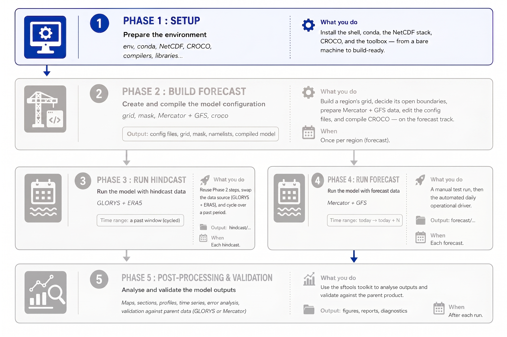
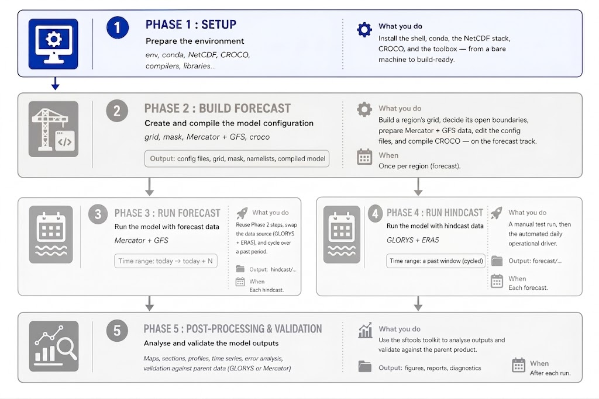

# Phase 1 — Setup: from a bare machine to build-ready

<!--  -->

SEA-FORWARD runs the **CROCO** regional ocean model to make short ocean
forecasts. To do that, the machine needs three independent things:

1. **Python tools** (to download global data and shape it for CROCO) — provided
   by the `seaforward` conda environment.
2. **A NetCDF library** (the file format all the ocean data uses) — compiled
   from source into `~/seaforward/opt_seq`.
3. **The CROCO model itself** (Fortran code you compile into a program) — lives
   in `~/seaforward/code/croco`.

This chapter assumes very little. If a step looks obvious, skip it; if a term is new
(conda, NetCDF, compiling), it is explained the first time it appears.

!!! important
    **Everything in this chapter is done once per machine.** Miniconda, the `seaforward`
    environment, the NetCDF/HDF5 stack and CROCO are installed once and reused for every
    forecast. From then on, a working session is three lines — source `env.sh`, source a
    `track.sh`, `conda activate seaforward` — shown at the end and used throughout
    Phases 2–5.
