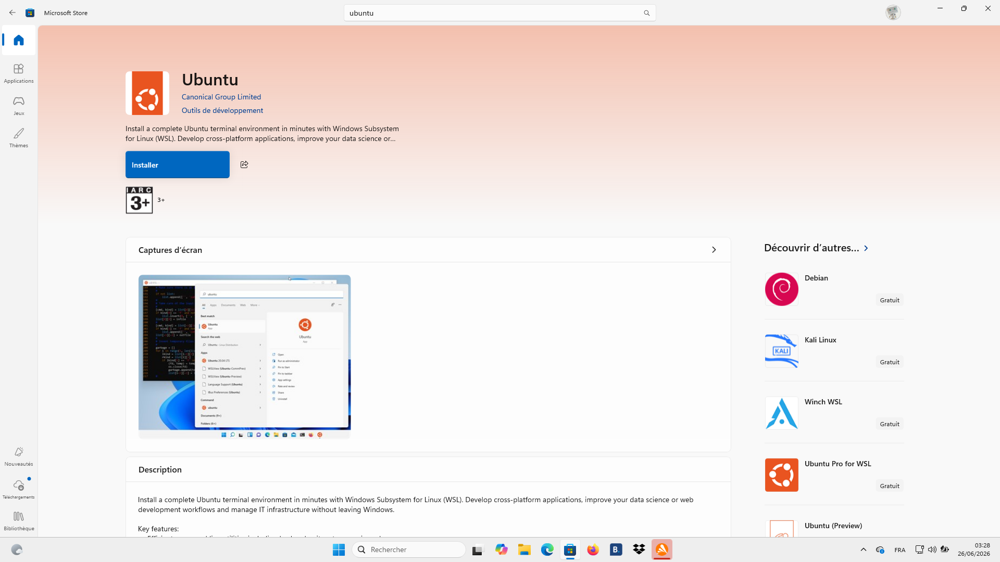

CROCO and its toolchain are built for Linux. You need a Linux command line.

- **Linux** — you already have one. Open a terminal.
- **macOS** — a terminal works, but the from-source NetCDF build in this guide
  is tuned for Linux; the smoothest path is a Linux machine or a Linux VM.
- **Windows** — install **WSL2** (Windows Subsystem for Linux), which gives you
  a real Ubuntu inside Windows.

### Installing WSL2 (Windows only)

You can install WSL2 using either the command line or the Microsoft Store.

**Method 1: Command Line (Fastest)**

Open **PowerShell as Administrator** and run:

```powershell
wsl --install -d Ubuntu
```

**Method 2: Microsoft Store**

1. Open the **Microsoft Store** from your Windows Start menu.
2. Search for **Ubuntu** (the recommended Linux distribution) and click **Get** or **Install**.
  

**After installing:**
Restart your computer if asked. Launch **Ubuntu** from the Start menu, and wait a few
moments for the initial setup to finish. It will ask you to create a **UNIX username**
and a **password**. When typing the password, characters won't appear on screen — that
is normal.

From now on, every command in these documents is typed in that Ubuntu terminal.

Check you're in Linux:

```bash
uname -a          # should mention "Linux" and "microsoft-standard-WSL2" on Windows
whoami            # your Linux username
```

!!! note
    **RAM note.** Building the libraries and running the model is comfortable with **16 GB** of RAM. With less, use fewer parallel compile jobs (shown later).

### Installing dependencies

You need a C/Fortran compiler and a few build utilities. Install them once:

```bash
sudo apt update
sudo apt install -y build-essential gfortran m4 curl wget git \
                    libcurl4-openssl-dev zlib1g-dev
```

What these are:

- `build-essential` — the C compiler (`gcc`) and `make`.
- `gfortran` — the Fortran compiler (CROCO is Fortran).
- `m4`, `zlib1g-dev`, `libcurl4-openssl-dev` — needed by the NetCDF build.
- `curl`, `wget` — to download source tarballs and datasets.
- `git` — to clone the repository.

Verify:

```bash
gcc --version
gfortran --version
```

Both should print a version without error.

### Installing conda

**Conda** installs and isolates Python libraries so they don't clash with your
system. We use it for the download/pre-processing tools.

Download and install Miniconda:

```bash
cd ~
wget -c https://repo.anaconda.com/miniconda/Miniconda3-latest-Linux-x86_64.sh
bash Miniconda3-latest-Linux-x86_64.sh
```

Accept the licence, keep the default location (`~/miniconda3`), and when it asks
whether to initialise, answer **yes**. Then close and reopen the terminal (or
`source ~/.bashrc`). Your prompt should now start with `(base)`.

Confirm:

```bash
conda --version
```