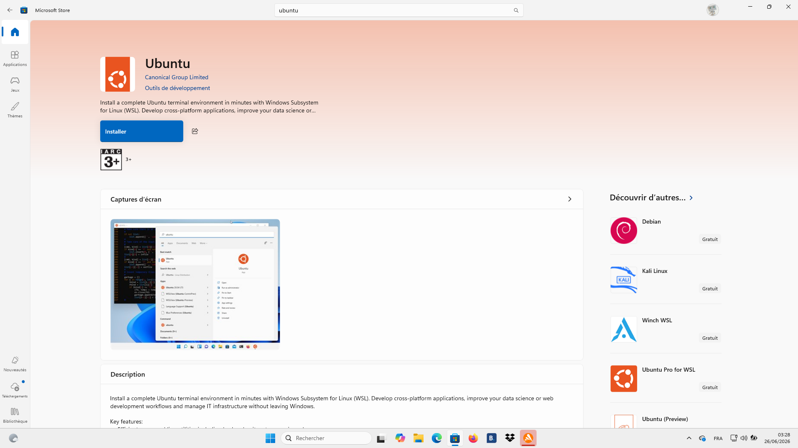

CROCO and its toolchain are built for Linux. You need a Linux command line.

- **Linux** — you already have one. Open a terminal.
- **macOS** — a terminal works, but the from-source NetCDF build in this guide
  is tuned for Linux; the smoothest path is a Linux machine or a Linux VM.
- **Windows** — install **WSL2** (Windows Subsystem for Linux), which gives you
  a real Ubuntu inside Windows.

### Installing WSL2 (Windows only)

You can install WSL2 using either the command line or the Microsoft Store.

!!! warning "Installing WSL2 needs Windows administrator rights"
    This is the only part of SEA-FORWARD that does. If you cannot get them, see
    [If you cannot use sudo](#3-if-you-cannot-use-sudo).

**Method 1: Command Line (Fastest)**

Open **PowerShell as Administrator** and run:

```powershell
wsl --install -d Ubuntu
```

**Method 2: Microsoft Store**

1. Open the **Microsoft Store** from your Windows Start menu.
2. Search for **Ubuntu** (the recommended Linux distribution) and click **Get** or **Install**.
  

**After installing:**
Restart your computer if asked. Launch **Ubuntu** from the Start menu, and wait a few
moments for the initial setup to finish. It will ask you to create a **UNIX username**
and a **password**. When typing the password, characters won't appear on screen — that
is normal.

From now on, every command in these documents is typed in that Ubuntu terminal.

Check you're in Linux:

```bash
uname -a          # should mention "Linux" and "microsoft-standard-WSL2" on Windows
whoami            # your Linux username
```

!!! note
    **RAM note.** Building the libraries and running the model is comfortable with **16 GB** of RAM. With less, use fewer parallel compile jobs (shown later).

### Installing dependencies

CROCO is written in Fortran, and the NetCDF stack is built from source, so you
need a C compiler, a Fortran compiler and a few build utilities.

How much of this a machine already has varies a great deal. A fresh WSL2 Ubuntu
has almost none of it. A workstation already used for scientific computing may
have all of it. So check first — it tells you whether you
need to install anything at all, and if you are not allowed to install software
on this machine, exactly what to ask for.

#### 1. Check what you already have

Seven of the requirements are programs. Two are **development headers**:
`zlib.h` and `curl/curl.h`. A header is the file a compiler reads in order to
build against a library, and it is packaged separately from the library itself
— so a machine can run `curl` perfectly well and still be missing
`curl/curl.h`. Checking that the commands exist is therefore not enough, and a
missing header does not announce itself here: it surfaces much later, as a
`configure` failure in [the library build](step7.md).

This block checks both:

```bash
echo "── tools ─────────────────────────────"
for p in gcc gfortran make m4 git curl wget; do
  if command -v "$p" >/dev/null 2>&1; then
    printf "  ok       %-10s %s\n" "$p" "$(command -v "$p")"
  else
    printf "  MISSING  %-10s\n" "$p"
  fi
done

echo "── headers ───────────────────────────"
if command -v gcc >/dev/null 2>&1; then
  if echo '#include <zlib.h>' | gcc -E - >/dev/null 2>&1; then
    echo "  ok       zlib.h"
  else
    echo "  MISSING  zlib.h            (package: zlib1g-dev)"
  fi
  if echo '#include <curl/curl.h>' | gcc -E - >/dev/null 2>&1; then
    echo "  ok       curl/curl.h"
  else
    echo "  MISSING  curl/curl.h       (package: libcurl4-openssl-dev)"
  fi
else
  echo "  skipped — install gcc first, then run this check again"
fi
```

`command -v` reports where the shell would find a program, and the two header
tests ask the compiler itself to resolve an `#include` — the same thing the
NetCDF build will do later.

Every line reads `ok` or `MISSING`, and each `MISSING` names the package that
provides it. **If everything reads `ok`, you are done — go to
[Installing conda](#installing-conda).**

#### 2. Install whatever is missing

```bash
sudo apt update
sudo apt install -y build-essential gfortran m4 curl wget git \
                    libcurl4-openssl-dev zlib1g-dev
```

`sudo` runs a command as the machine's administrator. It is needed here because
`apt` installs these packages **system-wide**, under `/usr`, where every user on
the machine shares them — and only an administrator may write there.

This is the only place SEA-FORWARD asks for that. Everything later — Miniconda,
the NetCDF/HDF5 stack, CROCO and the data — installs inside your own home
directory, which is also what lets SEA-FORWARD run on a shared cluster account.

Installing the full list is harmless if some of it is already there — `apt`
skips what it has.

- `build-essential` — the C compiler (`gcc`) and `make`.
- `gfortran` — the Fortran compiler (CROCO is Fortran).
- `m4`, `zlib1g-dev`, `libcurl4-openssl-dev` — needed by the NetCDF build.
- `curl`, `wget` — to download source tarballs and datasets.
- `git` — to clone the repository.

Run the check from step 1 again. Every line should now read `ok`.

#### 3. If you cannot use sudo

On a managed machine you may not be allowed to run `apt`. Four ways round it,
in order of preference.

**Ask whoever administers the machine.** A one-time request, for a short list
of standard packages:

```
build-essential gfortran m4 curl wget git libcurl4-openssl-dev zlib1g-dev
```

**Get the compilers from conda-forge.** Conda installs into your home
directory, so this needs no rights at all. Take this route if `gcc` or
`gfortran` is missing altogether. Install Miniconda first
([Installing conda](#installing-conda), next section), then:

```bash
conda create -n sfbuild -c conda-forge -y \
    gcc_linux-64 gfortran_linux-64 make m4 zlib libcurl
conda activate sfbuild
```

Activating that environment sets `CC` and `FC` to the conda compilers. Keep it
active for [the library build](step7.md) and point the builds at
`${CONDA_PREFIX}` instead of `/usr`, and use the same `CC`/`FC` for CROCO —
HDF5, NetCDF and CROCO must all be built by one compiler.

**You may not need `libcurl` at all.** `libcurl` is the library a program uses
to fetch things over the network, and NetCDF can be built to use it for
**OPeNDAP** — the Data Access Protocol, which opens a dataset living on a remote
server by its URL instead of a file path and reads only the slice you ask for.
SEA-FORWARD never does that: CMEMS, GFS and ERA5 arrive as files on disk, and
the model only ever opens local paths. So if `curl/curl.h` is the one thing
missing, switch that feature off — use `--disable-dap --disable-byterange`
instead of `--enable-curl` in [the library build](step7.md). The library then
reads and writes local NetCDF exactly as before.

If it is `zlib.h` that is missing instead, zlib builds from source into
`opt_seq` in about thirty seconds.

**Use a Linux machine elsewhere.** On a managed Windows laptop there is no way
round it — WSL2 cannot be installed without administrator rights. Run
SEA-FORWARD on a machine you can reach instead: a lab workstation, a
departmental server, a cluster account or a cloud VM.

### Installing conda

**Conda** installs and isolates Python libraries so they don't clash with your
system. We use it for the download/pre-processing tools.

Download and install Miniconda:

```bash
cd ~
wget -c https://repo.anaconda.com/miniconda/Miniconda3-latest-Linux-x86_64.sh
bash Miniconda3-latest-Linux-x86_64.sh
```

Accept the licence, keep the default location (`~/miniconda3`), and when it asks
whether to initialise, answer **yes**. Then close and reopen the terminal (or
`source ~/.bashrc`). Your prompt should now start with `(base)`.

Confirm:

```bash
conda --version
```

---

*Something not working? [Troubleshooting](trouble.md) collects the errors this phase throws, and what fixes them.*
