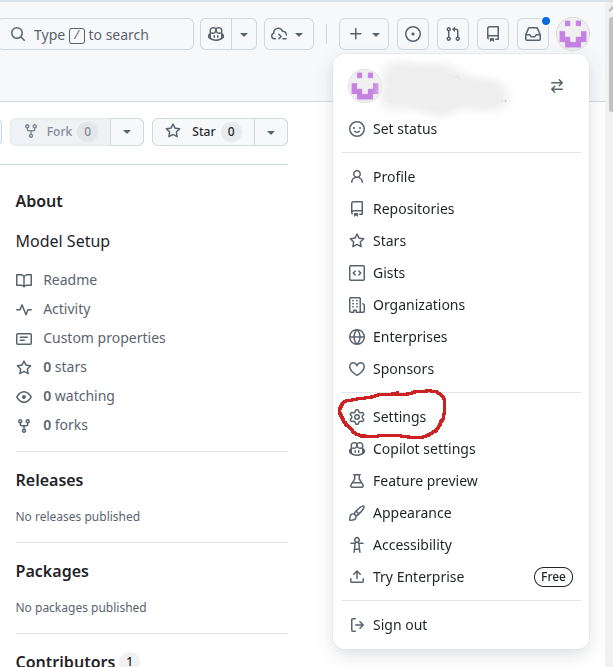
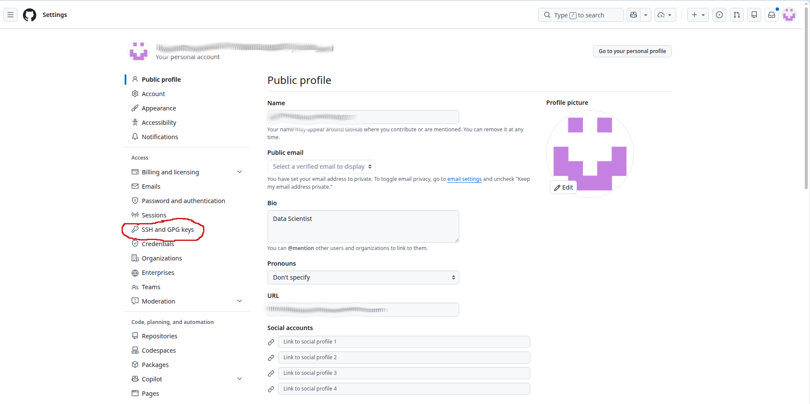
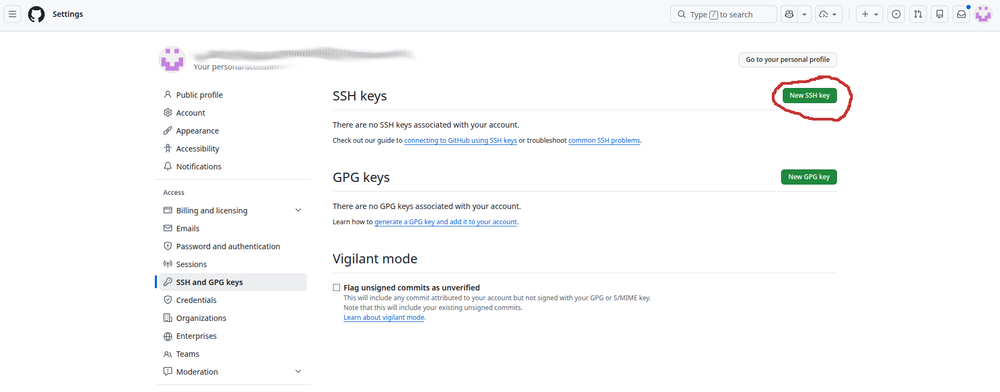
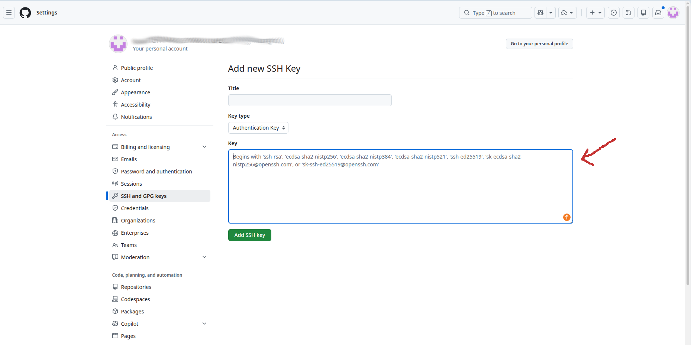

Before setting up the environment, you need to download (clone) the project to your local machine. You can do this using either **SSH** (recommended for frequent contributors) or **HTTPS** (easier for beginners).

### Option A: Clone via SSH (Recommended)

To use SSH, you must first have an SSH key configured on your GitHub account.
_If you haven't done this yet, please follow these instructions:_

!!! important
    **GitHub account required.** If you don't have a GitHub account yet, you must first [create one](https://github.com/join). You will need the exact **email address** associated with your GitHub account to successfully generate your SSH key below.

**Step 1 — generate an SSH key.**

!!! important
    If you're on Windows, open the Ubuntu terminal you configured in [System build tools](step1.md).

```bash
ssh-keygen -t ed25519 -C "your_email@example.com"
```

**Example output:**

```text
Generating public/private ed25519 key pair.
Enter file in which to save the key (/home/user/.ssh/id_ed25519): [Press Enter]
Enter passphrase (empty for no passphrase): [Press Enter]
Enter same passphrase again: [Press Enter]
Your identification has been saved in /home/user/.ssh/id_ed25519
Your public key has been saved in /home/user/.ssh/id_ed25519.pub
```

Then display the generated key:

```bash
cat ~/.ssh/id_ed25519.pub
```

**Example output:**

```text
ssh-ed25519 AAAAC3NzaC1lZDI1NTE5AAAAIP... your_email@example.com
```

Select the text starting with `ssh-ed25519` (the output of the `cat` command) and copy it.

**Step 2 — add the key to GitHub.**

- Open **Settings** on your GitHub account



- Open the **SSH and GPG keys** section



- Click **New SSH key**



- Paste your SSH key and save



Once your SSH key is added to GitHub, open a terminal and run:

```bash
cd ~
git clone git@github.com:opera-seaforward/seaforward.git
cd seaforward
ls
```

### Option B: Clone via HTTPS

If you don't want to set up SSH keys right now, you can clone using HTTPS. You may be prompted to enter your GitHub username and a personal access token.

```bash
cd ~
git clone https://github.com/opera-seaforward/seaforward.git
cd seaforward
ls
```

## SEA-FORWARD directory structure

```
~/seaforward/
├── env.sh                # sourced each session: shared paths + compilers + NetCDF
├── environment.yml       # the conda environment
├── install/              # 00..04 build scripts (system libs + CROCO)
├── sftools/              # the Python CLI (download + pre-process) + vendored toolbox
├── code/                 # CROCO + croco_pytools (obtained by install/04 — git-ignored)
│   ├── croco/            # CROCO model source
│   └── croco_pytools/    # pre-processing toolbox
├── opt_seq/              # NetCDF/HDF5 stack, compiled from source (git-ignored)
├── data/                 # DATASETS_CROCOTOOLS bathymetry/coastline (git-ignored)
├── forecast/
│   ├── track.sh          # forecast per-track paths
│   ├── configs/          # forecast config recipes
│   ├── scratch/          # forecast test builds (binary + grid)
│   ├── model-runs/       # kept forecast outputs
│   └── run_forecast_cycle.sh
├── hindcast/
│   ├── track.sh
│   ├── configs/  scratch/  model-runs/
│   └── run_hindcast_cycle.sh
└── docs/                 # these documents
```

!!! note
    **The golden rule of this project:** everything lives under `~/seaforward`. The scripts assume `SEA_FORWARD_ROOT=${HOME}/seaforward`. If you clone it somewhere else, adjust that variable in `env.sh`.