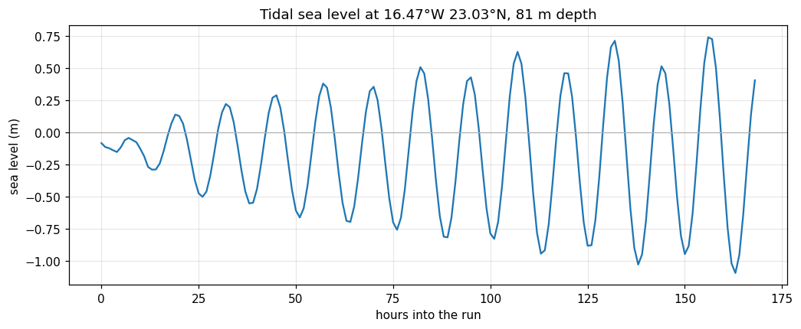
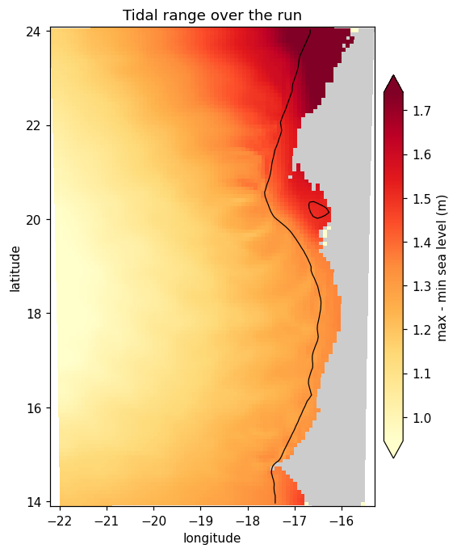

A run with the retimed output. The proof is not `MAIN: DONE` — it is the tidal signal
itself. Track sea level at a shelf point across the hourly records:

```bash
cd ~/seaforward
python3 << 'PYEOF'
import matplotlib; matplotlib.use('Agg')
import matplotlib.pyplot as plt, xarray as xr, numpy as np

D = 'forecast/scratch/Canary_12/CROCO_FILES/'
d = xr.open_dataset(D + 'croco_his.nc', decode_times=False)

lon = d.lon_rho.values; lat = d.lat_rho.values
h   = d.h.values;       m   = d.mask_rho.values > 0

# nearest wet cell to a point on the shelf
dist = np.where(m, (lon + 16.5)**2 + (lat - 23.0)**2, 1e9)
j, i = np.unravel_index(np.argmin(dist), dist.shape)

z = d.zeta.isel(eta_rho=j, xi_rho=i).values
t = (d.scrum_time.values - d.scrum_time.values[0]) / 3600.
print('point: %.2fW %.2fN, depth %.0f m' % (-lon[j,i], lat[j,i], h[j,i]))
print('%d records, %.1f hours' % (len(z), t[-1]))
print('swing over the run: %.3f m' % (z.max() - z.min()))

fig, ax = plt.subplots(figsize=(11, 4))
ax.plot(t, z, lw=1.5)
ax.axhline(0, color='0.7', lw=0.8)
ax.set_xlabel('hours into the run'); ax.set_ylabel('sea level (m)')
ax.set_title('Tidal sea level at %.2f°W %.2f°N, %.0f m depth'
             % (-lon[j,i], lat[j,i], h[j,i]))
ax.grid(alpha=0.3)
fig.savefig('docs/img/tides_timeseries.png', dpi=110, bbox_inches='tight')
PYEOF
```

```text
point: 16.47W 23.03N, depth 81 m
169 records, 168.0 hours
```



*Sea level at 16.47°W, 23.03°N in 81 m of water, hourly through the seven-day run.*

Fourteen rise-and-fall cycles in seven days — **that is M2**, at a 12.4-hour period. A
tide-free run at the same point drifts slowly with no oscillation; this one breathes.

The **envelope** is the other thing to see. The amplitude grows steadily across the
week, from about ±0.15 m in the first day to ±0.9 m by the seventh. That is M2 and S2
drifting into phase with each other — the **spring–neap cycle** — and it is evidence
that the multi-constituent forcing is working rather than M2 alone. A one-day run shows
the oscillation but not this; it is the reason to run a week.

The first few hours are also worth noticing: the signal starts small and irregular
before settling into a clean rhythm. That is `TIDERAMP` easing the forcing in, since
the initial condition carries no tidal signal at all.

### Where the tide is largest

```bash
cd ~/seaforward
python3 << 'PYEOF'
import matplotlib; matplotlib.use('Agg')
import matplotlib.pyplot as plt, xarray as xr, numpy as np
from matplotlib.colors import ListedColormap

D = 'forecast/scratch/Canary_12/CROCO_FILES/'
d = xr.open_dataset(D + 'croco_his.nc', decode_times=False)
z   = d.zeta.where(d.mask_rho == 1)
rng = (z.max('time') - z.min('time'))

print('tidal range: mean %.2f m   max %.2f m' % (float(rng.mean()), float(rng.max())))
h = d.h.values; m = d.mask_rho.values > 0
for lo, hi in [(0,100), (100,500), (500,2000), (2000,9000)]:
    s = m & (h >= lo) & (h < hi)
    print('  %5d-%5d m: mean range %.2f m  (%d cells)'
          % (lo, hi, np.nanmean(rng.values[s]), s.sum()))

lo = float(np.nanpercentile(rng, 2))      # scale to the data, not to zero,
hi = float(np.nanpercentile(rng, 98))     # or the field looks flat

fig, ax = plt.subplots(figsize=(7, 7))
ax.pcolormesh(d.lon_rho, d.lat_rho, np.where(d.mask_rho.values == 0, 1, np.nan),
              cmap=ListedColormap(['0.8']), vmin=0, vmax=1)
mm = ax.pcolormesh(d.lon_rho, d.lat_rho, rng, cmap='YlOrRd', vmin=lo, vmax=hi)
ax.contour(d.lon_rho, d.lat_rho, d.h, levels=[200], colors='k', linewidths=0.8)
ax.set_aspect('equal')
ax.set_xlabel('longitude'); ax.set_ylabel('latitude')
ax.set_title('Tidal range over the run')
fig.colorbar(mm, ax=ax, label='max - min sea level (m)', shrink=0.8, pad=0.02,
             extend='both')
fig.savefig('docs/img/tides_range.png', dpi=110, bbox_inches='tight')
PYEOF
```

```text
tidal range: mean 1.22 m   max 2.22 m
      0-  100 m: mean range 1.55 m  (505 cells)
    100-  500 m: mean range 1.42 m  (587 cells)
    500- 2000 m: mean range 1.36 m  (728 cells)
   2000- 9000 m: mean range 1.16 m  (6571 cells)
```



*Maximum minus minimum sea level over the run, with the 200 m isobath.*

**The range grows toward the coast**: 1.16 m in water deeper than 2000 m, 1.55 m on the
shelf inside 100 m, and a maximum of 2.22 m. The map shows where the change happens —
the dark band hugs the 200 m contour and widens where the shelf widens, north of 22°N
and around 20°N.

That is the defining behaviour of a shelf tide. The wave amplifies as it shoals,
because the same energy is squeezed into less water, so the isobath is not a
coincidence: it is the mechanism drawn on the map.

Note the colour scale is set from the data's own range rather than from zero. A field
that never approaches zero looks flat when plotted from it.

### Does the daily mean still match Mercator?

Compare the daily-mean SSH against Mercator's, and against the same comparison from a
tide-free run. If adding tides hasn't degraded the slow ocean, the two should be close.

!!! important
    **Compare daily means, not hourly.** Mercator has no tides, so an hourly comparison shows the whole tidal signal as error — over two metres on this shelf. Averaging over 24 hours removes it, which makes the daily mean the only fair comparison.