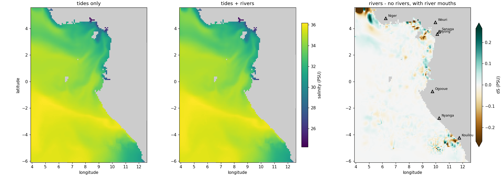

Because a climatology is built **once** and reused, rivers are simpler than tides. The
driver `run_forecast_cycle.sh` has a `--rivers` flag that, each cycle, **copies** the
pre-built `croco_runoff.nc` into the run folder, the same way it copies the grid. It
does not regenerate anything.

```bash
./run_forecast_cycle.sh --tides --rivers        # parent, tides + rivers
```

The flag also selects the matching pre-built binary. Names are built as
`croco_` + `plain|1way|2way` + `_tides` + `_rivers`, so this run needs
`croco_plain_tides_rivers`. Phase 3 documents the full matrix.

**Runs stay in separate folders.** The output folder carries the same tags as the
binary, so a run with rivers and a run without land in different places and never
overwrite each other:

```text
model-runs/IGOG_12/20260726_plain_tides/          # --tides           (no rivers)
model-runs/IGOG_12/20260726_plain_tides_rivers/   # --tides --rivers  (with rivers)
```

That makes a clean **river versus no-river comparison** straightforward — run the same
date both ways, and any difference is the rivers:

```bash
./run_forecast_cycle.sh --tides --rivers --date 2026-07-26   # with rivers
./run_forecast_cycle.sh --tides          --date 2026-07-26   # without rivers
```

Check the two cover the same window before comparing:

```bash
cd ~/seaforward
python3 << 'PYEOF'
import xarray as xr
B = 'forecast/model-runs/IGOG_12/'
for tag in ['20260726_plain_tides', '20260726_plain_tides_rivers']:
    d = xr.open_dataset(B + tag + '/fcst/CROCO_FILES/croco_his.nc', decode_times=False)
    t = d.scrum_time.values / 86400
    print('%-32s %2d records  %.3f .. %.3f days' % (tag, len(t), t[0], t[-1]))
PYEOF
```

```text
20260726_plain_tides             121 records  9703.000 .. 9708.000 days
20260726_plain_tides_rivers      121 records  9703.000 .. 9708.000 days
```

Identical, so the last record of each is the same instant. Then plot them, marking the
river mouths so you can tell a plume from anything else:

```bash
cd ~/seaforward
python3 << 'PYEOF'
import matplotlib; matplotlib.use('Agg')
import matplotlib.pyplot as plt, xarray as xr, numpy as np
from matplotlib.colors import ListedColormap

B = 'forecast/model-runs/IGOG_12/'
a = xr.open_dataset(B + '20260726_plain_tides/fcst/CROCO_FILES/croco_his.nc',
                    decode_times=False)
b = xr.open_dataset(B + '20260726_plain_tides_rivers/fcst/CROCO_FILES/croco_his.nc',
                    decode_times=False)

sa = a.salt.isel(time=-1, s_rho=-1).where(a.mask_rho == 1)
sb = b.salt.isel(time=-1, s_rho=-1).where(b.mask_rho == 1)
d  = sb - sa

print('no rivers: min salinity %.2f' % float(sa.min()))
print('   rivers: min salinity %.2f' % float(sb.min()))
print('largest freshening: %.3f PSU' % float(d.min()))

# the seven rivers in the runoff file, from Step 1's listing
rivers = [('Niger', 6.25, 4.75), ('Ogooue', 9.75, -0.75), ('Sanaga', 10.25, 3.75),
          ('Kouilou', 11.75, -4.25), ('Nyanga', 10.25, -2.75),
          ('Nyong', 10.12, 3.57), ('Wouri', 9.97, 4.46)]

vmin = min(float(sa.min()), float(sb.min()))
vmax = max(float(sa.max()), float(sb.max()))
lim  = float(np.nanpercentile(np.abs(d), 99.5))   # a few mouth cells would
land = ListedColormap(['0.8'])                    # otherwise flatten the scale

fig, ax = plt.subplots(1, 3, figsize=(17, 6), constrained_layout=True)
for k in range(3):
    ax[k].pcolormesh(a.lon_rho, a.lat_rho,
                     np.where(a.mask_rho.values == 0, 1, np.nan),
                     cmap=land, vmin=0, vmax=1)
    ax[k].set_aspect('equal'); ax[k].set_xlabel('longitude')

h1 = ax[0].pcolormesh(a.lon_rho, a.lat_rho, sa, cmap='viridis', vmin=vmin, vmax=vmax)
ax[0].set_title('tides only')
h2 = ax[1].pcolormesh(a.lon_rho, a.lat_rho, sb, cmap='viridis', vmin=vmin, vmax=vmax)
ax[1].set_title('tides + rivers')
fig.colorbar(h2, ax=ax[:2], label='salinity (PSU)', shrink=0.8, pad=0.02)

h3 = ax[2].pcolormesh(a.lon_rho, a.lat_rho, d, cmap='BrBG', vmin=-lim, vmax=lim)
for nm, lo, la in rivers:
    ax[2].plot(lo, la, 'k^', ms=7, mfc='none', mew=1.5)
    ax[2].annotate(nm, (lo, la), textcoords='offset points', xytext=(6, 4), fontsize=8)
ax[2].set_title('rivers - no rivers, with river mouths')
fig.colorbar(h3, ax=ax[2], label='dS (PSU)', shrink=0.8, pad=0.02, extend='both')

ax[0].set_ylabel('latitude')
fig.savefig('docs/img/rivers_salinity.png', dpi=110)
PYEOF
```



*Surface salinity at the end of the forecast, with and without river forcing, and the
difference with the seven river mouths marked. The two salinity panels share a colour
scale; the difference has its own.*

The first two panels look almost identical, which is the honest result — rivers are a
**local** effect, and the domain-wide salinity field is set by the boundaries and the
atmosphere.

The difference panel is where they show. At the marked mouths the signal behaves as a
plume should: freshening at the mouth with a compensating rim around it, since a plume
displaces water as well as adding fresh. The Cameroon cluster — Wouri, Sanaga and
Nyong — and Kouilou in the south are the clearest.

**The largest difference in the domain is not at a river.** It sits at 4.3–5.5°E,
4.8–5.5°N, about 2° west of the Niger mouth and against the north-west corner, reaching
−1.035 PSU where no plume exceeds −0.35. It also grows through the run: the domain
minimum runs −0.33, −0.79, −0.95, −0.72, −1.04 across the five days.

Whether that is Niger water advected west and pooling in the corner, or the open west
boundary responding to the added freshwater, this comparison does not say. It is worth
investigating before trusting coastal salinity in that corner.