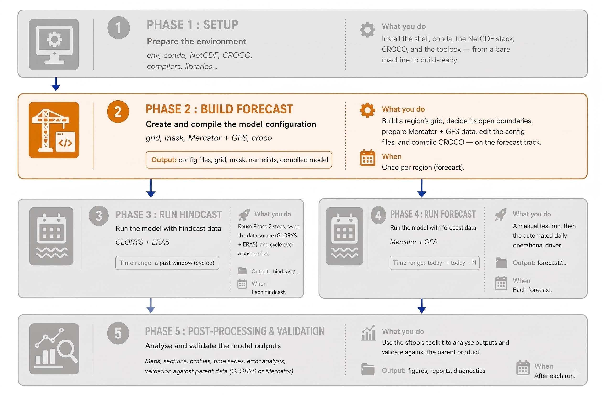
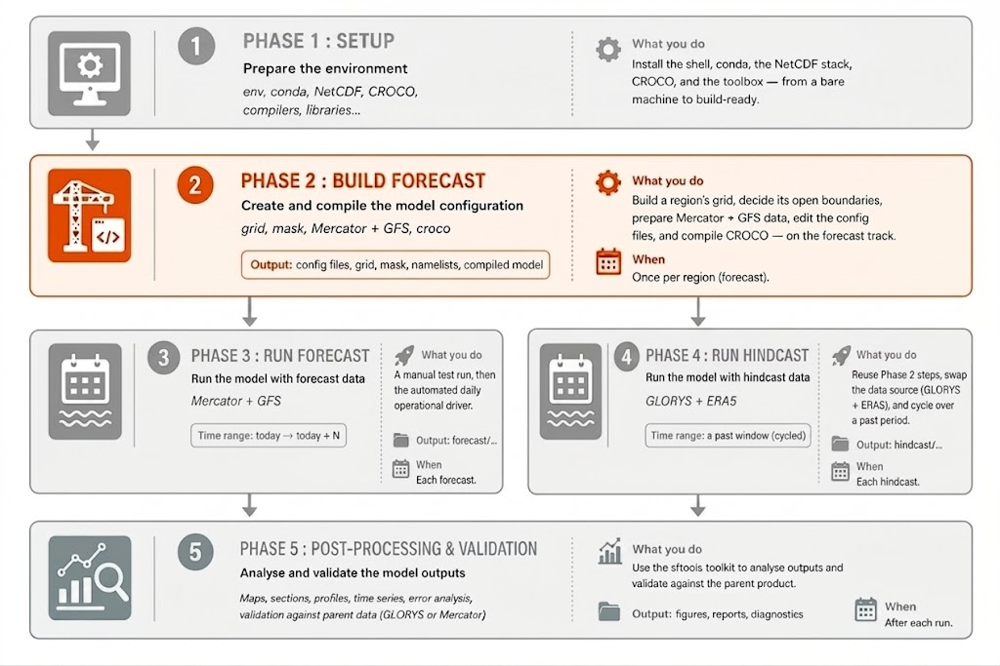

# Phase 2 — Building a Forecast Configuration

<!--  -->



### Building and running a single CROCO forecast by hand, from global data to a proven model

This chapter builds a complete regional ocean **forecast** and runs it once, on
your own machine, editing every configuration file by hand. You start from today's
global ocean and atmosphere, refine them over your region, compile the model, and
integrate forward to produce a short forecast. Doing it by hand — rather than
running one wrapper script — is the point: you finish knowing _what_ every setting
does and _why_ it is there, which is exactly the knowledge that automating the run
later depends on.

The data sources for this build:

- **Ocean** (initial condition and open boundaries) — the Mercator global
  analysis-and-forecast product.
- **Atmosphere** (surface forcing) — GFS.

The worked example is **Canary_12**, a 1/12° domain off North-West Africa
(22°W–15.5°W, 14°N–24°N). To build your own region you change only a handful of the
values you edit here.

!!! note
    **This is not yet an operational forecast.** The run here is manual and cold-started. An operational system adds a spin-up and runs on a schedule — Phase 3 builds that.

!!! important
    **Prerequisite.** You have finished Phase 1 (Setup): the `seaforward` conda environment exists, `nf-config --prefix` shows `~/seaforward/opt_seq`, CROCO is in `~/seaforward/code/croco`, and the bathymetry data is under `~/seaforward/data/DATASETS_CROCOTOOLS/`.

**How to read this guide.**

- When a step **edits a file**, you open it in `nano`; the guide tells you what to
  **find** and what to **change it to**, with a **What / Why** for each edit.
- A few steps — downloading data, building the grid, compiling — are run rather
  than edited, and the guide explains what each is doing.
- **✅ CHECK** shows what a correct result looks like.
- **⚠️ WATCH** marks a trap.
- A **workflow diagram** opens each step, with the piece that step produces
  highlighted, so you always see where you are in the build.

### nano crash course

```
nano FILENAME        open a file
Ctrl-W               search ("Where is") — type text, Enter — jumps to it
Ctrl-K               cut the current line
Ctrl-O, Enter        save ("Write Out")
Ctrl-X               exit
arrow keys           move around; just type to insert text
```

`Ctrl-W` (search) is the main tool — you use it to find the line to change in each
file.

## The upstream data — what feeds your model

A regional ocean model takes a global ocean and weather product and adds fine
detail over your region. Before the steps, understand _what_ the model eats: a
handful of global datasets, the **upstream data sources**, which you either
**download and shape** each run or **build once** into the grid.

<figure style="text-align: center; margin: 20px 0;">
  
  <figcaption style="font-size: 1em; color: #555; margin-top: 8px; font-style: italic;">
    The whole forecast build chain, from upstream data through to downstream services. Dashed boxes — tides, rivers and the AGRIF child grid — are optional, covered in later chapters.
  </figcaption>
</figure>

| upstream source               | what it gives the model                   | product             | you set it in                                             |
| ----------------------------- | ----------------------------------------- | ------------------- | --------------------------------------------------------- |
| **Bathymetry**                | the sea-floor shape — the geometry itself | ETOPO2 + GSHHS      | the grid (Step 2), once                                   |
| **Parent ocean model**        | initial state + open-boundary values      | **Mercator**        | `crocotools_param.py` + `make_ini`/`make_bry` (Steps 4–5) |
| **Atmospheric forcing**       | wind, heat, pressure, rain at the surface | **GFS**             | `cppdefs.h` `ONLINE` + `make_forcing` (Steps 5, 7)        |
| **Tides** _(optional)_        | tidal rise/fall at the boundaries         | **TPXO**            | `cppdefs.h` `TIDES` + `make_tides` _(Phase 10)_           |
| **River inputs** _(optional)_ | coastal freshwater                        | **Dai climatology** | `cppdefs.h` `PSOURCE` + `make_river` _(Phase 12)_         |

Read the roles, because they tell you _where_ each enters:

- **Bathymetry** is not forcing — it's the shape of the basin the model solves
  in. It's baked into `croco_grd.nc` at grid build and never touched again: the
  one upstream source you don't regenerate each run.
- **The global ocean forecast** is the big one. It gives the _initial condition_
  (the ocean state at t=0, from `make_ini`) and the _boundary conditions_ (what
  flows in at your open edges over time, from `make_bry`). This is the ocean your
  model refines.
- **Atmospheric forcing** is the weather that drives the ocean from above.
- **Tides** are optional and added separately (Phase 10). No global ocean product
  carries tides, so if your domain has a shelf or coast where the tide matters,
  you add it from TPXO. Deep open-ocean domains skip it.
- **Rivers** add coastal freshwater as point sources, built once per region as a
  repeating seasonal climatology (Dai & Trenberth) and then staged automatically
  each cycle with the `--rivers` flag (Phase 12).

Three sources are wired in during this chapter: the bathymetry (Step 2), the
global ocean (Steps 4–5), and the atmosphere (Steps 5 and 7).

### The build at a glance

The twelve steps fall into four stages:

| stage     | steps | what you produce                                                                                 |
| --------- | ----- | ------------------------------------------------------------------------------------------------ |
| **Grid**  | 0–3   | the model grid and its open/closed boundaries                                                    |
| **Data**  | 4–5   | download the global data, then shape it into initial conditions, boundaries, and surface forcing |
| **Build** | 6–10  | the four config files, then the compiled `croco` binary                                          |
| **Run**   | 11–12 | the run-time settings, then a proof run to `MAIN: DONE`                                          |

Each step opens with the workflow diagram, the piece it produces highlighted, so
you always know which stage you are in.