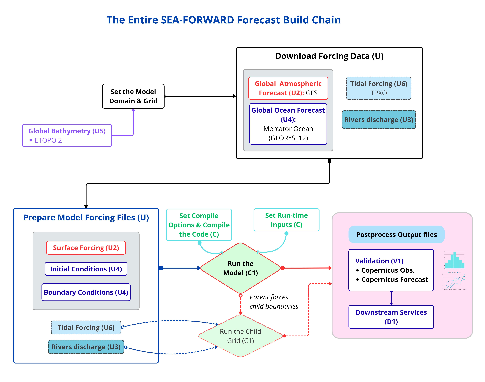

# Phase 2 — Run a Forecast Locally

<!--  -->


### Building and running a single CROCO forecast by hand, from global data to a proven model

This chapter builds a complete regional ocean **forecast** and runs it once, on
your own machine, editing every configuration file by hand. You start from today's
global ocean and atmosphere, refine them over your region, compile the model, and
integrate forward to produce a short forecast. Doing it by hand — rather than
running one wrapper script — is the point: you finish knowing _what_ every setting
does and _why_ it is there, which is exactly the knowledge that automating the run
later depends on.

For the initial condition and open boundaries we use the **Mercator** global
analysis-and-forecast product; for the surface forcing we use **GFS**. The worked
example is **Canary_12**, a 1/12° domain off North-West Africa (22°W–15.5°W,
14°N–24°N). To build your own region you change only a handful of the values you
edit here — and because you edited them by hand, you will know exactly which ones.

!!! note
    **A note on scope — this is not yet a fully operational forecast.** A real operational system does two things this manual run does not: it gives the forecast a proper **spin-up** (a short run that lets the regional model settle into balance and provides the forecast's initial state, instead of a cold start from the global model), and it runs **automatically on a schedule**. Here we do a single cold-started run by hand. That is the correct place to begin — it is the forecast that the operational cycle wraps a spin-up around and repeats daily. The step from this manual run to the automated, spun-up workflow is introduced at the end of this chapter (_Toward an operational workflow_) and built in Phase 3.

!!! important
    **Prerequisite.** You have finished Phase 1 (Setup): the `seaforward` conda environment exists `nf-config --prefix` shows `~/seaforward/opt_seq`, CROCO is in `~/seaforward/code/croco`, and the bathymetry data is under `~/seaforward/data/DATASETS_CROCOTOOLS/`.

!!! important
    **How to read this guide.** - When a step **edits a file**, you open it in `nano`; the guide tells you what to **find** and what to **change it to**, with a **What / Why** for each edit. - A few steps (downloading data, building the grid, compiling) are run rather than edited — the guide explains what each is doing. - **✅ CHECK** shows what a correct result looks like. - **⚠️ WATCH** marks a trap. - A **workflow diagram** opens each step, with the piece that step produces highlighted, so you always see where you are in the build.

### nano crash course

```
nano FILENAME        open a file
Ctrl-W               search ("Where is") — type text, Enter — jumps to it
Ctrl-K               cut the current line
Ctrl-O, Enter        save ("Write Out")
Ctrl-X               exit
arrow keys           move around; just type to insert text
```

`Ctrl-W` (search) is the main tool — you use it to find the line to change in each
file.

## The idea behind the whole thing

A regional ocean model **takes a global ocean and weather product and adds fine detail over your region**. You build it in two phases:

- **Phase A — prepare the data:** make a grid, decide its boundaries, download the
  global ocean and weather, and turn them into the model's starting state, edge
  values, and surface forcing.

- **Phase B — set up and run the model:** tell CROCO about your grid and physics
  (by editing four text files), compile it into a program, and run it.

Everything you edit by hand is _configuration_ — text that describes your region
to the model. Understanding that configuration is the whole point.

## The upstream data — what feeds your model, and what you choose



_The whole forecast build. Each step below highlights the piece it produces; the two dashed boxes (tides, AGRIF child) are optional add-ons covered in later chapters._

Before the steps, understand _what_ the model eats. A regional model doesn't
invent the ocean — it takes global datasets, the **upstream data sources**, and
refines them over your box. There are only a handful, and each one you either
**download and shape** (a per-cycle input) or **build once** (the grid). Knowing
which source does what is what lets you decide, later, what to change for a
different run.

Here is everything, and the role each plays:

| upstream source               | what it gives the model                   | product             | you set it in                                             |
| ----------------------------- | ----------------------------------------- | ------------------- | --------------------------------------------------------- |
| **Bathymetry**                | the sea-floor shape — the geometry itself | ETOPO2 + GSHHS      | the grid (Step 2), once                                   |
| **Parent ocean model**        | initial state + open-boundary values      | **Mercator**        | `crocotools_param.py` + `make_ini`/`make_bry` (Steps 4–5) |
| **Atmospheric forcing**       | wind, heat, pressure, rain at the surface | **GFS**             | `cppdefs.h` `ONLINE` + `make_forcing` (Steps 5, 7)        |
| **Tides** _(optional)_        | tidal rise/fall at the boundaries         | **TPXO**            | `cppdefs.h` `TIDES` + `make_tides` _(Phase 10)_           |
| **River inputs** _(optional)_ | coastal freshwater                        | **Dai climatology** | `cppdefs.h` `PSOURCE` + `make_river` _(Phase 12)_         |

Read the roles, because they tell you _where_ each enters:

- **Bathymetry** is not forcing — it's the shape of the basin the model solves
  in. It's baked into `croco_grd.nc` at grid build and never touched again. The
  one upstream source you don't regenerate each run.
- **The global ocean forecast** is the big one. It gives the _initial condition_
  (the ocean state at t=0, from `make_ini`) and the _boundary conditions_ (what
  flows in at your open edges over time, from `make_bry`). This is the ocean your
  model refines. It comes from **Mercator**, the global ocean forecast product.
- **Atmospheric forcing** is the weather that drives the ocean from above. It
  comes from **GFS**, the global weather forecast.
- **Tides** are optional and added separately (Phase 10). No global ocean product
  carries tides, so if your domain has a shelf or coast where the tide matters,
  you add it from TPXO. If your domain is deep open ocean, you skip it.
- **Rivers** add coastal freshwater as point sources. They are built once per
  region as a repeating seasonal climatology (Dai & Trenberth), then staged
  automatically each cycle with the `--rivers` flag — the same optional-add-on
  pattern as tides. Wire them in for domains where a big river mouth matters
  (see **Phase 12, Rivers**).

So as you go through the steps, notice that **three sources are being wired in**:
the bathymetry (Step 2, into the grid), the global ocean forecast (Steps 4–5, ini + bry),
and the atmosphere (Steps 5, 7, the forcing). Tides come later as an add-on. When
you build your own region, _these_ are the things you'd reconsider — and the table
above is your checklist.

### The build at a glance

The twelve steps fall into four natural stages:

| stage     | steps | what you produce                                                                                 |
| --------- | ----- | ------------------------------------------------------------------------------------------------ |
| **Grid**  | 0–3   | the model grid and its open/closed boundaries                                                    |
| **Data**  | 4–5   | download the global data, then shape it into initial conditions, boundaries, and surface forcing |
| **Build** | 6–10  | the four config files, then the compiled `croco` binary                                          |
| **Run**   | 11–12 | the run-time settings, then a proof run to `MAIN: DONE`                                          |

Each step opens with the workflow diagram, the piece it produces highlighted, so
you always know which stage you are in.
