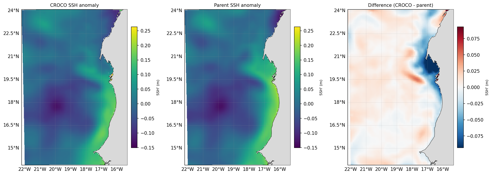
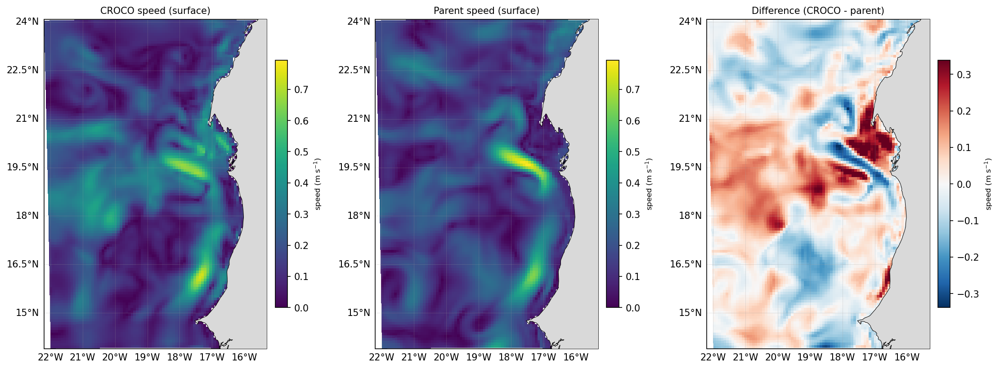

For your region you have a compiled model that has **run to completion**, with all
its inputs and outputs in the run folder:

``` { .text .no-copy }
forecast/scratch/Canary_12/
├── croco                       # the compiled program
├── cppdefs.h param.h croco.in jobcomp   # your edited config (also in configs/Canary_12)
├── compile.log
├── run.log                     # the proof it ran to MAIN: DONE
├── CROCO_FILES/
│   ├── croco_grd.nc            # grid + land mask
│   ├── crocotools_param.py     # pre-processing parameters
│   ├── croco_ini_MERCATOR_*.nc # initial condition
│   ├── croco_bry_MERCATOR_*.nc # boundary conditions
│   ├── croco_his.nc            # history output (this run)
│   ├── croco_avg.nc            # averages output (this run)
│   └── croco_rst.nc            # restart — can seed a subsequent run
└── downloaded_data/            # Mercator + GFS (+ for_croco forcing)
```

## A first look at the output

Compare the run against the Mercator product it was built from.

```bash
cd ~/seaforward
conda activate seaforward

python3 << PY
import glob
import matplotlib; matplotlib.use("Agg")
import sftools.validation as val
import sftools.postprocess as pp

B    = "forecast/scratch/Canary_12"
HIS  = B + "/CROCO_FILES/croco_his.nc"
# the Mercator file is named for the day it was downloaded
MERC = sorted(glob.glob(B + "/downloaded_data/MERCATOR/MERCATOR_*.nc"))[-1]

# the run's last record — passing date= matters, see the warning below
DATE = str(pp.open_history(HIS, Yorig=2000).time.values[-1])[:10]
print("comparing", DATE)

val.compare_sst(HIS, MERC, date=DATE, Yorig=2000, out="sst_vs_mercator.png")
val.compare_ssh(HIS, MERC, date=DATE, Yorig=2000, out="ssh_vs_mercator.png")
val.compare_currents(HIS, MERC, date=DATE, Yorig=2000, out="cur_vs_mercator.png")
PY
```

!!! warning
    **Always pass `date=`.** Without it the comparison takes CROCO's *last* record and the parent's *first* — eight days apart in this run — and the statistics are meaningless.

Each call draws three panels — CROCO, the parent regridded onto the CROCO grid, and
the difference — and prints the domain statistics. The numbers below are from the
run this guide describes; **yours will differ**, depending on your domain, your
download and how long the run was:

``` { .text .no-copy }
SST          bias=-0.830  RMSE=1.094  cRMSE=0.713  corr=0.949
SSH anomaly  bias=-0.000  RMSE=0.019  cRMSE=0.019  corr=0.954
Speed        bias=+0.016  RMSE=0.114  cRMSE=0.113  corr=0.519
```





`bias` is the mean offset, `RMSE` the total error, `cRMSE` the error with the bias
removed, and `corr` the spatial correlation. Read together, the three lines say
something useful about a seven-day free run:

- **SSH agrees closely.** The large-scale dynamics track the parent.
- **SST carries a −0.83 °C offset**, and most of the error is that offset: `cRMSE`
  is 0.71 against an RMSE of 1.09. The pattern is largely intact; the field is
  simply cooler. A free run develops its own surface balance, where the parent is
  continually pulled back by SST assimilation.
- **Speed correlates weakly (0.52) while the error stays small.** That is the finer
  grid resolving eddies and filaments the parent cannot — the fields disagree
  point-by-point precisely because the regional model is adding something.

Whether any of this is *better* than the parent needs independent observations, not
this comparison. [Phase 6](../phase6_validation/06_validation.md) covers that, along with `margin_deg` to trim the sponge band
before computing statistics.

**Next:** turning the raw NetCDF into plots, sections and comparisons is
**post-processing**, covered in [Phase 5](../phase5/05_postprocessing.md).