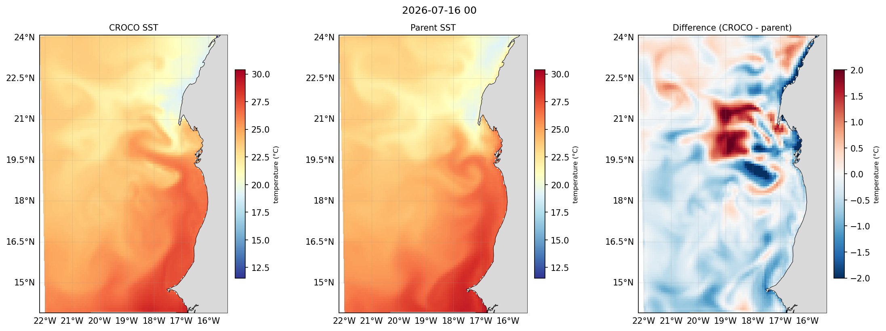

For your region you have a compiled model that has **run to completion**, with all
its inputs and outputs in the run folder:

```
forecast/scratch/Canary_12/
├── croco                       # the compiled program
├── cppdefs.h param.h croco.in jobcomp   # your edited config (also in configs/Canary_12)
├── compile.log
├── run.log                     # the proof it ran to MAIN: DONE
├── CROCO_FILES/
│   ├── croco_grd.nc            # grid + land mask
│   ├── crocotools_param.py     # pre-processing parameters
│   ├── croco_ini_MERCATOR_*.nc # initial condition
│   ├── croco_bry_MERCATOR_*.nc # boundary conditions
│   ├── croco_his.nc            # history output (this run)
│   ├── croco_avg.nc            # averages output (this run)
│   └── croco_rst.nc            # restart — can seed a subsequent run
└── downloaded_data/            # Mercator + GFS (+ for_croco forcing)
```

## A first look at the output

Compare the run against the Mercator product it was built from. Run from `~/seaforward`:

```python
import sftools.validation as val

HIS  = "forecast/scratch/Canary_12/CROCO_FILES/croco_his.nc"
MERC = "forecast/scratch/Canary_12/downloaded_data/MERCATOR/MERCATOR_20260711_00.nc"

val.compare_sst(HIS, MERC, Yorig=2000, out="sst_vs_mercator.png")
val.compare_ssh(HIS, MERC, Yorig=2000, out="ssh_vs_mercator.png")
val.compare_currents(HIS, MERC, Yorig=2000, out="cur_vs_mercator.png")
```

Replace the date in the Mercator filename with your own download's. Each call draws
three panels — CROCO, the parent regridded onto the CROCO grid, and the difference —
and prints the domain statistics:

```
SST  CROCO vs parent:
  [SST]  n=8390  bias=-0.213  RMSE=0.660  cRMSE=0.624  corr=0.955
```



`bias` is the mean offset, `RMSE` the total error, `cRMSE` the error after removing
the bias, and `corr` the spatial correlation. At the start of a run the two fields
are near-identical — the model *is* the interpolated parent, so agreement proves the
interpolation and the vertical grid are right, not that the model has skill.
Differences develop as the run proceeds and the finer grid resolves structure the
parent cannot.

Phase 5 covers these tools in full, including `margin_deg` to trim the sponge band
before computing statistics, and validation against independent observations rather
than the parent product.

**Next:** turning the raw NetCDF into plots, sections and comparisons is
**post-processing**, covered in Phase 5.