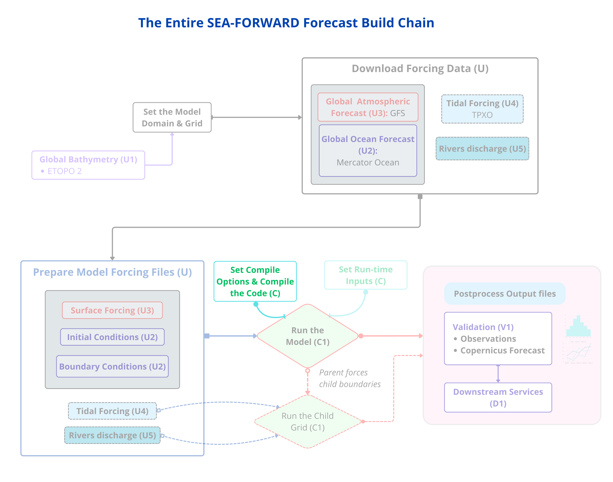

*Step 10 **compiles** the model into a runnable program.*

This turns the source + your compile-time files into an executable called `croco`.
It's a command, not an edit — but one detail matters a lot.

First, **stage** the three compile-time files from the recipe folder into the run
folder (where the build happens). `croco.in` is *not* needed yet — it's a run-time
file, edited next in Step 11 — so only these three go in now:

```bash
cd ${FCAST}
cp ${CONFIG_DIR}/{cppdefs.h,param.h,jobcomp} .
```

Then set the compile environment and build. **Compile outside conda** so the
system linker uses your `opt_seq` NetCDF, not conda's:

```bash
conda deactivate                 # leave conda for the link step
source ~/seaforward/env.sh       # ensures opt_seq's nf-config + compilers are set
which nf-config                  # must show .../seaforward/opt_seq/bin/nf-config
./jobcomp 2>&1 | tee compile.log | tail -40
```

**Why `conda deactivate` first:** conda ships its own NetCDF, and if it's ahead
on the path the build fails with a confusing `libcurl` / `CURL_OPENSSL` error.
Leaving conda lets the system linker use your `opt_seq` build. Sourcing `env.sh`
keeps `opt_seq/bin` on `PATH` and the compilers set.

!!! warning
    ⚠️ **WATCH — `which nf-config` must show `opt_seq`, not a conda path.** If it shows conda, run `conda deactivate`, `source ~/seaforward/env.sh`, and re-check before `./jobcomp`.

!!! check
    ✅ **CHECK** — after a few minutes you see the CROCO ASCII logo and **`CROCO is OK`**, and a `croco` program appears:
    ```bash
    ls -lh ${FCAST}/croco
    ```