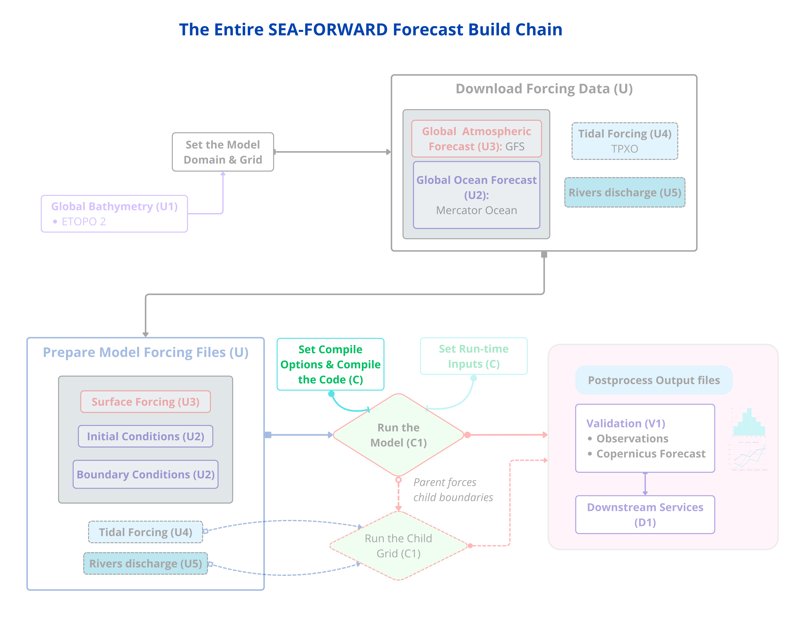

*Step 10 **compiles** the model into a runnable program.*

This turns the source and your compile-time files into an executable called
`croco`. It is a command rather than an edit, but where you run it from matters.

First, **stage** the three compile-time files from the config folder into the run
folder, where the build happens:

```bash
cd ${FCAST}
cp ${CONFIG_DIR}/{cppdefs.h,param.h,jobcomp} .   # croco.in is run-time — Step 11
```

Then set the compile environment:

```bash
conda deactivate                 # leave conda for the link step
source ~/seaforward/env.sh       # ensures opt_seq's nf-config + compilers are set

echo "CONDA_PREFIX = ${CONDA_PREFIX:-(none - good)}"
nf-config --flibs                # the -L path the linker will actually use
```

`CONDA_PREFIX` must print `(none - good)` and `--flibs` must point into
`opt_seq`. If `CONDA_PREFIX` shows a path instead, conda is still active —
deactivate, source `env.sh` again and re-check before going on.

```bash
./jobcomp 2>&1 | tee compile.log | tail -40
```

**Why conda has to be off:** conda ships its own NetCDF, and an active conda
environment points the linker at `$CONDA_PREFIX/lib` through `LDFLAGS` and its
own binutils. `-lnetcdf` then resolves there rather than in `opt_seq`, and the
build fails — either with `cannot find -lnetcdf`, or with a confusing `libcurl`
/ `CURL_OPENSSL` error from a NetCDF built against a different curl. Sourcing
`env.sh` keeps `opt_seq/bin` on `PATH` and the compilers set.

!!! check
    After a few minutes you see the CROCO ASCII logo and **`CROCO is OK`**, and a `croco` program appears:
```bash
    ls -lh ${FCAST}/croco
```
