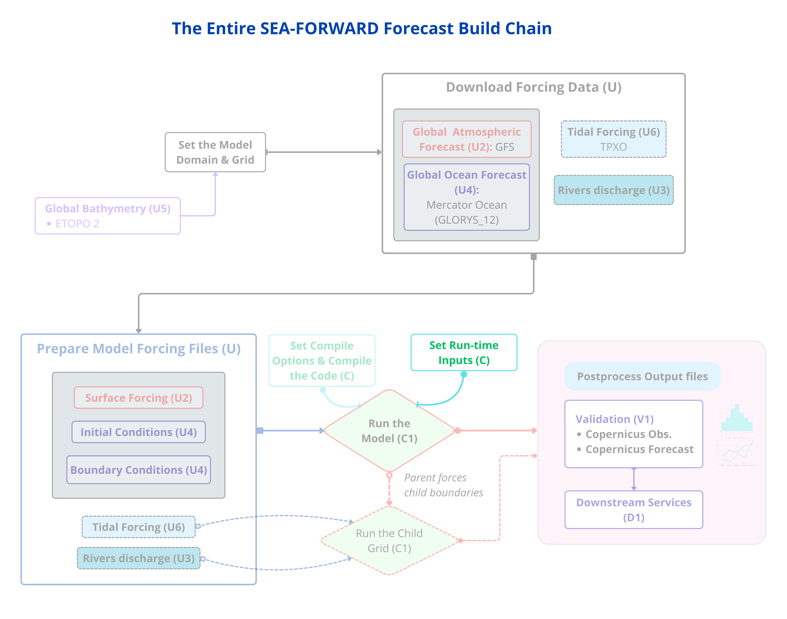

*Step 11 sets the **run-time inputs** in `croco.in` — dates, filenames, output intervals. Changing these needs no recompile.*

`croco.in` is the model's run recipe. You already compiled — this file is read at
*run* time, not compile time, which is why it comes after the build. Edit the
recipe copy in your config folder:

```bash
nano ${CONFIG_DIR}/croco.in
```

### 11.1 — Title

`Ctrl-W`, `BENGUELA TEST`, Enter. Change the title line to your config's name:

```
        CANARY_12 FORECAST
```

Cosmetic, but keeps configs identifiable.

### 11.2 — The S-coordinate (check it matches)

`Ctrl-W`, `S-coord`, Enter. The line below should read:

```
           7.0d0     2.0d0      200.0d0
```

**Confirm** it's `7.0 / 2.0 / 200.0` — these are `theta_s / theta_b / hc`, and
they **must equal** your `sigma_params` from Step 4. The template usually already
has these — check, don't assume.

### 11.3 — The sponge (remove the placeholders)

`Ctrl-W`, `X_SPONGE`, Enter. The line **below** the header may show `XXX  XXX`.
Change it to real numbers:

```
                    50000.            400.
```

**What:** a 50 km "sponge" band near the open boundaries that absorbs outgoing
waves so they don't reflect back inward. `50000.` is its width in metres (≈5–6
cells at 1/12°); `400.` is the peak viscosity (m²/s). **Why:** the template
leaves `XXX` placeholders that would make CROCO error — you must set real values.
(Finer grids use smaller numbers.)

Save (`Ctrl-O`, Enter), exit (`Ctrl-X`), and confirm no placeholder remains:

```bash
grep -n "XXX" croco.in && echo "STILL HAS XXX — fix it" || echo "no XXX left — good"
```

!!! important
    The `time_stepping`, `initial`, `boundary`, and `online` lines are set at run time (Phase 3). The many `diagnostics`, `floats`, `stations`, `psource`, `sediment`, `biology`, `wkb_*` sections are inert unless their CPP switch is on, so you can ignore them for this configuration.