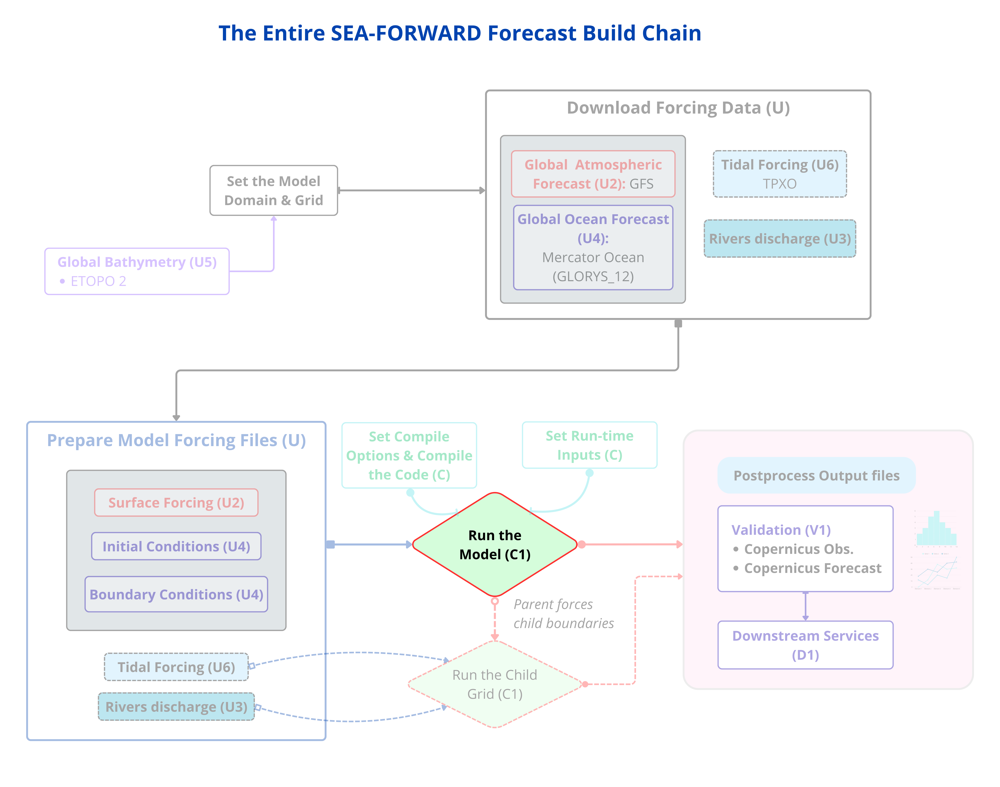

*Step 12 **runs the model** — now every prepared input converges on the run.*

Compiling only proves the code builds — it doesn't prove your grid, boundaries,
and data actually run. So do **one** manual run here. (The operational driver in
Phase 3 does this automatically every day; this single run is the by-hand proof.)

A single run needs four run-time lines set in `croco.in` — the driver would patch
these for you, but for this one manual run you set them by hand. First **stage** the
`croco.in` you just edited into the run folder (the compile step staged the other
three files; this is the last one), then patch it. Still in `${FCAST}`, with
today's dated file names:

```bash
cd ${FCAST}
cp ${CONFIG_DIR}/croco.in .            # stage the run-time file you edited in Step 11
TODAY=$(date -u +%Y%m%d)

# how long / what timestep: NTIMES = (spin-up+forecast days)*86400/dt = (2+5)*86400/300 = 2016
sed -i '/^time_stepping:/{n; s/.*/                2016     300       60      1/}' croco.in

# initial condition (NRREC=1 = start fresh from this file)
sed -i "/^initial:/{n; n; s|.*|    CROCO_FILES/croco_ini_MERCATOR_${TODAY}_00.nc|}" croco.in

# boundary file
sed -i "/^boundary:/{n; s|.*|    CROCO_FILES/croco_bry_MERCATOR_${TODAY}_00.nc|}" croco.in

# online forcing block: dummy dates + the for_croco path
sed -i '/^online:/{n;   s/.*/           9999   1      24            9999     1/}' croco.in
sed -i "/^online:/{n; n; s|.*|    ${FCAST}/downloaded_data/GFS/for_croco/|}" croco.in
```

!!! important
    **Why these values.** `dt=300` s and `NTIMES=2016` integrate **7 days** — the whole `today−2 … today+5` window — as **one continuous cold-started run**. (This is not the two-phase spin-up/forecast cycle described at the end of the chapter; that splits the same window into a separate spin-up and forecast. Here it is a single straight integration, enough to prove the configuration runs.) `9999 1 24 9999 1` is the dummy-date convention that pairs with the `Y9999M01` forcing files (24 = hourly records). With `USE_CALENDAR` off (the regional default), CROCO ignores real calendar dates and just steps through the records — so you don't hand-edit real dates here.

!!! note
    **Leave `start_date` / `end_date` alone.** You'll see lines like `start_date: 2000-01-01 00:00:00` in `croco.in`. Because `USE_CALENDAR` is off, CROCO **ignores** them — they have no effect on the run, so there's nothing to change. (The operational driver in Phase 3 does fill them in per phase, purely for bookkeeping; the model still ignores them when the calendar is off.)

Now run the model (outside conda, same linker reason as compiling):

```bash
cd ${FCAST}
conda deactivate
source ~/seaforward/env.sh
./croco croco.in 2>&1 | tee run.log | tail -60
```

**What to watch:** it reads the grid, initial, boundary and weather files
(`GET_INITIAL`, `GET_BRY`, `ONLINE_BULK -- Read file`), then a table of steps
counting toward 2016. The kinetic-energy column should stay small and steady (not
grow), and `trd` should be `0`.

!!! check
    ✅ **CHECK** — it ends with **`MAIN: DONE`** and writes the outputs:
    ```bash
    ls -lh ${CF}/croco_his.nc ${CF}/croco_avg.nc
    tail -6 run.log
    ```

You should see `croco_his.nc` (history) and `croco_avg.nc` (averages). The
`IEEE_UNDERFLOW` note at the very end is **harmless**. **Your configuration is now
proven** — it builds *and* runs.

!!! important
    **If it crashes with `Abnormal termination: netCDF INPUT`** right after "Open Meteo file" — it's the GFS longitude issue; redo the GFS-longitude fix in Step 5b. **If numbers go `NaN` / it says `BLOW UP`** — an instability: recheck the open boundaries (Step 3) match the mask, and that the timestep isn't too large.