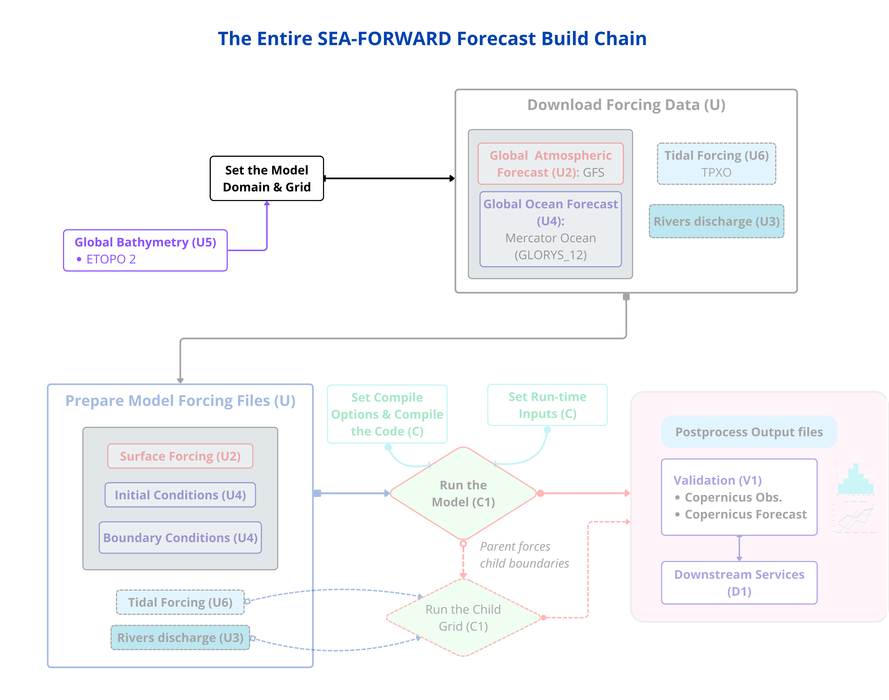

*Step 2 builds the **model grid** from bathymetry (ETOPO2) and coastline (GSHHS).*

```bash
cd ${CROCO_PYTOOLS_DIR}/prepro
python3 make_grid.py ${CONFIG_DIR}/grid.ini 2>&1 | tail -20
```

**What this does:** reads the sea-floor depth data (ETOPO2), works out which grid
points are land vs ocean (the "mask") from the coastline, and smooths the
bathymetry so the model stays stable. The scrolling `rx0`/`ry0` numbers are the
smoothing working; they settle near `0.20`. It finishes with
`Writing .../CROCO_FILES/croco_grd.nc done`.


Now read the **real** grid dimensions from the file it produced:

```bash
ncdump -h ${CF}/croco_grd.nc | grep -E "xi_rho|eta_rho"
```

!!! check
    ✅ **CHECK** for Canary_12: `xi_rho = 81`, `eta_rho = 123`.

**Write these two numbers down.** You'll need them (minus 2) for `param.h` later:

     - `LLm0 = xi_rho − 2 = 79`
     - `MMm0 = eta_rho − 2 = 121`

!!! warning
    ⚠️ **WATCH — use the numbers from the file, not the estimate.** The estimate said 79×121; the real grid is 81×123. The `− 2` removes two boundary rows CROCO adds internally.