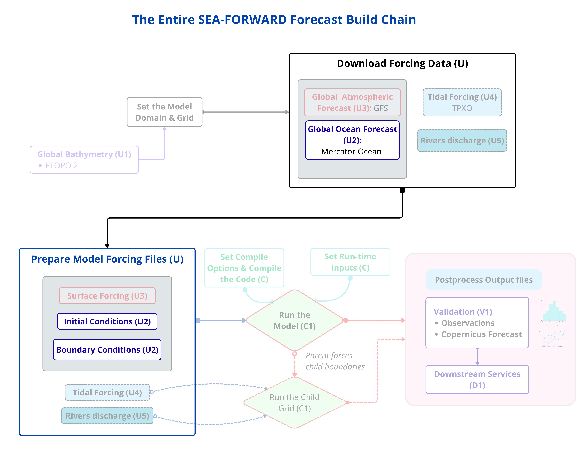

Now, let’s talk about how to construct the ocean boundaries



**Step 4** — Write `crocotools_param.py`
To do so, we must edit primarily the file `crocotools_param.py`. This file tells the tools that build the initial and boundary conditions about your grid. The CLI reads it from the folder you point make_ini/make_bry at (your CROCO_FILES). Create and edit it:

```bash
nano ${CF}/crocotools_param.py
```

The file is empty. **Type in** the following (don't type the explanations that
follow):

```python
inputdata    = 'mercator'
Nzgoodmin    = 4
multi_files  = False
tracers      = ['temp', 'salt']
croco_grd    = 'croco_grd.nc'
sigma_params = dict(theta_s=7, theta_b=2, N=50, hc=200)
ini_prefix   = 'croco_ini_MERCATOR'
bry_prefix   = 'croco_bry_MERCATOR'
obc_dict     = dict(south=1, west=1, east=0, north=1)
cycle_bry    = 0
```

Save: `Ctrl-O`, Enter. Exit: `Ctrl-X`.

**Line by line — what each is:**

- `inputdata = 'mercator'` — the global ocean data comes from Mercator (variables named `zos/thetao/so/uo/vo`). This tells the reader which naming to expect.
  **(Hindcast: this becomes `'glorys'`.)**
- `Nzgoodmin = 4` — minimum good vertical levels before the tool fills gaps.
- `multi_files = False` — your ocean data is one merged file, not many.
- `tracers = ['temp', 'salt']` — temperature and salinity, carried through the water.
- `croco_grd = 'croco_grd.nc'` — the grid filename, in the same folder.
- `sigma_params = dict(theta_s=7, theta_b=2, N=50, hc=200)` — the **vertical grid**: 50 layers from surface to sea floor, stretched to pack more near the surface. **These four numbers must match `croco.in` and `param.h` later.**
- `ini_prefix` / `bry_prefix` — the names your initial/boundary files will get.
- `obc_dict = dict(south=1, west=1, east=0, north=1)` — **your boundaries from Step 3.** Change these to match *your* mask for a different region.
- `cycle_bry = 0` — the boundary data uses real dates, not a repeating loop.

!!! important
    **Keep a copy with the recipe.** Also save this file into your config folder so the recipe is complete: `cp ${CF}/crocotools_param.py ${CONFIG_DIR}/`.

!!! warning
    ⚠️ **WATCH — `sigma_params` must match everywhere.** `theta_s=7, theta_b=2, N=50, hc=200` here must equal the S-coord line in `croco.in` and the `N` in `param.h`. If they differ, the model's vertical grid won't match its inputs.