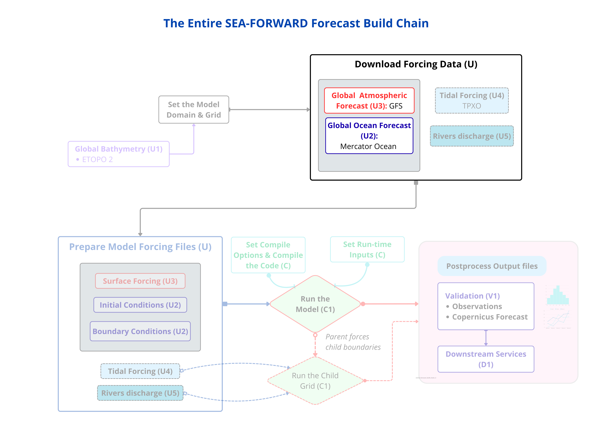
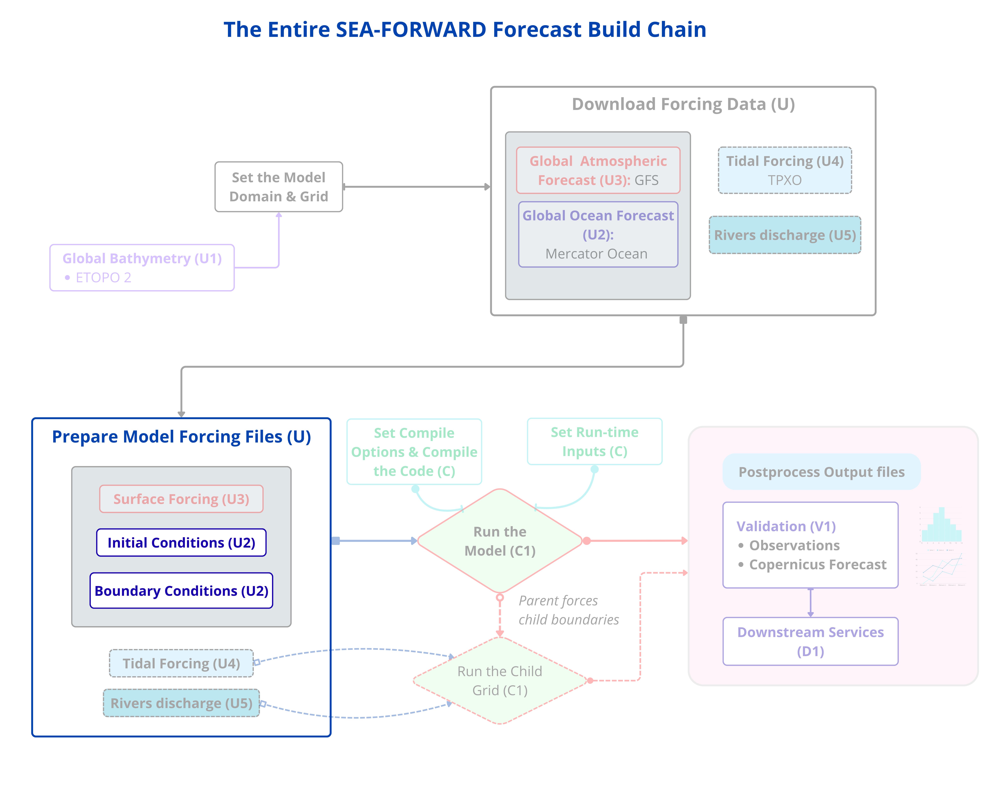
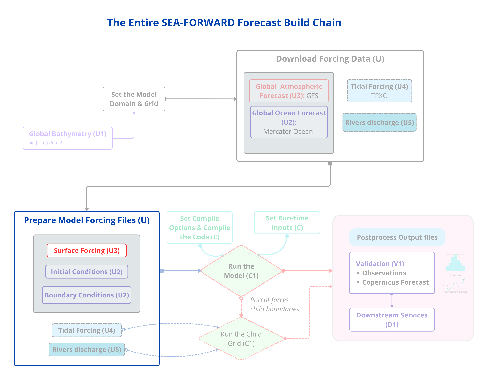
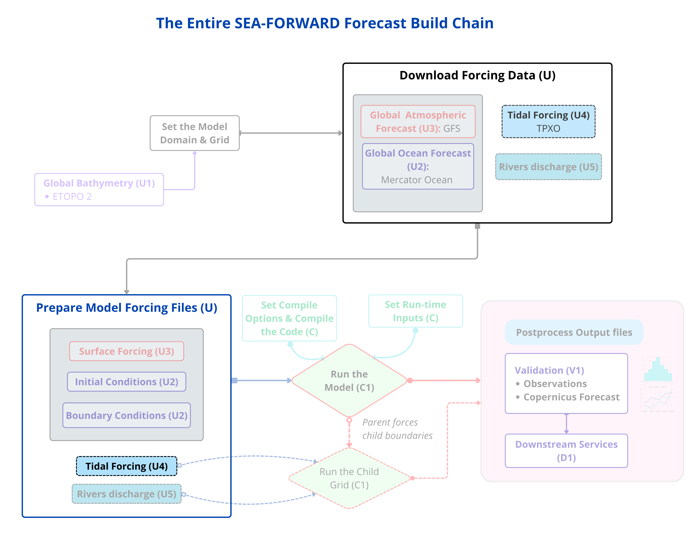
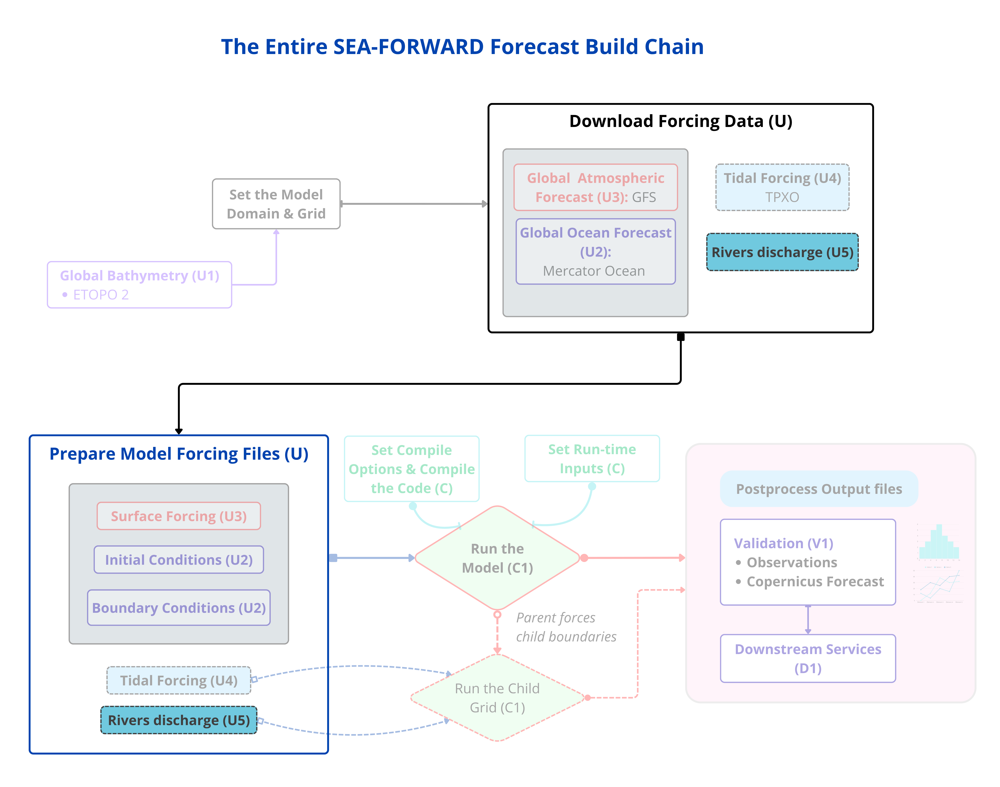

This is where the **upstream data sources become model inputs**. You do it in the
order you actually run it: **download the forcing data first, then shape it** into
what the model reads. The workflow diagram has exactly these two columns — the
downloads on the left, the prepared inputs in the middle.

The sources involved:

- **Global ocean forecast** (Mercator) → the initial condition and boundaries
- **Atmosphere** (GFS) → the surface forcing
- **Tides** (TPXO) → *optional*, skipped here
- **Rivers** (Dai & Trenberth) → *optional*, skipped here

Bathymetry was the fifth source, already wired in at the grid (Step 2). This guide
produces the **tide-free, river-free** forecast, so you download and prepare the
ocean and the atmosphere, and stop.

First set up the shared bits:

```bash
cd ${SEAFORWARD}
export RUN_DT="$(date -u +'%Y-%m-%d') 00:00:00"
```

!!! warning
    **Negative longitudes need `--domain=` with an equals sign.** Because your box is west of Greenwich, the domain string starts with `-`, and the command reader mistakes it for an option unless you attach it with `=`. Use `--domain="${EXTENTS}"`.

### 5a — Download the forcing data



*First, pull down both global datasets — the ocean and the atmosphere. Nothing is shaped yet; you're just fetching the raw data your region sits inside.*

**Download the global ocean** (Mercator). It asks for your Copernicus Marine login the first time, then remembers it.

```bash
python seaforward.py download_ocean \
    --domain="${EXTENTS}" --run_date "${RUN_DT}" \
    --hdays ${HDAYS} --fdays ${FDAYS} \
    --outputDir ${FCAST}/downloaded_data/MERCATOR
```

**Download the global weather** (GFS).

```bash
python seaforward.py download_atmosphere \
    --domain="${EXTENTS}" --run_date "${RUN_DT}" \
    --hdays ${HDAYS} --fdays ${FDAYS} \
    --outputDir ${FCAST}/downloaded_data/GFS
```

!!! check
    Both `downloaded_data/MERCATOR` and `downloaded_data/GFS` now hold raw global files covering your download box.


### 5b — Prepare the model inputs

Now shape the raw downloads onto your grid. Each source becomes its own model
input: the **ocean** becomes the initial and boundary conditions, the
**atmosphere** becomes the surface forcing. Do them in turn.

**From the ocean → initial + boundary conditions**



*The global ocean forecast supplies both the state your model starts from and the values that flow in at the open edges — both interpolated from the one Mercator file you downloaded. The figure below shows how this is implemented.*

<figure style="text-align: center; margin: 20px 0;">
  
  <figcaption style="font-size: 1em; color: #555; margin-top: 8px; font-style: italic;">
    Ingesting the global ocean forecast: the downloaded product, the model grid and the run date pass through the SEA-FORWARD pytools, which subset, convert and interpolate them onto your grid — producing the initial condition and the open boundary conditions.
  </figcaption>
</figure>

Build the **initial condition** (the ocean's state at the start):

```bash
export MERC=${FCAST}/downloaded_data/MERCATOR/MERCATOR_$(date -u +'%Y%m%d')_00.nc
python seaforward.py make_ini \
    --input_file ${MERC} --output_dir ${CF} \
    --run_date "${RUN_DT}" --hdays ${HDAYS} --Yorig ${YORIG}
```

!!! check
    It interpolates temp/salt/u/v onto the sigma layers and prints `Initial file created … croco_ini_MERCATOR_<date>_00.nc`.

Build the **boundary conditions** (what flows in at the open edges over time):

```bash
python seaforward.py make_bry \
    --input_file ${MERC} --output_dir ${CF} \
    --run_date "${RUN_DT}" --hdays ${HDAYS} --fdays ${FDAYS} --Yorig ${YORIG}
```

!!! check
    It processes **south, west, north** and **skips east**. That's your `obc_dict` in action: it only builds data for the *open* boundaries. The mask, `obc_dict`, and the `OBC_*` switches all describe the same set of open edges.

**From the atmosphere → surface forcing**



*The global weather becomes the surface forcing — the ten files (wind, heat, radiation, pressure, humidity, precipitation) CROCO reads at every timestep. The figure below shows how this is implemented.*

<figure style="text-align: center; margin: 20px 0;">
  
  <figcaption style="font-size: 1em; color: #555; margin-top: 8px; font-style: italic;">
    Preparing the atmospheric forcing: the downloaded GFS fields, the run date and the model grid pass through the SEA-FORWARD pytools, which subset, convert and interpolate them onto your grid — producing the surface forcing files CROCO reads at run time.
  </figcaption>
</figure>

Build the **surface forcing**:

```bash
python seaforward.py make_forcing \
    --gfsDir ${FCAST}/downloaded_data/GFS \
    --outputDir ${FCAST}/downloaded_data/GFS/for_croco \
    --Yorig ${YORIG}
ls ${FCAST}/downloaded_data/GFS/for_croco/*.nc | wc -l   # expect 10
```

!!! check
    It works through Temperature, Humidity, Precipitation, the four radiation fluxes, U/V wind, and pressure, then `10` files exist.

**Fix the GFS longitudes — only for western-hemisphere regions.** GFS labels
longitude from 0 to 360; your model uses −180 to 180. For a region west of
Greenwich these don't match, and the model would crash reading the weather
forcing. Check whether you're affected:

```bash
python3 -c "
import xarray as xr
g = xr.open_dataset('${CF}/croco_grd.nc')
f = xr.open_dataset('${FCAST}/downloaded_data/GFS/for_croco/TEMPERATURE_HEIGHT_ABOVE_GROUND_Y9999M01.nc')
print('MODEL   lon: %.2f .. %.2f' % (float(g.lon_rho.min()), float(g.lon_rho.max())))
print('FORCING lon: %.2f .. %.2f' % (float(f.lon.min()), float(f.lon.max())))
print('covers?', float(f.lon.min())<=float(g.lon_rho.min()) and float(f.lon.max())>=float(g.lon_rho.max()))
"
```

If it says `covers? False` and the forcing lon numbers are big (like 336..346),
run the one-time conversion that shifts the axis to −180..180:

```bash
cd ${FCAST}
python3 << 'PYEOF'
import xarray as xr, glob, os
for f in sorted(glob.glob('downloaded_data/GFS/for_croco/*.nc')):
    d = xr.open_dataset(f); lon = d['lon'].values
    if lon.max() > 180:
        d = d.assign_coords(lon=((lon + 180) % 360) - 180).sortby('lon')
        tmp=f+'.tmp'; d.to_netcdf(tmp); d.close(); os.replace(tmp, f)
        print('fixed', os.path.basename(f))
    else:
        d.close()
print('done')
PYEOF
```

!!! check
    Re-run the check above; it should now say `covers? True` with forcing lon around your box. Eastern-hemisphere regions skip this — their GFS longitudes already fall in range.


### 5c — Tides



*Tides are the one forcing no global ocean product carries. If your domain has a shelf or coast where the tide is a large signal, you add it from a tidal atlas (TPXO); deep open-ocean domains skip it.*

This guide builds the **tide-free** forecast, so you do not build this source here.
For completeness, in the same download-then-shape pattern:

- **There is nothing to download per cycle** — the TPXO atlas is a fixed dataset —
  but the tide file *is* regenerated each cycle, because its phase is keyed to the
  run's start date.
- **Shape the atlas onto your grid** with a single tool (`make_tides`), which writes
  a `croco_frc.nc` tidal-forcing file.
- **Turn tides on at compile time** with the `TIDES` switch in `cppdefs.h`, so a
  tidal run is a *different binary* — the same compile-time-vs-run-time distinction
  you meet at Step 7.

Because tides touch both the data preparation *and* the compile step, they are a
chapter of their own. **See Phase 10 (Tides)** for the full build.

### 5d — Rivers



*Rivers are the one input that comes from land rather than from the global ocean or the atmosphere. For domains with a significant river mouth — a delta, an estuary — the freshwater they add is what keeps coastal salinity and stratification right.*

This guide builds the **river-free** forecast, so you do not build this source here.
For completeness, and to show where rivers differ from tides:

- **There is nothing to download per cycle** — rivers use a fixed climatology (Dai &
  Trenberth) already on disk. And unlike tides, the river file is **built once**, not
  regenerated each cycle: a climatology repeats every year, so CROCO reads the right
  day-of-year on any date.
- **Shape the climatology onto your grid** with two tools: `dai_rivers.py` picks your
  region's rivers by reading the grid, and `make_river_run.py` builds them into a
  `croco_runoff.nc` runoff file plus the `psource` block for `croco.in`.
- **Turn rivers on at compile time** with the `PSOURCE` / `PSOURCE_NCFILE` switches in
  `cppdefs.h`, so a river run is a *different binary* — the same distinction you meet
  at Step 7 and with tides.

Because rivers touch the data preparation, the compile step *and* `croco.in`, they are
a chapter of their own. **See Phase 11 (Rivers)** for the full build.

### 5e — Confirm your inputs are in place

```bash
ls -lh ${CF}/croco_ini_MERCATOR*.nc ${CF}/croco_bry_MERCATOR*.nc
ls ${FCAST}/downloaded_data/GFS/for_croco/*.nc | wc -l   # 10
```

You now have the two sources this forecast needs: the **ocean** (ini + bry) and the
**atmosphere** (surface forcing). **Bathymetry** was already wired in at the grid
(Step 2). **Tides** and **rivers** are the optional sources, skipped here. That is the
full upstream picture for a forecast.