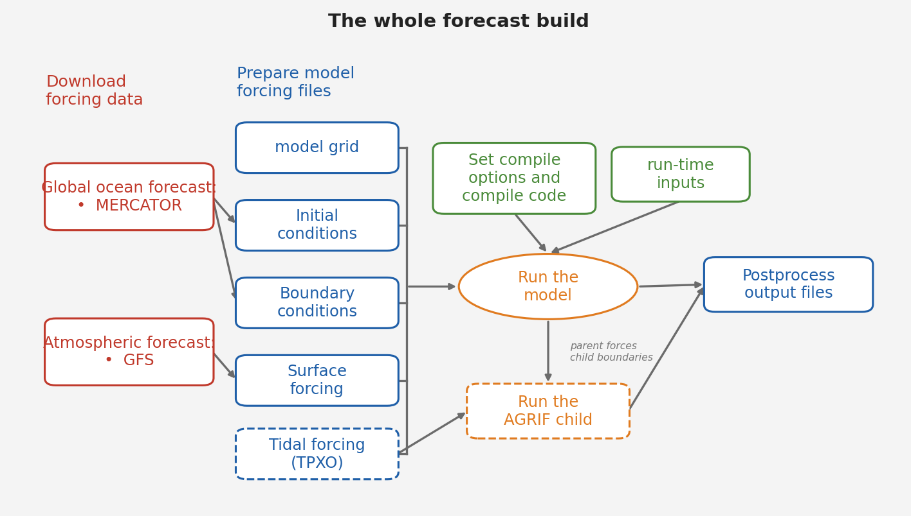

## The upstream data — what feeds your model, and what you choose

*The whole forecast build. Each step below highlights the piece it produces; the two dashed boxes (tides, AGRIF child) are optional add-ons covered in later chapters.*

Before the steps, understand *what* the model eats. A regional model doesn't
invent the ocean — it takes global datasets, the **upstream data sources**, and
refines them over your box. There are only a handful, and each one you either
**download and shape** (a per-cycle input) or **build once** (the grid). Knowing
which source does what is what lets you decide, later, what to change for a
different run.

Here is everything, and the role each plays:

| upstream source | what it gives the model | product | you set it in |
|---|---|---|---|
| **Bathymetry** | the sea-floor shape — the geometry itself | ETOPO2 + GSHHS | the grid (Step 2), once |
| **Parent ocean model** | initial state + open-boundary values | **Mercator** | `crocotools_param.py` + `make_ini`/`make_bry` (Steps 4–5) |
| **Atmospheric forcing** | wind, heat, pressure, rain at the surface | **GFS** | `cppdefs.h` `ONLINE` + `make_forcing` (Steps 5, 7) |
| **Tides** *(optional)* | tidal rise/fall at the boundaries | **TPXO** | `cppdefs.h` `TIDES` + `make_tides` *(Phase 10)* |
| **River inputs** *(not yet used)* | coastal freshwater | GloFAS | — |

Read the roles, because they tell you *where* each enters:

- **Bathymetry** is not forcing — it's the shape of the basin the model solves
  in. It's baked into `croco_grd.nc` at grid build and never touched again. The
  one upstream source you don't regenerate each run.
- **The global ocean forecast** is the big one. It gives the *initial condition*
  (the ocean state at t=0, from `make_ini`) and the *boundary conditions* (what
  flows in at your open edges over time, from `make_bry`). This is the ocean your
  model refines. It comes from **Mercator**, the global ocean forecast product.
- **Atmospheric forcing** is the weather that drives the ocean from above. It
  comes from **GFS**, the global weather forecast.
- **Tides** are optional and added separately (Phase 10). No global ocean product
  carries tides, so if your domain has a shelf or coast where the tide matters,
  you add it from TPXO. If your domain is deep open ocean, you skip it.
- **Rivers** are available in the tools but not yet wired into the pipeline — a
  future addition for domains where coastal freshwater (a big river mouth)
  matters.

So as you go through the steps, notice that **three sources are being wired in**:
the bathymetry (Step 2, into the grid), the global ocean forecast (Steps 4–5, ini + bry),
and the atmosphere (Steps 5, 7, the forcing). Tides come later as an add-on. When
you build your own region, *these* are the things you'd reconsider — and the table
above is your checklist.

### The build at a glance

The twelve steps fall into four natural stages:

| stage | steps | what you produce |
|---|---|---|
| **Grid** | 0–3 | the model grid and its open/closed boundaries |
| **Data** | 4–5 | download the global data, then shape it into initial conditions, boundaries, and surface forcing |
| **Build** | 6–10 | the four config files, then the compiled `croco` binary |
| **Run** | 11–12 | the run-time settings, then a proof run to `MAIN: DONE` |

Each step opens with the workflow diagram, the piece it produces highlighted, so
you always know which stage you are in.
