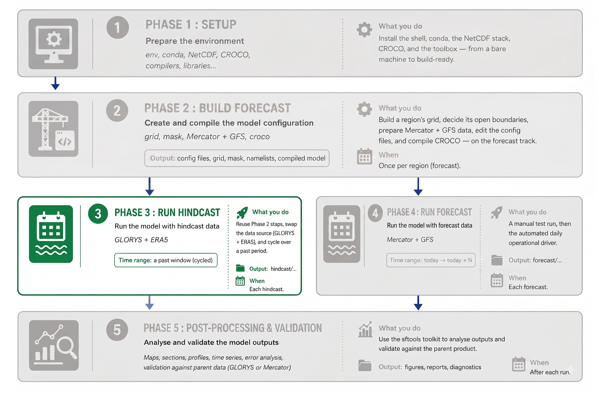
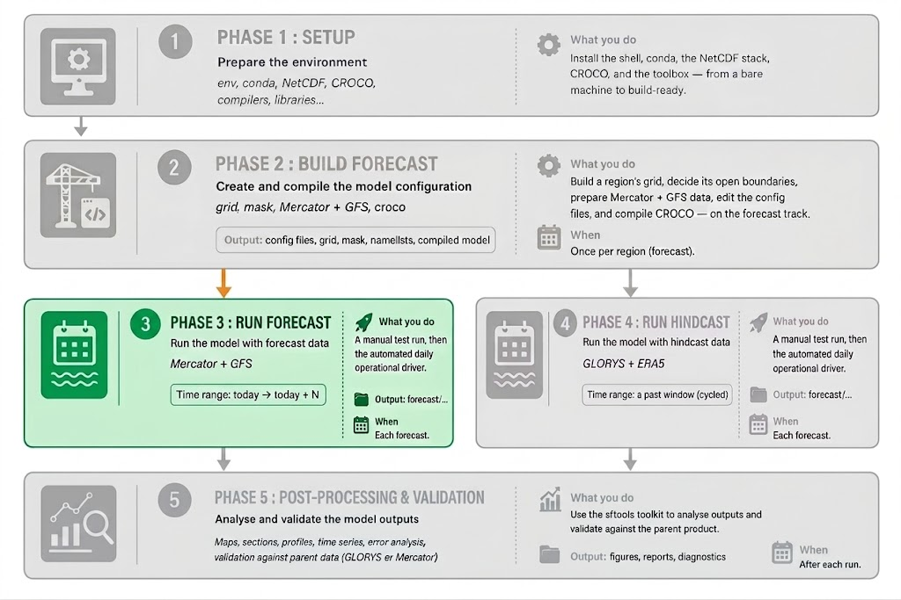

# Phase 3 — Running a Forecast

<!--  -->

At the end of Phase 2 you have a **compiled forecast configuration** for your
region — the `croco` program plus its grid, initial condition, boundary
conditions, and surface forcing, all under `forecast/scratch/<CONFIG>/`. This
document runs it two ways:

- **Part A — a single manual run.** You already built and ran this in Phase 2;
  here it's recalled briefly, as the "run it once by hand" baseline.
- **Part B — the operational driver.** One script that does the full daily cycle
  automatically: a **2-day spin-up** followed by a **5-day forecast** initialised
  from the spin-up's end, using data for the whole `today−2 … today+5` window,
  saved into `forecast/model-runs/`.

Part B is the real content of this phase.

!!! note
    **The driver ships set up for `Canary_12`.** Everything in Part B is shown for that configuration. When you run a **different** region, update the driver's settings to match the config you built in Phase 2 — otherwise it runs Canary_12 instead of yours.

!!! important
    **Prerequisite:** Phase 2 complete for your region — `croco` compiled and the `CROCO_FILES/` inputs present under `forecast/scratch/<CONFIG>/`.