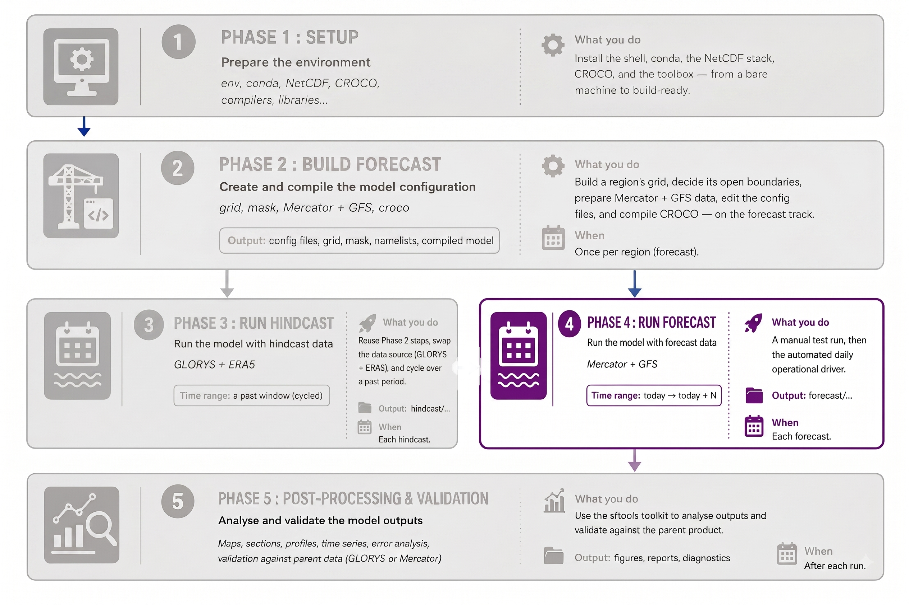
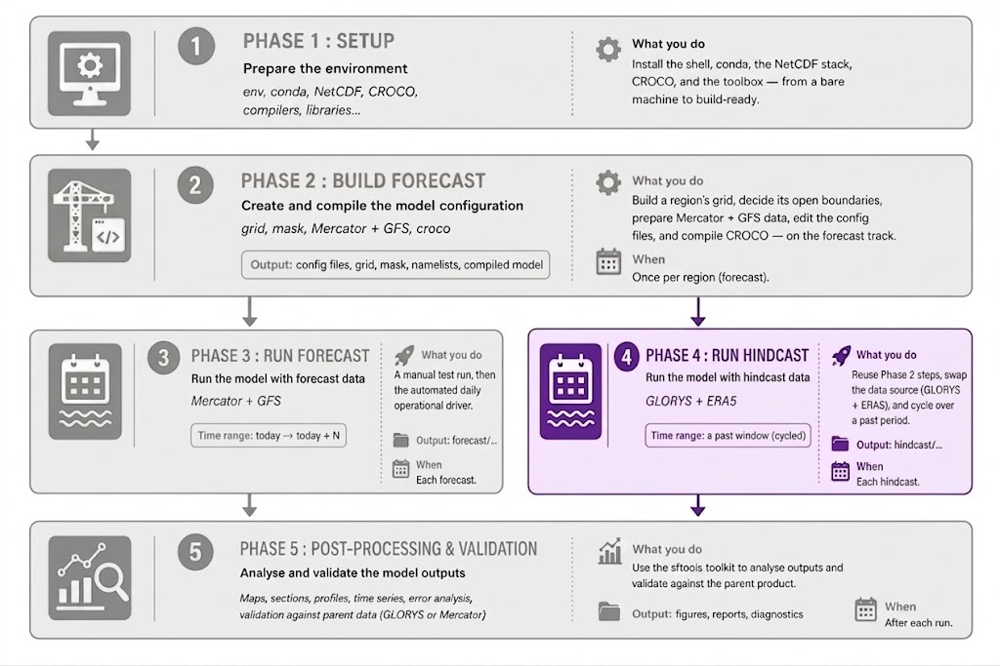
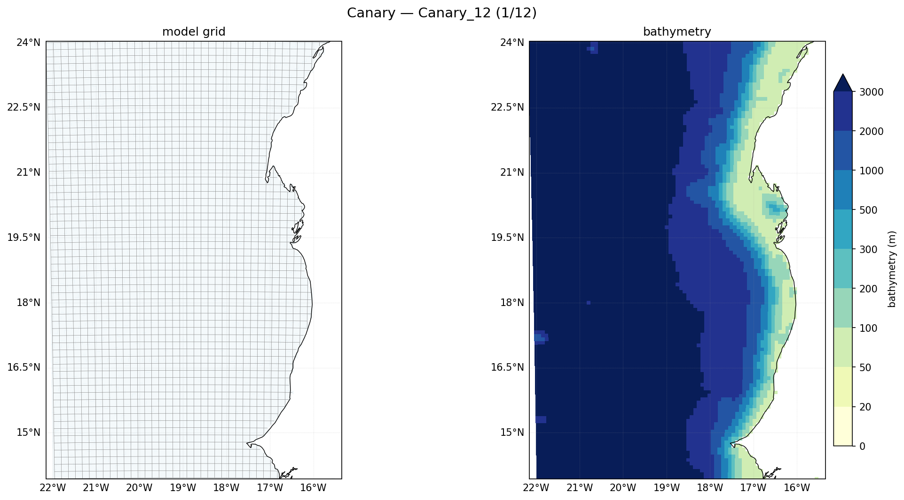

# Phase 4 — Running a Hindcast

<!--  -->

A **hindcast** reconstructs the ocean for a **past** period, rather than
predicting the future. The model and the workflow are the same as the forecast;
what changes is the **data**:

|                     | Forecast (Phases 2–3)             | Hindcast (this phase)                     |
| ------------------- | --------------------------------- | ----------------------------------------- |
| Ocean source        | Mercator analysis-forecast (anfc) | **GLORYS** reanalysis (CMEMS)             |
| Atmosphere source   | GFS (online)                      | **ERA5** reanalysis (online, ECMWF format) |
| Time direction      | today → today+N                   | a chosen past window                      |
| Track folder        | `forecast/`                       | `hindcast/`                               |
| Time origin `Yorig` | 2000                              | **1993** (GLORYS/reanalysis convention)   |

Because the grid, the config files, and the run mechanics are the same skeleton
as Phase 2, this document focuses on **what's different for a hindcast** and
points back to Phase 2 for the shared steps. By the end you'll have built a
GLORYS + ERA5 hindcast config for a region, proven a single run, and run a
multi-cycle hindcast (2-day spin-up + 5-day hindcast per cycle) over a past
window — including one that **crosses the year boundary**.

The worked example is again **Canary_12** (22°W–15.5°W, 14°N–24°N, 1/12°), for
**December 2025 → January 2026**.

!!! important
    **Prerequisites:** Phase 1 (Setup) done, and you've read Phases 2–3 (the hindcast reuses their steps and vocabulary). You need a **CDS account + API key** for ERA5 (explained in [Step 3](step3.md)).

!!! note
    **How to read this guide** — same conventions as Phase 2: `nano` hand-edits with **What / Why**, `✅ CHECK`, `⚠️ WATCH`.

---

## The idea: same model, reanalysis data, run in cycles

A hindcast forces the same CROCO model with **reanalysis** products — best
estimates of the _past_ ocean (GLORYS) and atmosphere (ERA5). You run a long
past period in **cycles**: each cycle is a short model run (here a 2-day spin-up
followed by a 5-day hindcast), and cycles tile the period. Every cycle re-starts
its ocean state from GLORYS, so the reconstruction stays anchored to the
reanalysis rather than drifting.

The SEA-FORWARD hindcast tools are exposed through the same CLI as the forecast
(`seaforward.py`), with a parallel set of **`*_hindcast`** subcommands.