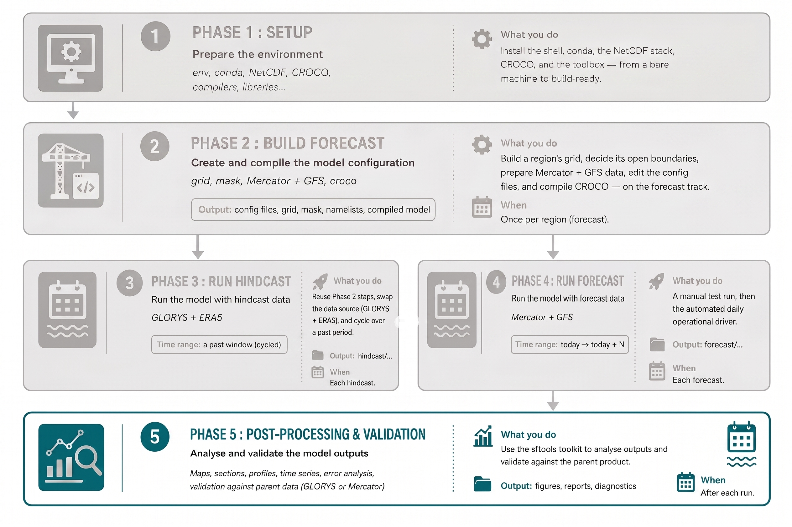
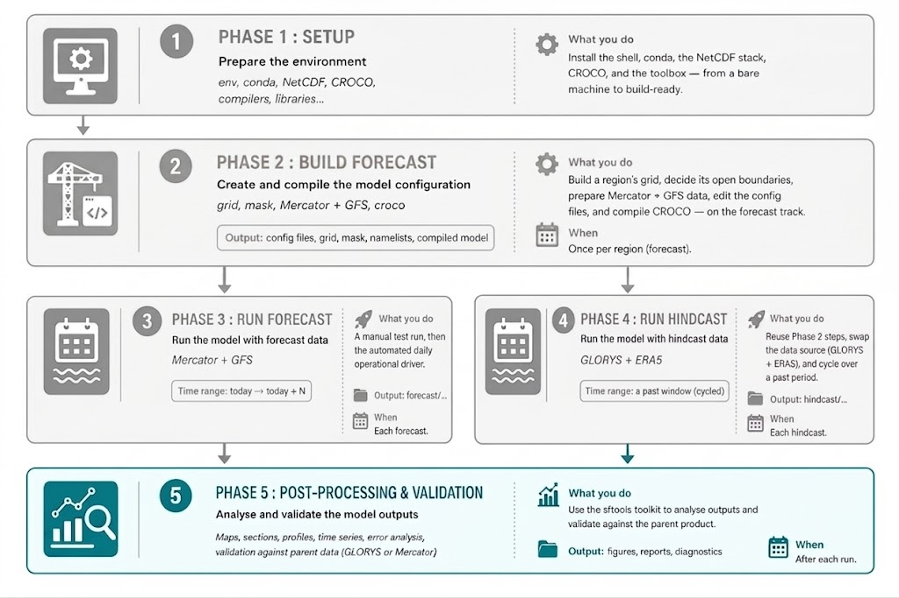
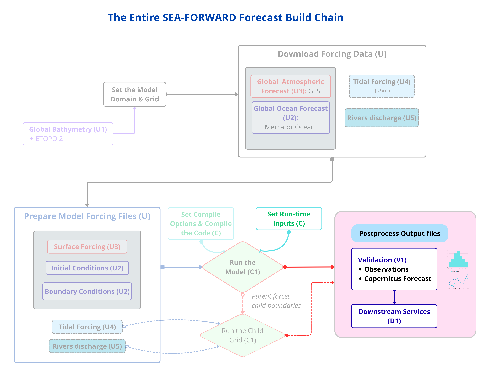

# SEA-FORWARD — Phase 5: Post-processing & Validation

<!--  -->

SEA-FORWARD ships a small, self-contained Python toolkit for analysing CROCO
output — making maps, sections, profiles, Hovmöller diagrams and time series,
and for validating a run against the parent product it was downscaled from
(GLORYS for hindcasts, Mercator for forecasts).

The figure below highlights where this phase sit on in the SEA-FORWARD entire build chain

The toolkit lives in `sftools/` and is organised into four modules:

| Module                    | Purpose                                                                                                                                             |
| ------------------------- | --------------------------------------------------------------------------------------------------------------------------------------------------- |
| `sftools/postprocess.py`  | Load CROCO output; extract fields, sections, profiles, time series; compute derived quantities (speed, vorticity, EKE) at the surface or any depth. |
| `sftools/define_attrs.py` | A single registry of CF metadata **and** display defaults (colormap, range) for every variable. Plots label and colour themselves from this.        |
| `sftools/plotting.py`     | Attribute-driven plotting: generic builders plus a smart `plot()` wrapper that auto-detects the plot type.                                          |
| `sftools/validation.py`   | Model-vs-parent validation: maps, error growth, profiles, sections, time series, and error-vs-depth — all on the CROCO grid.                        |

The design philosophy is a clean separation:

- **Extractors** (in `postprocess`) build a labelled `xarray.DataArray` — they decide _what_ data (which variable, depth, time).
- **Plotters** (in `plotting`) decide _how_ it looks (colormap, range, title) — reading the labels from the data by default.

So a typical call reads `pl.plot(pp.field(ds, "temp", depth_m=50))`: the extractor
builds temperature at 50 m, the plotter draws and labels it.

!!! note
    Note that this section covers the validation of the simulation outputs and the production of downstream services. However, before reaching that stage, an upstream step is required to prepare the observations so that they can be compared with the model simulations. The figure below illustrates this process. The validation process, as well as the production of downstream services, is then illustrated by the two dedicated figures that follow.

<figure style="text-align: center; margin: 20px 0;">
  
  <figcaption style="font-size: 1em; color: #555; margin-top: 8px; font-style: italic;">
    Workflow for ingesting Copernicus-observations (profiles, fixed stations, satellites, drifters, tide gauges) with <code>model_grid.nc</code>, processed via SEA_FORWARD pytools (obs-selector, format-converter) and observation-processing steps (obs-processing &rarr; colocate-in-time &rarr; colocate-in-space), producing <code>obs-upstr-input</code>, linked to V1.
  </figcaption>
</figure>

<figure style="text-align: center; margin: 20px 0;">
  
  <figcaption style="font-size: 1em; color: #555; margin-top: 8px; font-style: italic;">
    Workflow for qualifying ocean-model products, taking ocean-model, <code>obs-upstr-input</code>, and <code>model_grid.nc</code> as inputs, processed by SEA_FORWARD pytools/Notebooks (hardware-control-val, class-1 to class-4 validation), producing class-1 through class-4 metrics and process-oriented-metrics, linked to D1.
  </figcaption>
</figure>

<figure style="text-align: center; margin: 20px 0;">
  
  <figcaption style="font-size: 1em; color: #555; margin-top: 8px; font-style: italic;">
    Workflow taking ocean-model, <code>model_grid.nc</code>, and class-1/2/4 and process-oriented metrics as inputs into SEA_FORWARD tools, delivering outputs to Visualization and Web Portal interfaces (<a href="https://readthedocs.io" target="_blank">https://readthedocs.io</a>) for end users, with a feedback loop back into the system.
  </figcaption>
</figure>