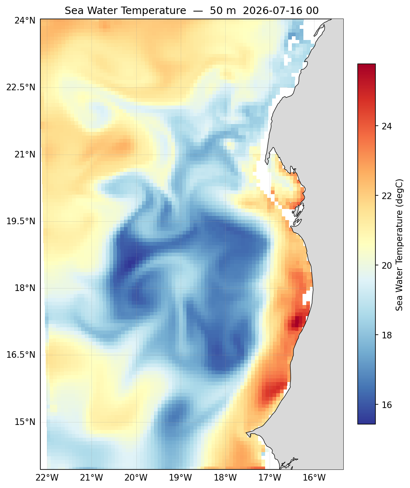

# Phase 5 — Post-processing

<!--  -->


SEA-FORWARD includes a small, self-contained Python toolkit for analysing CROCO output —
maps, sections, profiles, Hovmöller diagrams, time series and animations. Comparing a run
against the parent product it was downscaled from is the next chapter, Validation.

The toolkit lives in `sftools/` and this chapter uses three of its modules:

| Module | Purpose |
| --- | --- |
| `postprocess.py` | Load CROCO output; extract fields, sections, profiles and time series; compute derived quantities (speed, vorticity, EKE) at the surface or any depth. |
| `define_attrs.py` | One registry of CF metadata **and** display defaults — colormap, range — for every variable. Plots label and colour themselves from this. |
| `plotting.py` | Attribute-driven plotting: generic builders plus a `plot()` wrapper that detects the plot type from the data. |

The design is a clean split:

- **Extractors** in `postprocess` build a labelled `xarray.DataArray`. They decide *what*
  — which variable, which depth, which time.
- **Plotters** in `plotting` decide *how* it looks, reading the labels from the data by
  default.

So a typical call reads:

```bash
cd ~/seaforward
conda activate seaforward
python3 << 'PYEOF'
import matplotlib; matplotlib.use('Agg')
import sftools.postprocess as pp
import sftools.plotting as pl

ds = pp.open_history('forecast/scratch/Canary_12/CROCO_FILES/croco_his.nc',
                     Yorig=2000)

pl.plot(pp.field(ds, 'temp', depth_m=50), out='temp_50m.png')
PYEOF
```



The extractor builds temperature at 50 m; the plotter draws and labels it — the title, the
colour scale, the units and the depth all come from the data's own attributes. Those two
functions cover most of this chapter: `pp.field()` for the data, `pl.plot()` for the
figure.

`pp` and `pl` are used throughout the pages that follow, always meaning those two imports,
and `ds` always means a history file opened with `pp.open_history()`. The Setup page
covers both properly.