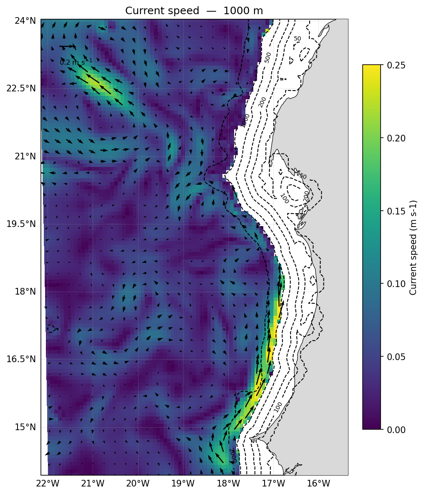
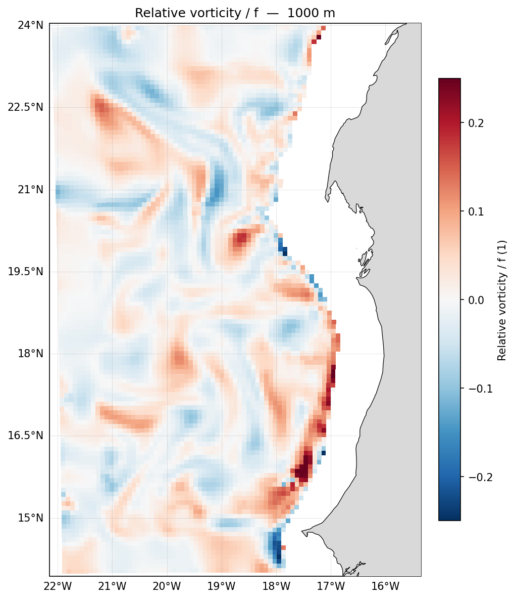
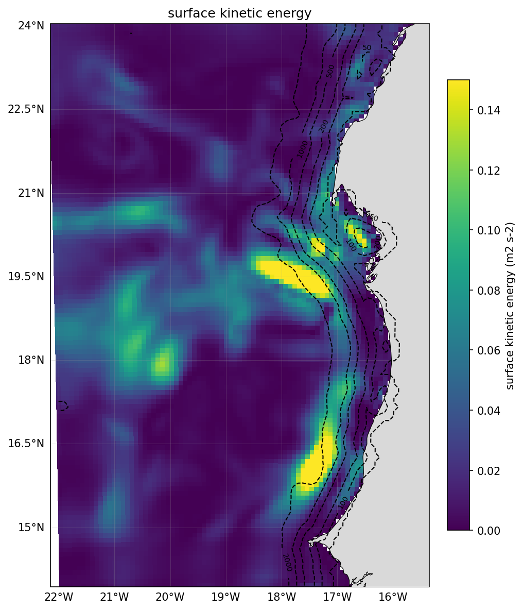
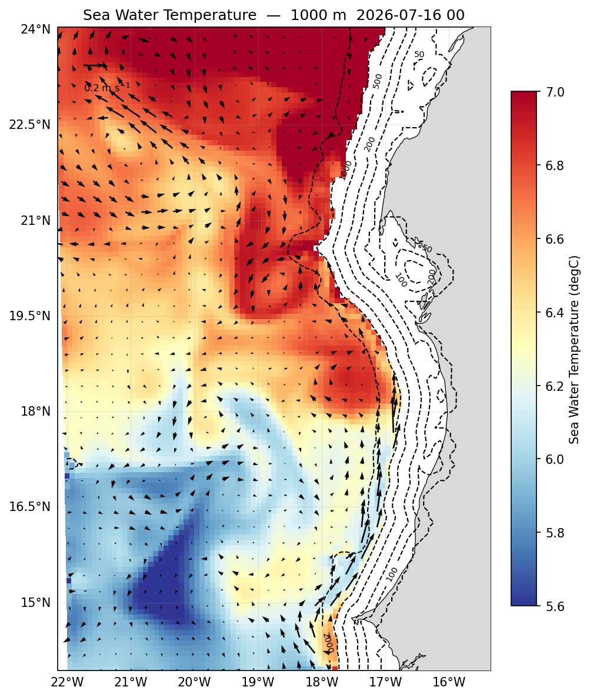
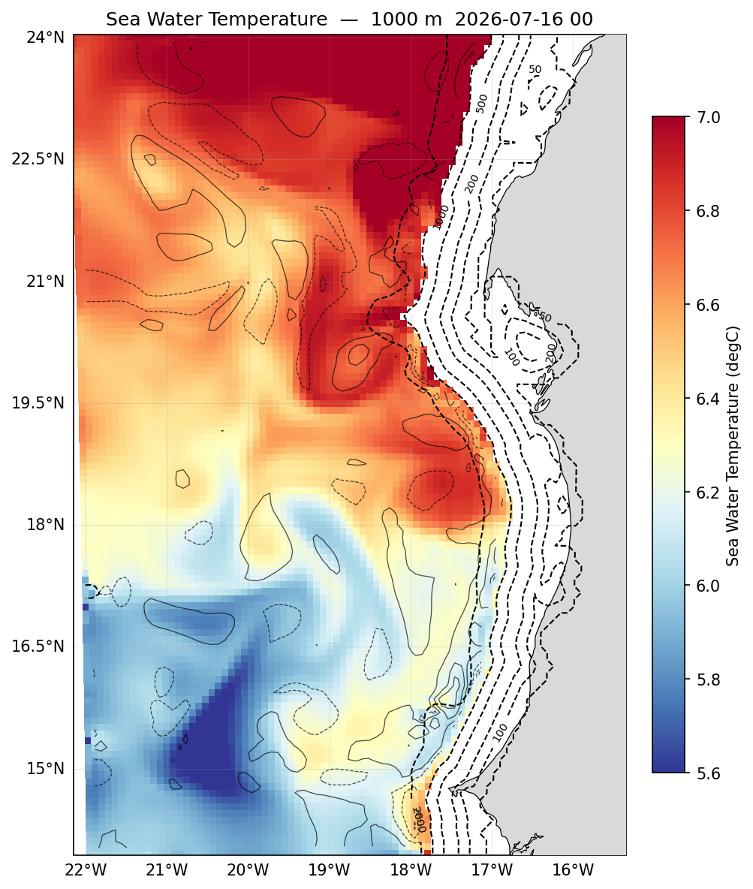

# Dynamics

Currents, vorticity and the eddy field — what the ocean is *doing*, rather than what
it is made of. These are derived quantities: the toolkit computes them from the
model's `u` and `v` rather than reading them from the file.

The examples below work at **1000 m**, deep enough to be below the wind-driven
surface layer, where the mesoscale field is cleanest. Change `depth` and every
figure follows.

```python
import sftools.postprocess as pp
import sftools.plotting    as pl

ds       = pp.open_history("forecast/scratch/Canary_12/CROCO_FILES/croco_his.nc",
                           Yorig=2000)
depth    = 1000                                   # metres; None for the surface
isobaths = [50, 100, 200, 500, 1000, 2000]

u, v = pp.uv_at_depth(ds, depth_m=depth, tindex=-1, rotate=True)
```

!!! note
    `pp.uv_at_depth()` needs a real depth — it has no surface shortcut. For surface currents use `pp.surface_uv(ds, tindex=-1)` and rotate them yourself with `pp.rotate_uv(ds, u, v)`.

## Currents and speed

Speed is computed from the zonal and meridional components and rotated to
east/north, so it is a physical speed rather than a grid-aligned one. Shading the
magnitude and overlaying the vectors shows both how fast and which way:

```python
fig = pl.plot(pp.speed_map(ds, depth_m=depth), ds=ds, uv=(u, v),
              isobaths=isobaths, uv_scale=4, uv_skip=3, uv_ref=0.2,
              vmin=0, vmax=0.25)
```



`uv_skip` thins the arrows so they stay legible, `uv_scale` sets their length —
smaller values give longer arrows — and `uv_ref` fixes the magnitude of the
reference arrow in the legend.

## Vorticity

Relative vorticity, ζ = ∂v/∂x − ∂u/∂y, picks out the rotating structures. Dividing
by the Coriolis parameter *f* makes it dimensionless and of order ±1 for a strong
eddy, which is the usual way to look at the mesoscale.

```python
fig = pl.plot(pp.vorticity(ds, depth_m=depth, normalized=True),
              vmin=-0.25, vmax=0.25)
```



Positive (red) is cyclonic in the northern hemisphere, negative (blue)
anticyclonic. Filaments show up as thin bands of alternating sign, often more
clearly than in the speed field.

The limits matter here. The default range is ±1, sized for a strong surface eddy —
at depth the field rarely exceeds ±0.25, so without the override almost all the
colour range goes unused and the structure disappears into white.

```python
pl.plot(pp.vorticity(ds))                        # raw vorticity, s⁻¹
pl.plot(pp.vorticity(ds, normalized=True))       # ζ / f, dimensionless
pl.plot(pp.vorticity(ds, depth_m=50, normalized=True))
```

## Kinetic energy

Kinetic energy, ½(u² + v²), highlights where the flow is energetic — the jets and
the eddy cores — and suppresses the quiet interior. Here at the surface, where the
energy is:

```python
spd = pp.speed_map(ds, tindex=-1)
ke  = 0.5 * spd**2
ke.attrs.update(spd.attrs)
ke.attrs["long_name"] = "surface kinetic energy"
ke.attrs["units"] = "m2 s-2"
ke.name = "ke"

fig = pl.plot(ke, ds=ds, isobaths=isobaths, vmin=0, vmax=0.15)
```



## The combined eddy view

`plot_eddy` shades one field and draws another over it — either vorticity contours
or current vectors. This is the most informative single figure the toolkit makes,
because it shows a tracer and the flow acting on it together.

Unlike `plot_map`, `plot_eddy` takes no `vmin`/`vmax`: the shaded field carries its
own limits, so set them on the DataArray first.

```python
base = pp.field(ds, "temp", depth_m=depth)
base.attrs["vmin"] = 5.6
base.attrs["vmax"] = 7.0
```

**With current vectors** — temperature shaded, the flow drawn over it:

```python
fig = pl.plot_eddy(base, ('uv', (u, v)), ds=ds, isobaths=isobaths,
                   uv_scale=4, uv_skip=3, uv_ref=0.2)
```



**With vorticity contours** — the same field, with the rotation drawn as contours
rather than arrows:

```python
vort_da = pp.vorticity(ds, depth_m=depth, normalized=True)
fig = pl.plot_eddy(base, ('vort', vort_da), ds=ds, isobaths=isobaths)
```



`pp.eddy_view()` builds both pieces in one call if you would rather not assemble
them yourself:

```python
base, ov = pp.eddy_view(ds, base="temp", overlay="vort", depth_m=depth)
pl.plot_eddy(base, ov, ds=ds, isobaths=isobaths)
```

It returns the field to shade and an overlay tuple — `("vort", vort_da)` or
`("uv", (u, v))` — which go straight to `plot_eddy`.

## Reproducing these figures

```python
import matplotlib; matplotlib.use("Agg")
import sftools.postprocess as pp, sftools.plotting as pl

D     = "docs/img/phase5/"
ds    = pp.open_history("forecast/scratch/Canary_12/CROCO_FILES/croco_his.nc",
                        Yorig=2000)
iso   = [50, 100, 200, 500, 1000, 2000]
depth = 1000

u, v = pp.uv_at_depth(ds, depth_m=depth, tindex=-1, rotate=True)

pl.plot(pp.speed_map(ds, depth_m=depth), ds=ds, uv=(u, v), isobaths=iso,
        uv_scale=4, uv_skip=3, uv_ref=0.2, vmin=0, vmax=0.25,
        out=D + "g_currents.png")

pl.plot(pp.vorticity(ds, depth_m=depth, normalized=True),
        vmin=-0.25, vmax=0.25, out=D + "g_vort.png")

spd = pp.speed_map(ds, tindex=-1)
ke  = 0.5 * spd**2
ke.attrs.update(spd.attrs)
ke.attrs["long_name"] = "surface kinetic energy"
ke.attrs["units"] = "m2 s-2"
ke.name = "ke"
pl.plot(ke, ds=ds, isobaths=iso, vmin=0, vmax=0.15, out=D + "g_ke.png")

base = pp.field(ds, "temp", depth_m=depth)
base.attrs["vmin"] = 5.6
base.attrs["vmax"] = 7.0
pl.plot_eddy(base, ("uv", (u, v)), ds=ds, isobaths=iso,
             uv_scale=4, uv_skip=3, uv_ref=0.2, out=D + "g_eddy_uv.png")

vort_da = pp.vorticity(ds, depth_m=depth, normalized=True)
pl.plot_eddy(base, ("vort", vort_da), ds=ds, isobaths=iso, out=D + "g_eddy.png")
```

## The extractors

```python
pp.surface_uv(ds, tindex=-1)                    # (u, v) on the rho grid, surface
pp.uv_at_depth(ds, depth_m, rotate=True)        # (u, v) at a true depth, east/north
pp.rotate_uv(ds, u, v)                          # grid-aligned -> east/north
pp.speed(u, v)                                  # sqrt(u² + v²)
pp.speed_map(ds, depth_m=None)                  # speed as a labelled DataArray
pp.vorticity(ds, depth_m=None, normalized=False)
pp.eddy_view(ds, base="speed", overlay="vort", depth_m=None)
```