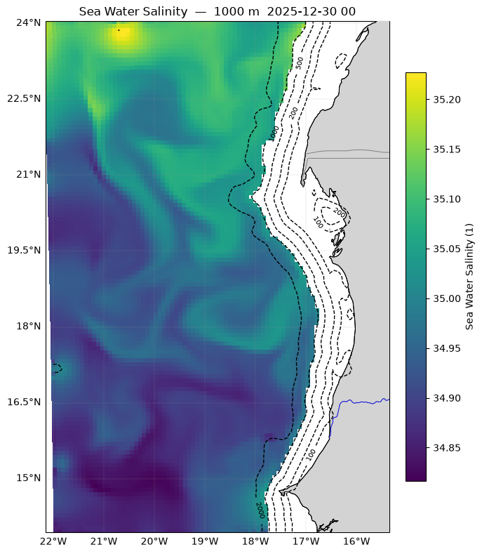
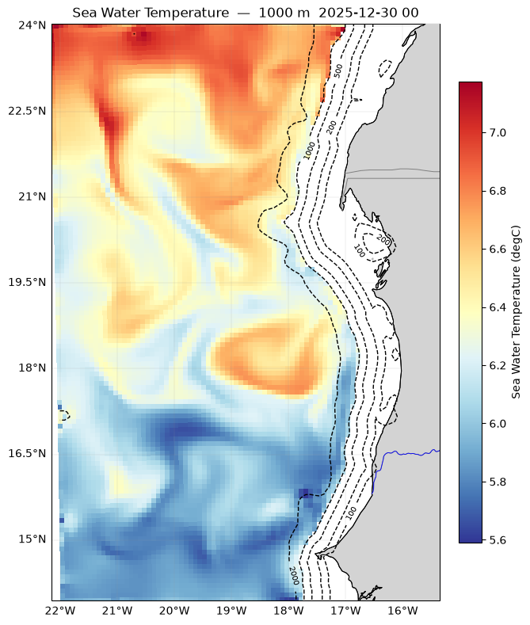
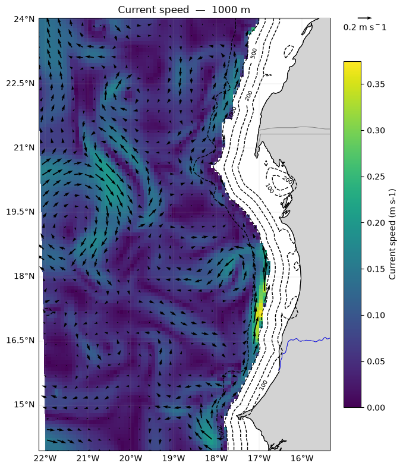
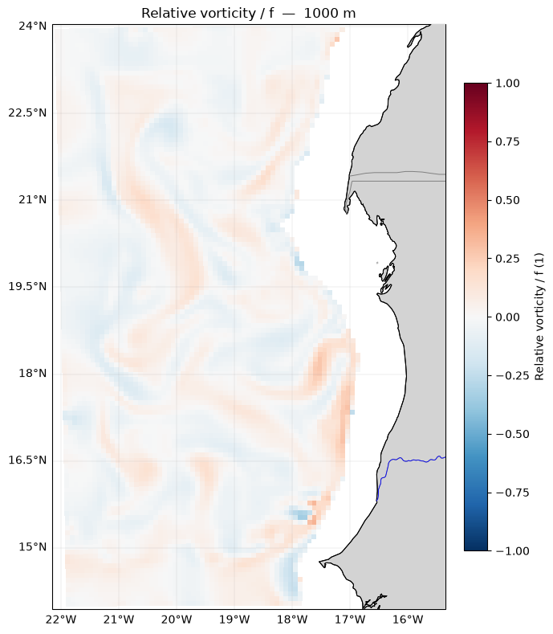
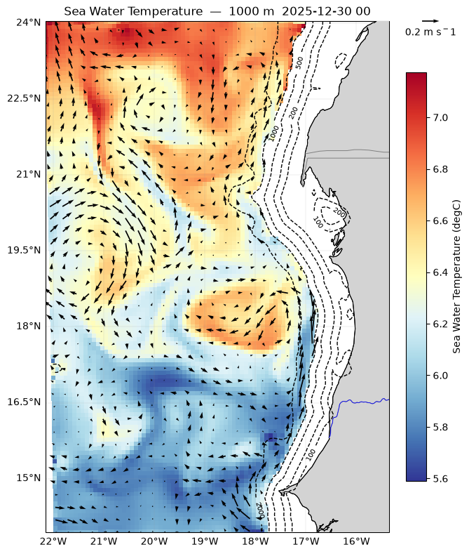
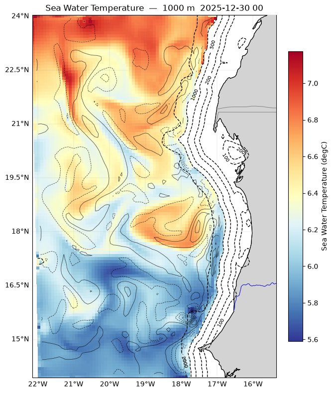

# Horizontal section

## Salinity

```python
%matplotlib inline

fig = pl.plot(pp.field(ds, "salt", depth_m=depth),ds=ds, isobaths=isobaths)   # no out= -> returns the figure
```

Horizontal sections allow visualizing the spatial distribution of a variable (such as temperature or salinity) over a geographical area, either at a given depth or at the surface. It is the ideal tool to identify fronts, eddies, and large-scale structures.
Salinity is a major water mass tracer. The code below extracts the salinity field and plots it alongside bathymetric contours (isobaths) or as a vertical profile/section.



## Temperature

```python
fig = pl.plot(pp.field(ds, "temp", depth_m=depth),ds=ds, isobaths=isobaths)   # no out= -> returns the figure
```

Water temperature is crucial for coastal dynamics (e.g., upwellings). Here is how to plot the temperature field to observe thermal gradients.



## Curent & Speed at depth

```python
u, v = pp.uv_at_depth(ds, depth_m=depth, tindex=-1, rotate=True)
fig=pl.plot(pp.speed_map(ds,depth_m=depth),ds=ds, uv=(u, v),isobaths=isobaths,uv_scale=4, uv_skip=3, uv_ref=0.2)
```

Current speed is calculated from the zonal (u) and meridional (v) components. The rendering overlays the velocity magnitude and direction vectors.



## Vorticity

```python
fig=pl.plot(pp.vorticity(ds,depth_m=depth, normalized=True))
```

Relative vorticity helps identify cyclonic and anticyclonic eddies within the domain.



## Combined eddy view: shaded base field + vorticity contours or current vectors

```python
fig = pl.plot_eddy(pp.field(ds, "temp", depth_m=depth),ds=ds, isobaths=isobaths,overlay= ('uv', (u, v)),uv_scale=4, uv_skip=3, uv_ref=0.2)   # no out= -> returns the figure
```

This combined view smartly overlays the base field with vorticity contours or current vectors for an advanced synoptic analysis.



```python
vort_da = pp.vorticity(ds,depth_m=depth, normalized=True)
fig = pl.plot_eddy(pp.field(ds, "temp", depth_m=depth),ds=ds, isobaths=isobaths,overlay= ('vort', vort_da))   # no out= -> returns the figure
```


