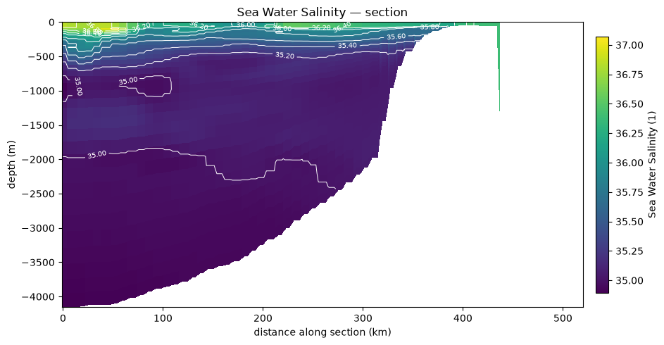
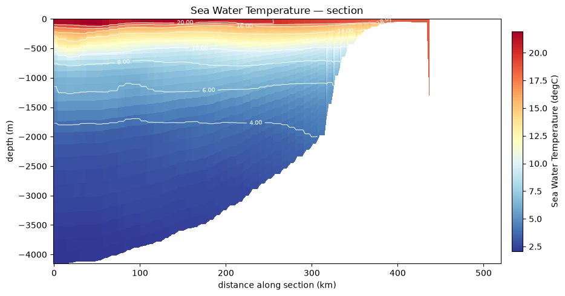
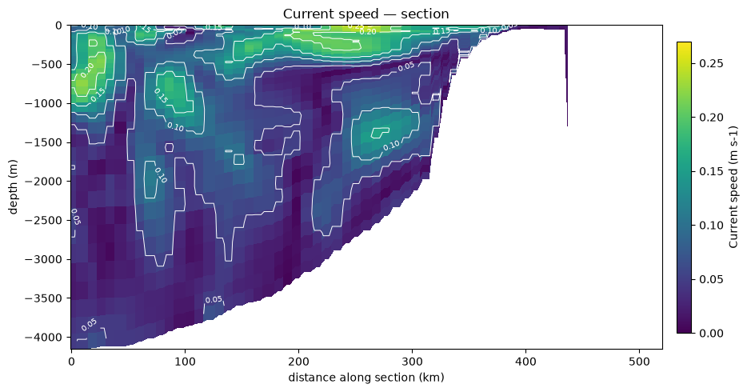
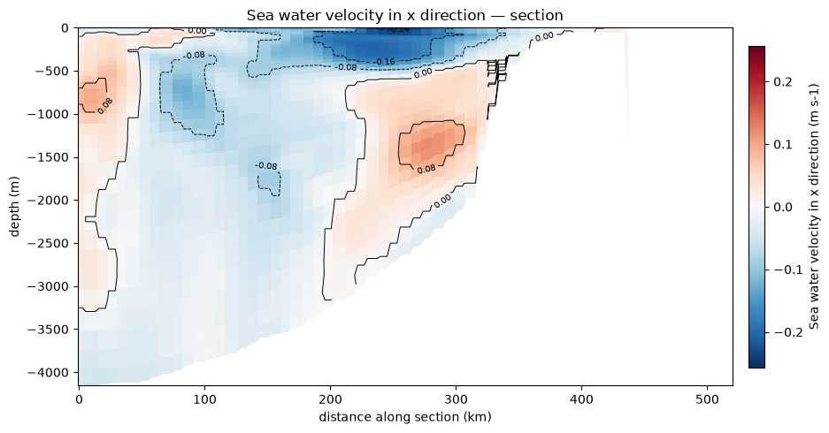
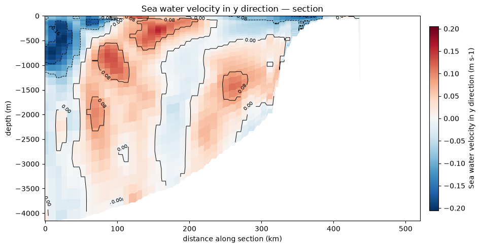

# Vertical section


## salinity


```python
fig=pl.plot(pp.section(ds, "salt",  lon0, lon1, lat0, lat1),contour_colors="white", levels=10)   # no out= -> returns the figure
```

A vertical section (or transect) cuts the ocean from the surface to the bottom along a specific line. This allows observing the stratification, the depth of the thermocline, and the vertical structure of thermohaline currents.
Salinity is a major water mass tracer. The code below extracts the salinity field and plots it alongside bathymetric contours (isobaths) or as a vertical profile/section.




## temperature


```python
fig=pl.plot(pp.section(ds, "temp",  lon0, lon1, lat0, lat1),contour_colors="white", levels=10)   # no out= -> returns the figure
```

Water temperature is crucial for coastal dynamics (e.g., upwellings). Here is how to plot the temperature field to observe thermal gradients.




## speed


```python
fig=pl.plot(pp.section(ds, "speed",  lon0, lon1, lat0, lat1),contour_colors="white", levels=5)   # no out= -> returns the figure
```

Current velocity (magnitude) highlights areas of strong shear or dominant oceanic jets.




## Zonal current (u)


```python
fig=pl.plot(pp.section(ds, "u",  lon0, lon1, lat0, lat1),contour_colors="black", levels=5)   # no out= -> returns the figure
```

The zonal component represents the current flowing from West to East.




## Meridional current (v)


```python
fig=pl.plot(pp.section(ds, "v",  lon0, lon1, lat0, lat1),contour_colors="black", levels=5)   # no out= -> returns the figure
```

The meridional component represents the current flowing from South to North.



