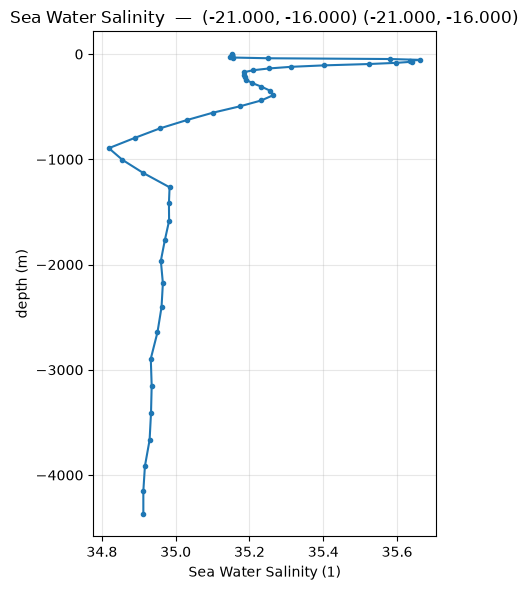
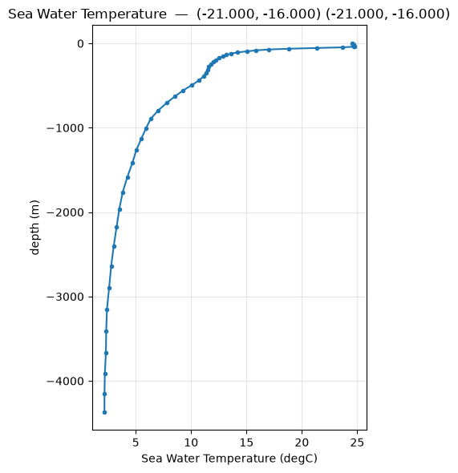
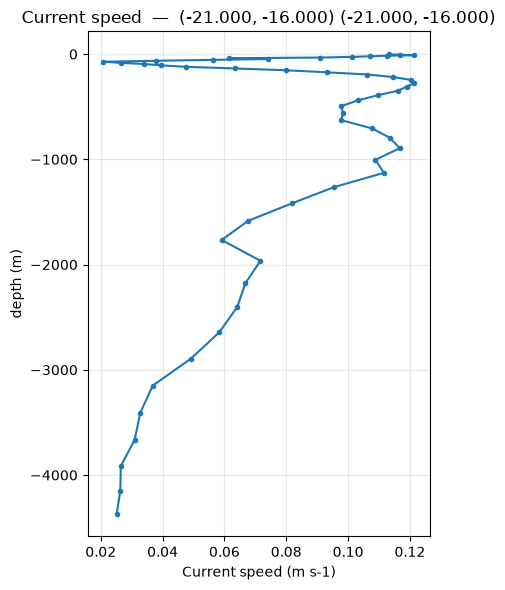
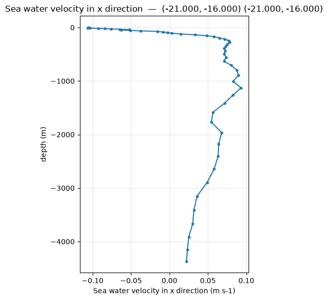
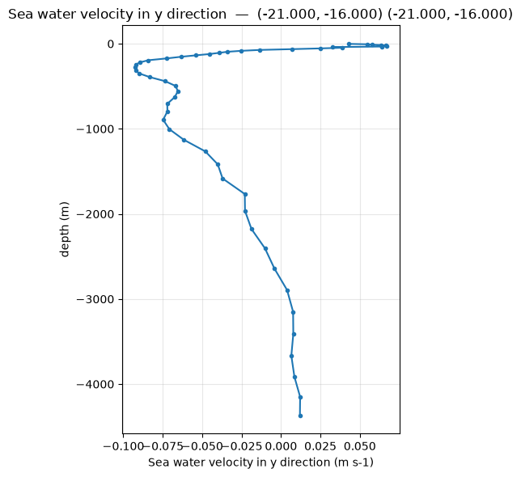

# Vertical Profile


## salinity


```python
fig=pl.plot(pp.profile(ds, "salt",  lon0, lat0))
```

Vertical profiles plot the evolution of a variable from the surface to the bottom for a single geographical point. They are very useful for a precise analysis of the local water column.
Salinity is a major water mass tracer. The code below extracts the salinity field and plots it alongside bathymetric contours (isobaths) or as a vertical profile/section.




## temperature


```python
fig=pl.plot(pp.profile(ds, "temp",  lon0, lat0))
fig
```

Water temperature is crucial for coastal dynamics (e.g., upwellings). Here is how to plot the temperature field to observe thermal gradients.




## speed


```python
fig=pl.plot(pp.profile(ds, "speed",  lon0, lat0))
fig
```

Current velocity (magnitude) highlights areas of strong shear or dominant oceanic jets.




## Zonal current (u)


```python
fig = pl.plot(pp.profile(ds, "u", lon0, lat0))
```

The zonal component represents the current flowing from West to East.




## Meridional current (v)


```python
fig = pl.plot(pp.profile(ds, "v", lon0, lat0))
```

The meridional component represents the current flowing from South to North.



