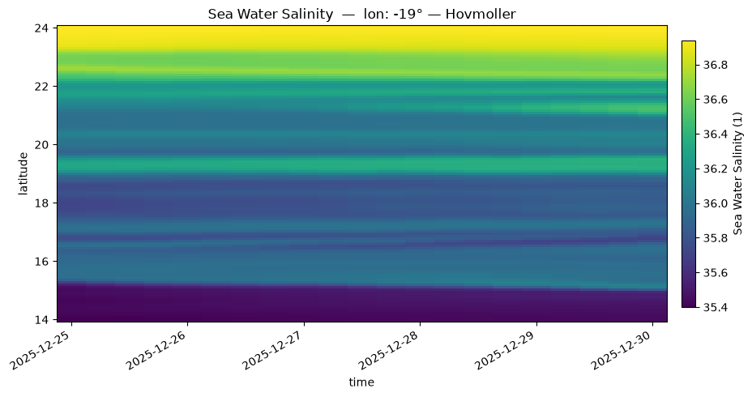
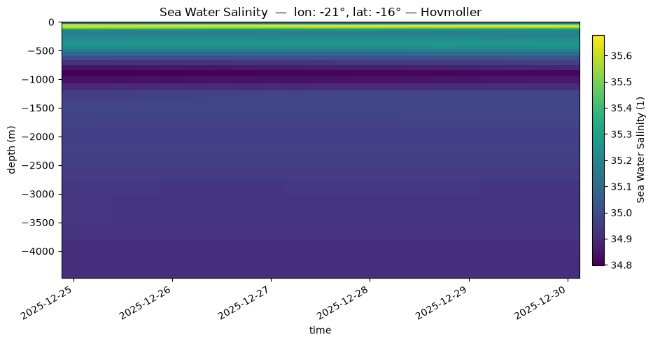
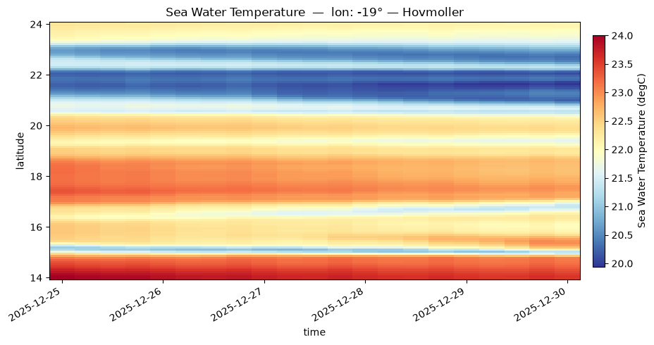
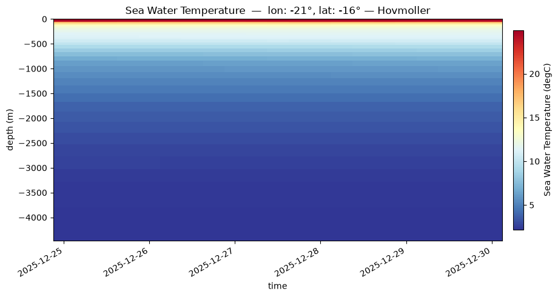
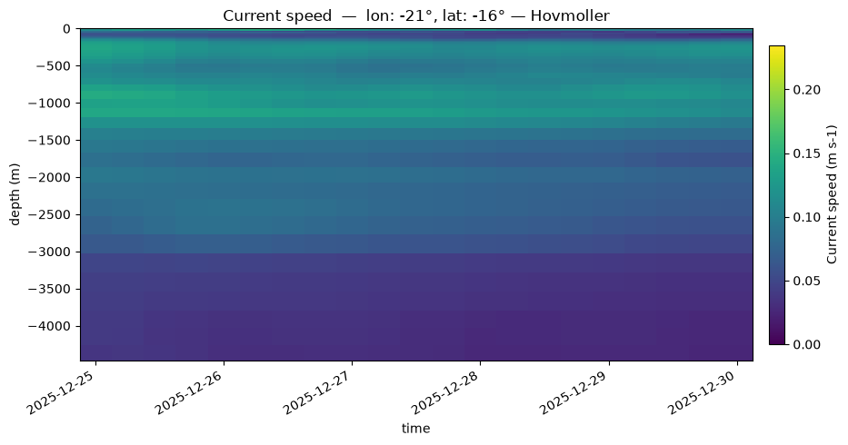
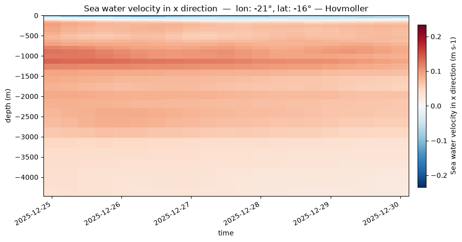
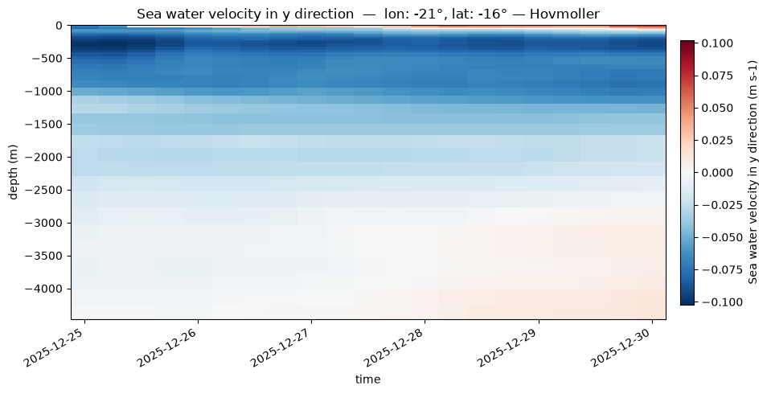

# Hovmöller diagrams

- **Time vs Depth (`kind="time_depth"`)**: Perfect for visualizing the evolution of the water column stratification at a specific fixed point.
- **Time vs Latitude/Longitude (`kind="time_lat"` / `"time_lon"`)**: Useful for tracking the propagation of oceanic structures (like eddies, waves, or fronts) across a specific transect over time.


## salinity


```python
fig = pl.plot(pp.hovmoller(ds, "salt", "time_lat", lon0=-19))
```

Hovmöller diagrams display the temporal evolution of a variable along a single spatial dimension (either depth, latitude, or longitude) against time. 
Salinity is a major water mass tracer. The code below extracts the salinity field and plots it alongside bathymetric contours (isobaths) or as a vertical profile/section.




```python
fig = pl.plot(pp.hovmoller(ds, "salt", kind="time_depth", lon0=lon0, lat0=lat0))
```




## temperature


```python
fig = pl.plot(pp.hovmoller(ds, "temp", "time_lat", lon0=-19))
```

Water temperature is crucial for coastal dynamics (e.g., upwellings). Here is how to plot the temperature field to observe thermal gradients.




```python
fig = pl.plot(pp.hovmoller(ds, "temp", kind="time_depth", lon0=lon0, lat0=lat0))
```




## Speed


```python
fig = pl.plot(pp.hovmoller(ds, "speed", kind="time_depth", lon0=lon0, lat0=lat0))
```

Current velocity (magnitude) highlights areas of strong shear or dominant oceanic jets.




## Zonal current (u)


```python
fig = pl.plot(pp.hovmoller(ds, "u", kind="time_depth", lon0=lon0, lat0=lat0))
```

The zonal component represents the current flowing from West to East.




## Meridional current (v)


```python
fig = pl.plot(pp.hovmoller(ds, "v", kind="time_depth", lon0=lon0, lat0=lat0))
```

The meridional component represents the current flowing from South to North.



