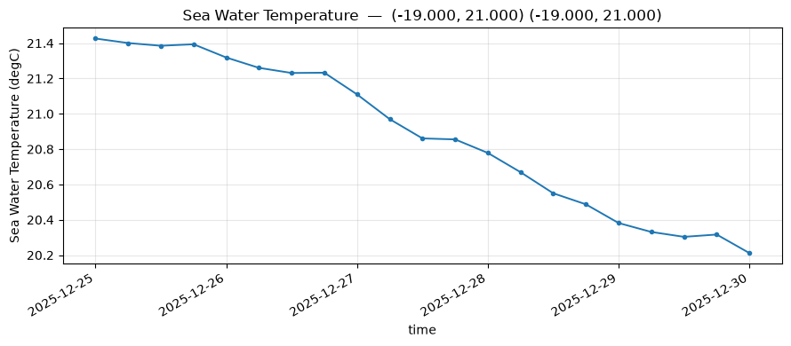
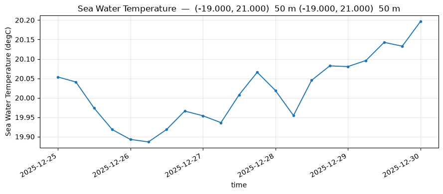
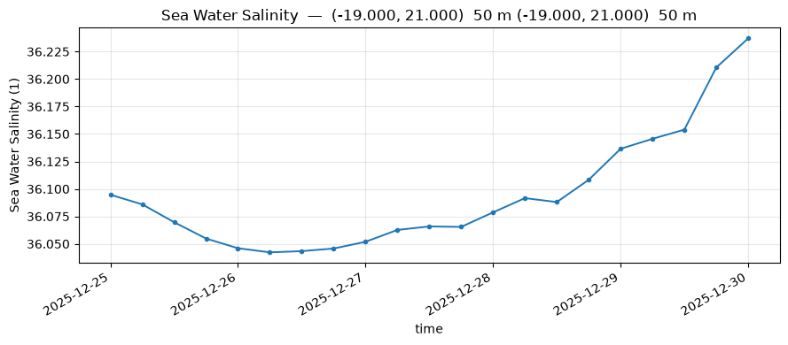
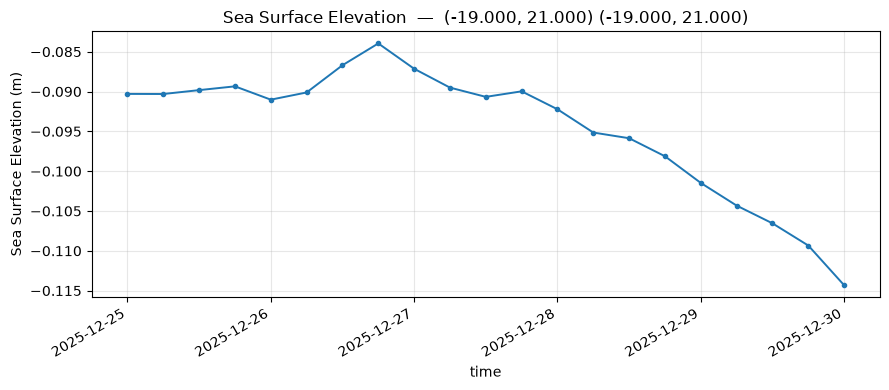
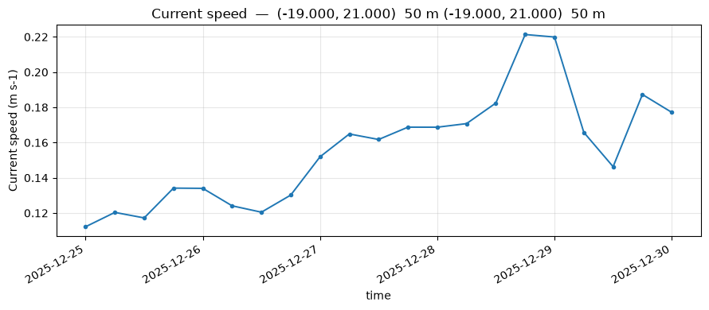

# Time series


### surface SST over time

```python
fig=pl.plot(pp.timeseries(ds, "temp",   lon0=-19, lat0=21))
```

Time series show the evolution of a variable over time. This makes it possible to observe diurnal and seasonal cycles, or the passage of transient events.




## temperature at depth over time


```python
fig=pl.plot(pp.timeseries(ds, "temp", lon0=-19, lat0=21,depth_m=50))
```

Temporal evolution of temperature extracted at a specific depth, useful for tracking subsurface warming.




## salinity at depth over time


```python
fig=pl.plot(pp.timeseries(ds, "salt", lon0=-19, lat0=21,depth_m=50))
```

Temporal evolution of salinity, making it possible to observe freshwater inputs or saline intrusions over time.




### SSH over time

```python
fig = pl.plot(pp.timeseries(ds, "zeta",  lon0=-19, lat0=21))
```




### Speed at depth over time

```python
fig = pl.plot(pp.timeseries(ds, "speed",  lon0=-19, lat0=21, depth_m=50))
```




```python
import importlib
import sftools
import sftools.postprocess as pp
import sftools.plotting    as pl
import sftools.validation  as val
importlib.reload(sftools.validation)
importlib.reload(sftools.plotting)
import sftools.validation  as val
import sftools.plotting as pl
```
