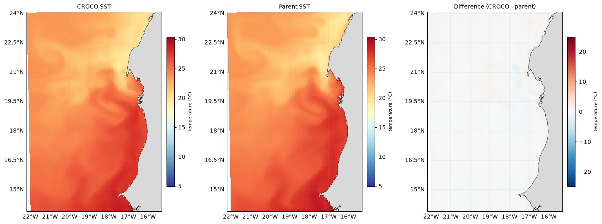

# Validation


```python

# validate the forecast against Mercator
F    = "forecast/model-runs/Canary_12/20260711/fcst/CROCO_FILES/croco_his.nc"
MERC = "forecast/scratch/Canary_12/downloaded_data/MERCATOR/MERCATOR_20260711_00.nc"
```

```python
res,s=val.compare_sst(F, MERC, date="2026-07-11", Yorig=2000)
```

Validation compares the model outputs (CROCO) against parent forcing data (such as GLORYS or Mercator) to evaluate the drift, errors, and value added by the high resolution.



