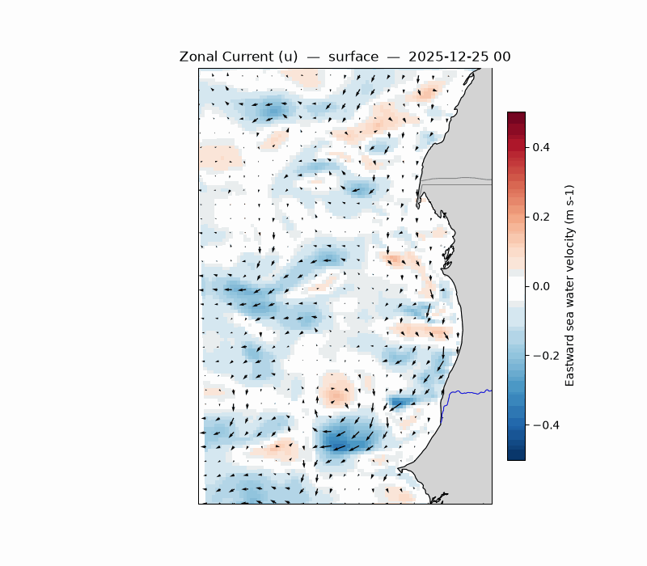
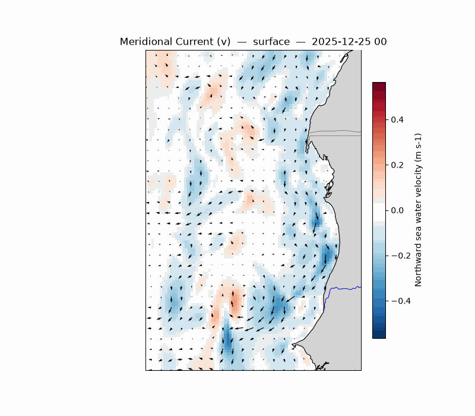

# Animations

This section provides animated visualizations of the model outputs over time. Animations are incredibly powerful for understanding the dynamic evolution of oceanographic features such as eddies, coastal currents, and upwelling responses to wind forcing.

The animations below were generated directly from the CROCO history files using the `sftools` toolkit. The Python code leverages `matplotlib.animation` to render the individual frames, which are presented here as smoothly looping GIFs.

## Animation: Sea Surface Temperature (SST) & Wind Stress

This animation overlays wind stress vectors on top of the Sea Surface Temperature (SST) field. It is highly useful to visualize how wind forcing drives coastal upwellings and surface cooling events over time.

```python
anim.animate(ds, "temp", overlay="wind")
```


## Animation: Sea Surface Height (SSH) & Surface Currents

This animation shows the Sea Surface Height (SSH) combined with surface current vectors. It helps identify geostrophic flows, eddies, and the propagation of coastal trapped waves.

```python
anim.animate(ds, "zeta", overlay="uv")
```


## Animation: Current Speed & Quivers

Current velocity magnitude (speed) overlaid with direction quivers. This highlights the temporal variability of strong oceanic jets and high-shear zones.

```python
anim.animate(ds, "speed", overlay="uv")
```


## Animation: Zonal Current (u)

Animation of the zonal (East-West) current component. Useful to track the temporal pulse of cross-shore or along-shore currents depending on the coastline orientation.

```python
anim.animate(ds, "u", overlay="uv")
```



## Animation: Meridional Current (v)

Animation of the meridional (North-South) current component.

```python
anim.animate(ds, "v", overlay="uv")
```


