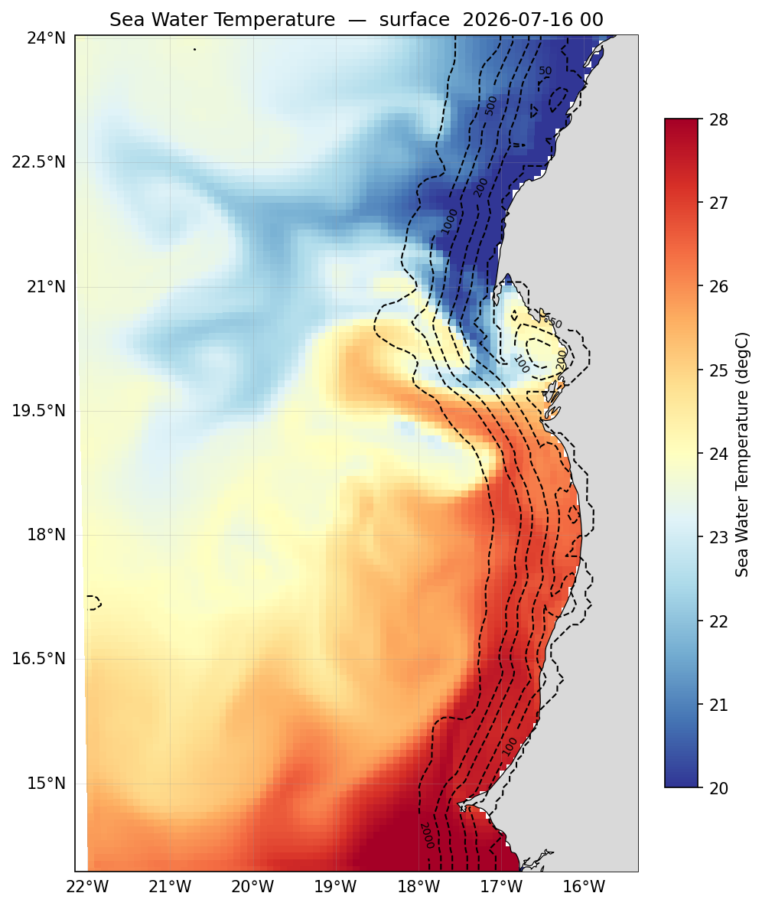
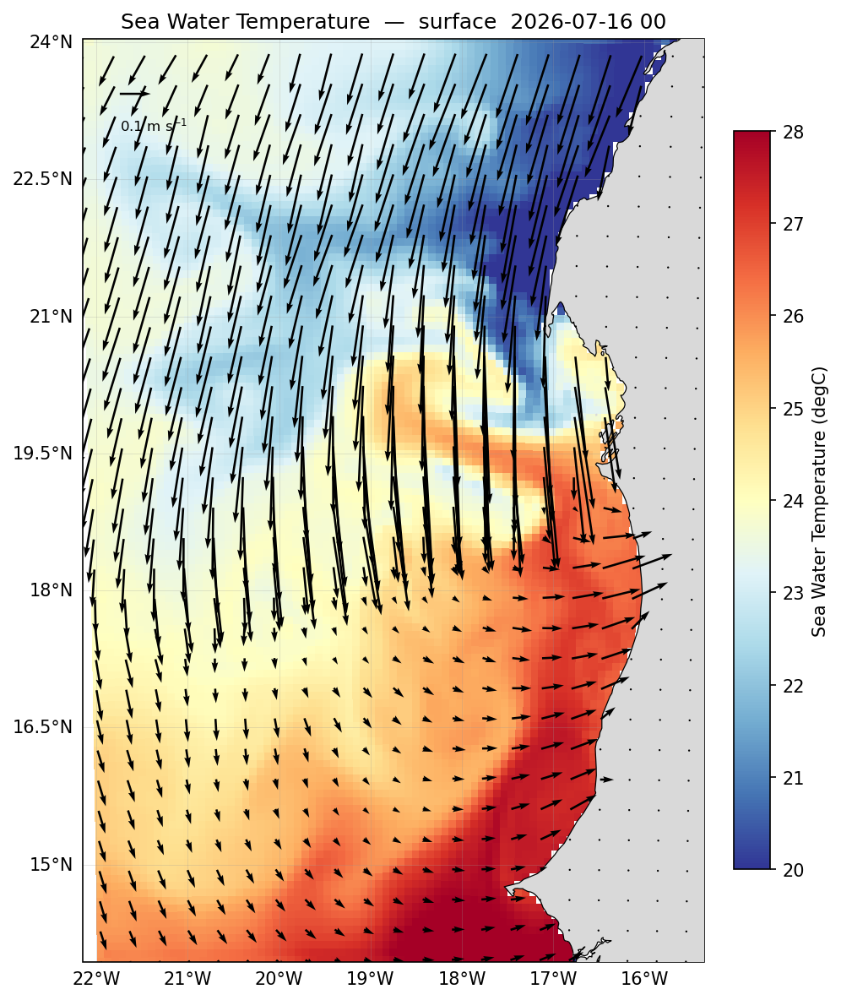
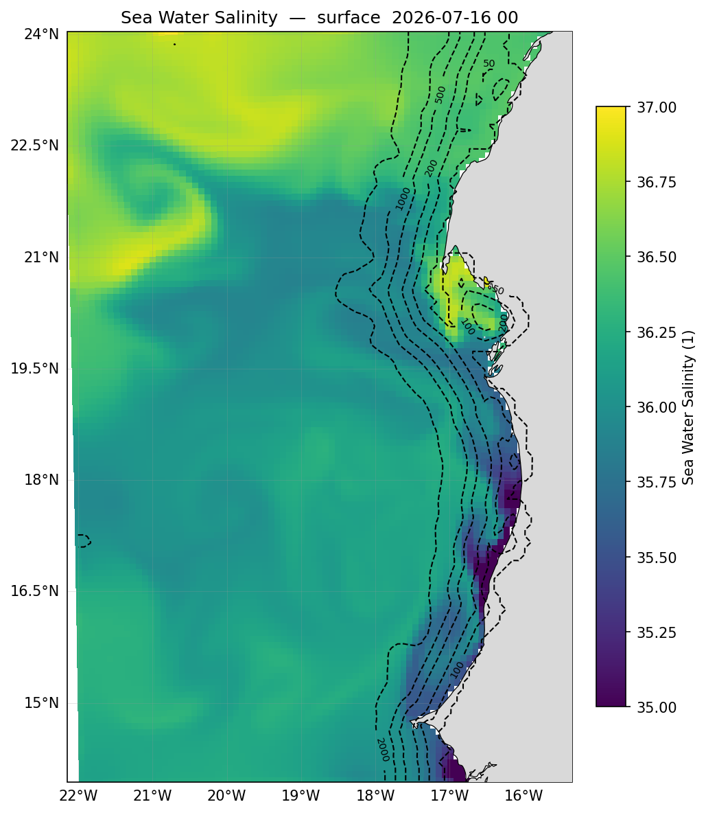
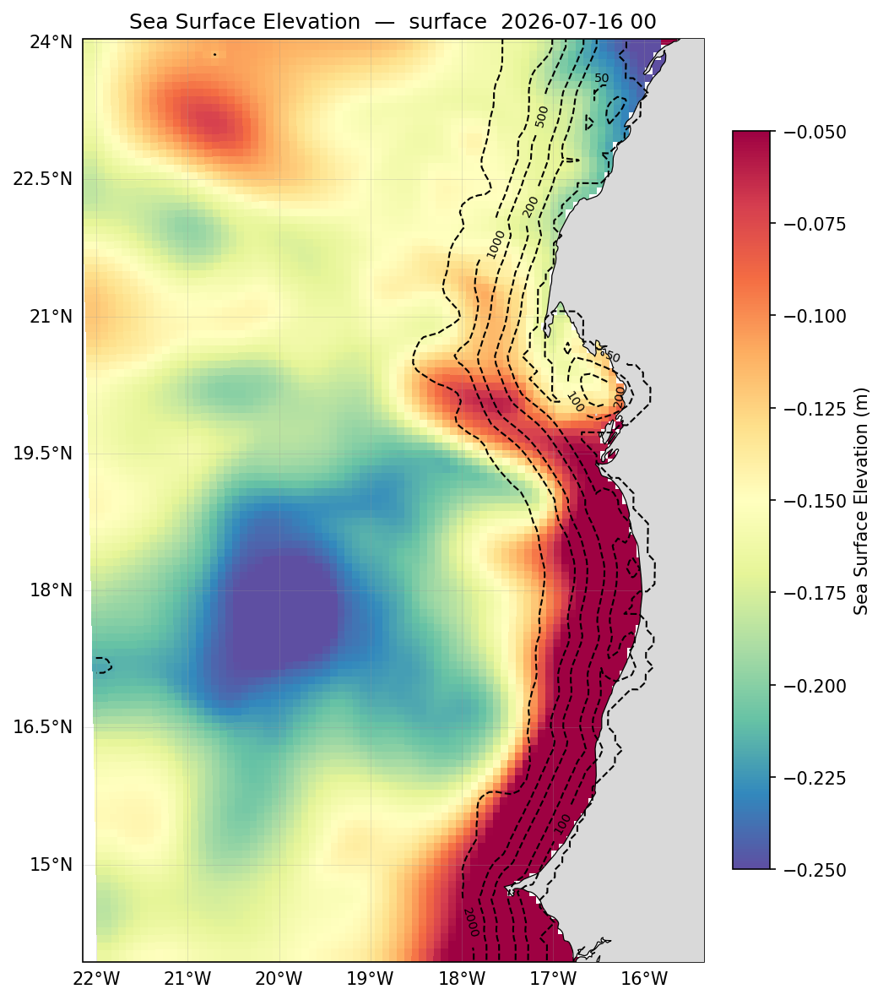

# Surface fields

The horizontal view: a variable spread across the domain, at the surface or at any
depth you choose. This is where you look for fronts, eddies and the large-scale
structure of the run.

All of these follow the same pattern — `pp.field()` extracts, `pl.plot()` draws:

```python
import sftools.postprocess as pp
import sftools.plotting    as pl

ds       = pp.open_history("forecast/scratch/Canary_12/CROCO_FILES/croco_his.nc",
                           Yorig=2000)
depth    = None                                   # None = surface; or a depth in metres
isobaths = [50, 100, 200, 500, 1000, 2000]        # bathymetry contours to overlay
```

!!! note
    **Sigma level versus true depth.** `pp.field_map(ds, "temp", level=-30)` selects sigma index −30 — a terrain-following layer whose real depth changes with the bathymetry. `pp.field(ds, "temp", depth_m=30)` gives temperature at a fixed 30 m, interpolated. Points where the sea floor is shallower than the requested depth come back blank.

## Temperature

Water temperature drives coastal dynamics, and in an upwelling system the SST field
is the clearest single diagnostic: the cold tongue, its front, and the filaments
carrying water offshore. The isobaths show why it sits where it does — the cold
water appears over the shelf, inshore of the 200 m contour.

```python
fig = pl.plot(pp.field(ds, "temp", depth_m=depth), ds=ds, isobaths=isobaths,
              vmin=20, vmax=28)
```



Adding the wind stress shows what is driving the pattern — the cold water appears
where the wind pushes surface water offshore.

```python
su = pp._u2rho(ds["sustr"].isel(time=-1).values)
sv = pp._v2rho(ds["svstr"].isel(time=-1).values)
se, sn = pp.rotate_uv(ds, su, sv)

fig = pl.plot_map(pp.field(ds, "temp"), ds=ds, uv=(se, sn), uv_kind="wind",
                  uv_skip=4, uv_scale=2, uv_ref=0.1, vmin=20, vmax=26)
```



These are `sustr` and `svstr` — wind **stress** in N/m², written by the model itself,
not 10 m wind speed. Values run around 0.01–0.3, so `uv_scale` has to be set
explicitly; the automatic scaling assumes the larger numbers of a wind-speed field
and renders stress vectors as dots.

## Salinity

Salinity is the major water-mass tracer — it distinguishes water of different origin
in a way temperature alone cannot, since two water masses can share a temperature
but rarely share both.

```python
fig = pl.plot(pp.field(ds, "salt", depth_m=depth), ds=ds, isobaths=isobaths,
              vmin=35, vmax=37)
```



## Sea surface height

SSH is the pressure field the geostrophic flow follows. Highs and lows mark
anticyclonic and cyclonic circulation, so this is often the quickest way to locate
eddies before looking at the velocity field itself.

```python
fig = pl.plot(pp.field(ds, "zeta"), ds=ds, isobaths=isobaths,
              vmin=-0.25, vmax=-0.05, cmap="Spectral_r")
```



The colour settings are overridden here for a reason. CROCO's `zeta` is elevation
relative to the model's own reference level, not an anomaly about zero — so the
whole field sits below zero, and the default diverging map centred on zero would
leave most of its range unused. Fixing the limits to the field's actual range brings
out the structure.

`zeta` is two-dimensional, so `depth_m` does not apply to it.

## Reproducing these figures

```python
import matplotlib; matplotlib.use("Agg")
import sftools.postprocess as pp, sftools.plotting as pl

D   = "docs/img/phase5/"
ds  = pp.open_history("forecast/scratch/Canary_12/CROCO_FILES/croco_his.nc",
                      Yorig=2000)
iso = [50, 100, 200, 500, 1000, 2000]

pl.plot(pp.field(ds, "temp"), ds=ds, isobaths=iso, vmin=20, vmax=28,
        out=D + "g_sst.png")
pl.plot(pp.field(ds, "salt"), ds=ds, isobaths=iso, vmin=35, vmax=37,
        out=D + "g_sss.png")
pl.plot(pp.field(ds, "zeta"), ds=ds, isobaths=iso, vmin=-0.25, vmax=-0.05,
        cmap="Spectral_r", out=D + "g_ssh.png")
su = pp._u2rho(ds["sustr"].isel(time=-1).values)
sv = pp._v2rho(ds["svstr"].isel(time=-1).values)
se, sn = pp.rotate_uv(ds, su, sv)
pl.plot_map(pp.field(ds, "temp"), ds=ds, uv=(se, sn), uv_kind="wind",
            uv_skip=4, uv_scale=2, uv_ref=0.1, vmin=20, vmax=26,
            out=D + "g_sst_wind.png")
```

## The extractors

```python
pp.field(ds, var, depth_m=None, tindex=-1)      # unified: surface, or a true depth
pp.field_map(ds, var, tindex=-1, level=-1)      # a sigma-level slice
pp.field_at_depth(ds, var, depth_m, tindex=-1)  # a true depth, interpolated
pp.surface(ds, var, tindex=-1)                  # top sigma level of a 3D field
```

`tindex=-1` is the last record; pass any index to plot an earlier time.