# Through time

Everything so far has been a single moment. These views add the time axis: a
**Hovmöller** diagram collapses one spatial dimension against time in a single
panel, a **time series** follows one point through the run, and an **animation**
plays the whole field forward.

The point is the same one the profiles use, so the pages describe the same place
from different angles.

```python
import sftools.postprocess as pp
import sftools.plotting    as pl
import sftools.animation   as anim

ds = pp.open_history("forecast/scratch/Canary_12/CROCO_FILES/croco_his.nc",
                     Yorig=2000)
plon, plat = -19.0, 21.0        # the same point as the vertical profiles
```

## Hovmöller diagrams

A Hovmöller trades one spatial dimension for time. Two kinds are useful here:

- **`kind="time_depth"`** — the water column at a fixed point, evolving. Shows
  stratification building or breaking down, and the mixed layer deepening.
- **`kind="time_lat"` or `"time_lon"`** — a transect against time. Structures that
  propagate — eddies, waves, fronts — appear as tilted bands, and the slope of the
  tilt is their speed.

```python
pp.hovmoller(ds, var, kind="time_depth", lon0=..., lat0=...)
pp.hovmoller(ds, var, kind="time_lat",   lon0=...)
pp.hovmoller(ds, var, kind="time_lon",   lat0=...)
```

!!! note
    **`hovmoller` works on `temp`, `salt` and `zeta`.** It reads the variable straight from the file and indexes on the rho grid, so `u` and `v` — which live on their own staggered grids — and the derived fields are not available here. Use `pp.timeseries()` for those.

### Time versus depth

The water column at one point, through the run. Crop the depth range or most of the
panel is uniform deep water:

```python
fig = pl.plot(pp.hovmoller(ds, "temp", kind="time_depth", lon0=plon, lat0=plat),
              title="Temperature — time vs depth")
fig.axes[0].set_ylim(-1500, 0)
```

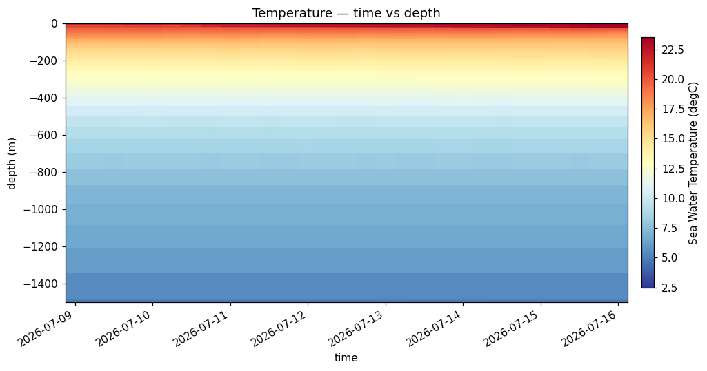

```python
fig = pl.plot(pp.hovmoller(ds, "salt", kind="time_depth", lon0=plon, lat0=plat),
              title="Salinity — time vs depth")
fig.axes[0].set_ylim(-1500, 0)
```

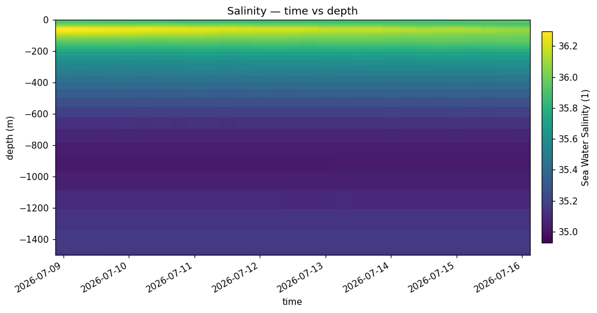

### Time versus latitude

A meridional transect against time — this is where propagating features show
themselves, as bands that tilt rather than run flat.

```python
fig = pl.plot(pp.hovmoller(ds, "temp", kind="time_lat", lon0=plon),
              title="Temperature — time vs latitude")
```

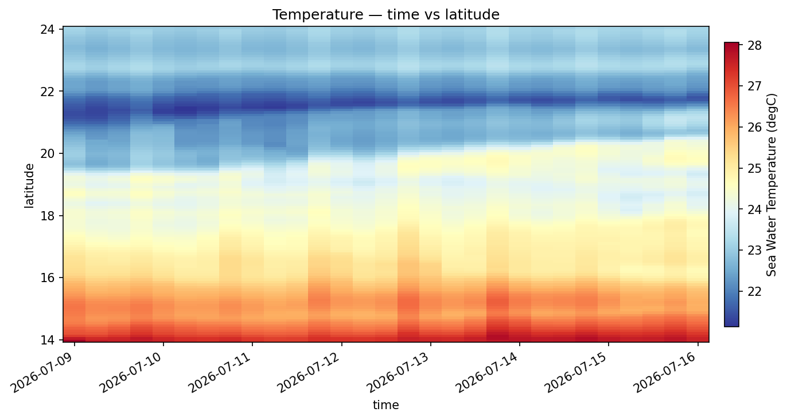

```python
fig = pl.plot(pp.hovmoller(ds, "salt", kind="time_lat", lon0=plon),
              title="Salinity — time vs latitude")
```

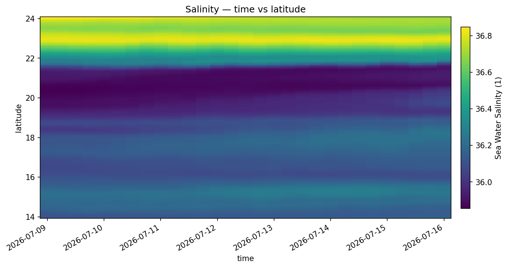

Over a five-day forecast the bands are close to horizontal — there simply isn't
enough time for much to propagate across the domain. A longer run makes this view
far more informative; hindcast cycles stitched together with `ncrcat` (Phase 4) give
the longer axis.

## Time series

One point, one variable, through the whole run. This is where diurnal cycles,
transient events and any drift show up.

```python
pp.timeseries(ds, var, lon0, lat0, surface_only=True, depth_m=None)
```

Unlike `hovmoller`, this handles derived fields and the staggered-grid velocities.

### At the surface

```python
fig = pl.plot(pp.timeseries(ds, "temp", lon0=plon, lat0=plat),
              title="Surface temperature")
```

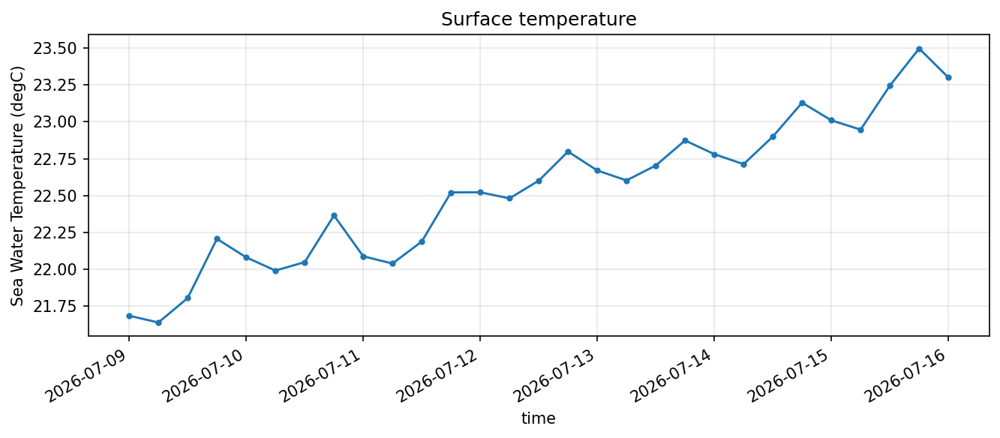

```python
fig = pl.plot(pp.timeseries(ds, "zeta", lon0=plon, lat0=plat),
              title="Sea surface height")
```

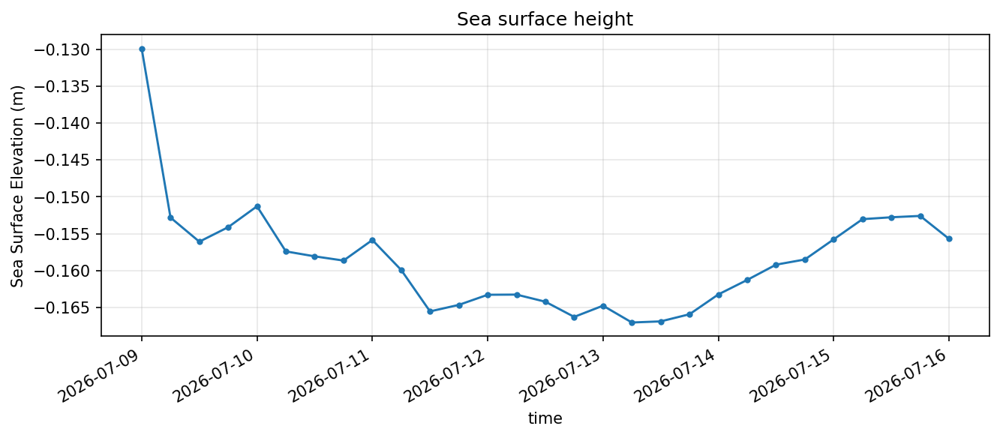

### At depth

Passing `depth_m` follows the same point below the surface — useful for separating
what the atmosphere is doing from what the ocean is doing.

```python
fig = pl.plot(pp.timeseries(ds, "temp", lon0=plon, lat0=plat, depth_m=50),
              title="Temperature at 50 m")
```

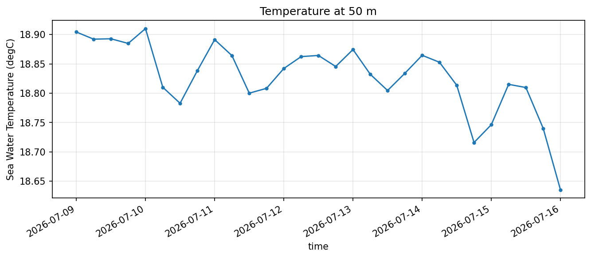

```python
fig = pl.plot(pp.timeseries(ds, "salt", lon0=plon, lat0=plat, depth_m=50),
              title="Salinity at 50 m")
```

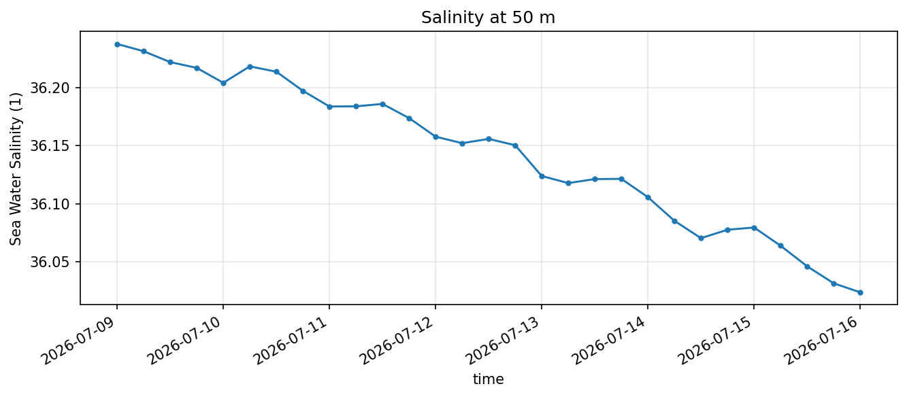

```python
fig = pl.plot(pp.timeseries(ds, "speed", lon0=plon, lat0=plat, depth_m=50),
              title="Speed at 50 m")
```

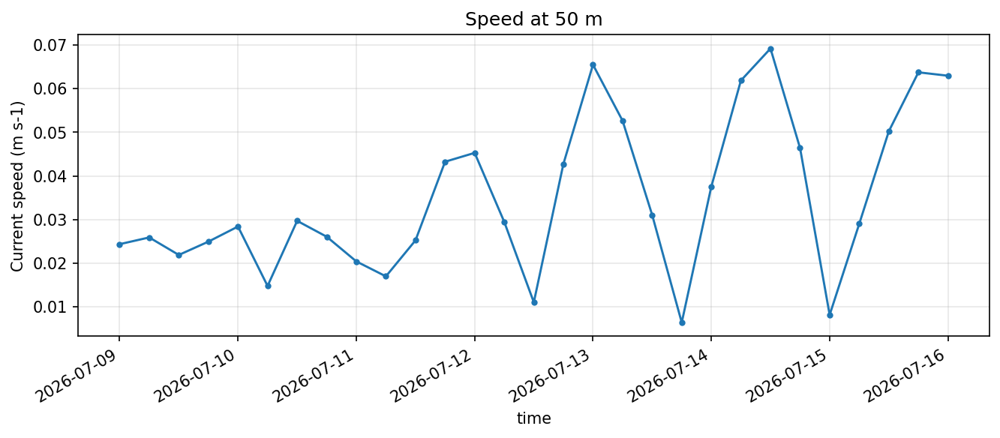

!!! tip
    **Set the title.** Without one, the plotter stamps the coordinates into it — on a narrow figure that runs wider than the plot itself.

## Animations

The most direct way to see time: play the field forward. `sftools.animation` reuses
the same colour scales and overlays as the static plots, and resolves the limits
once across the whole series so the scale doesn't flicker between frames.

```python
anim.animate(ds, "temp", overlay="wind", vmin=20, vmax=26)
```

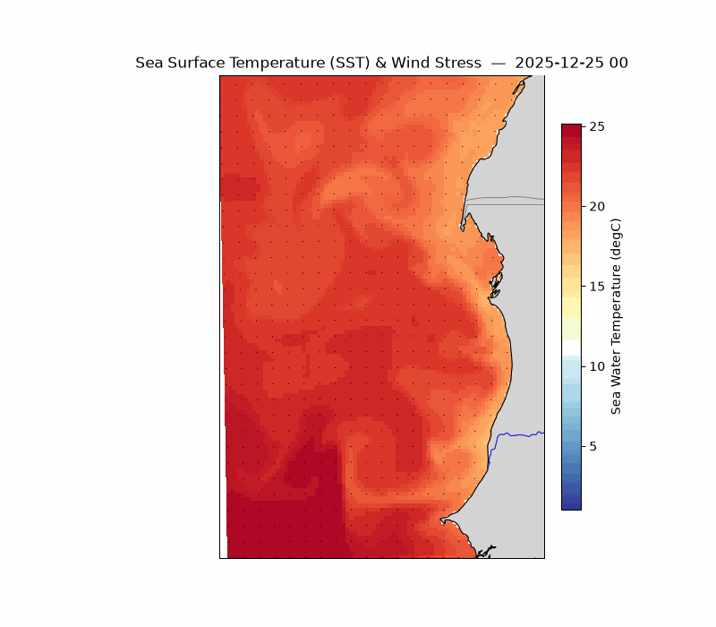

Without `out=`, it returns a widget that plays inline in Jupyter. With `out=`, it
writes a file — `.gif` through pillow, anything else through ffmpeg:

```python
anim.animate(ds, "temp", overlay="wind", vmin=20, vmax=26, out="sst_wind.gif")
```

### Sea surface height and currents

```python
anim.animate(ds, "zeta", overlay="uv", uv_depth=200, scale=2, skip=3,
             vmin=-0.25, vmax=-0.05, cmap="Spectral_r")
```

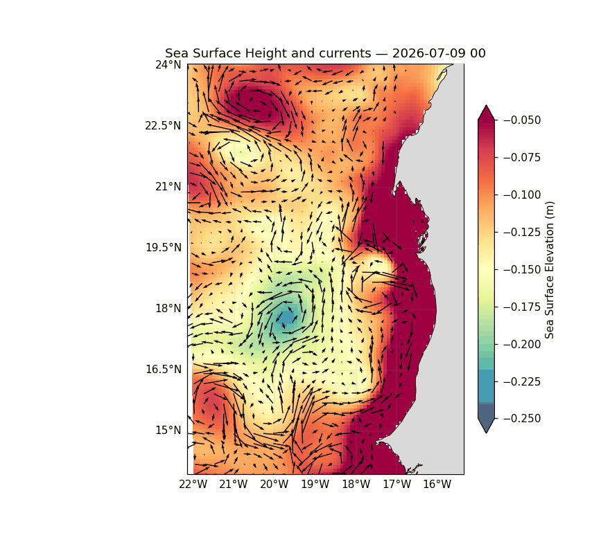

`uv_depth=200` puts the vectors below the Ekman layer, where the flow is geostrophic
and follows the SSH contours — clockwise around a high, anticlockwise around a low.
Leave it out and you get surface currents instead, which cut *across* the contours:
the wind-driven Ekman transport rides on top of the geostrophic flow and is roughly
perpendicular to the wind. Both are correct; they show different things.

Currents at depth are weaker than at the surface, so `scale=2` lengthens the arrows —
the parameter is inverse, and the default of 8 leaves them almost invisible here.

### Current speed at depth

`depth_m` sets the depth of the **shaded** field, `uv_depth` the depth of the
**arrows**. Set both and the whole figure sits at one level:

```python
anim.animate(ds, "speed", depth_m=200, overlay="uv", uv_depth=200,
             scale=2, skip=3, vmin=0, vmax=0.2)
```

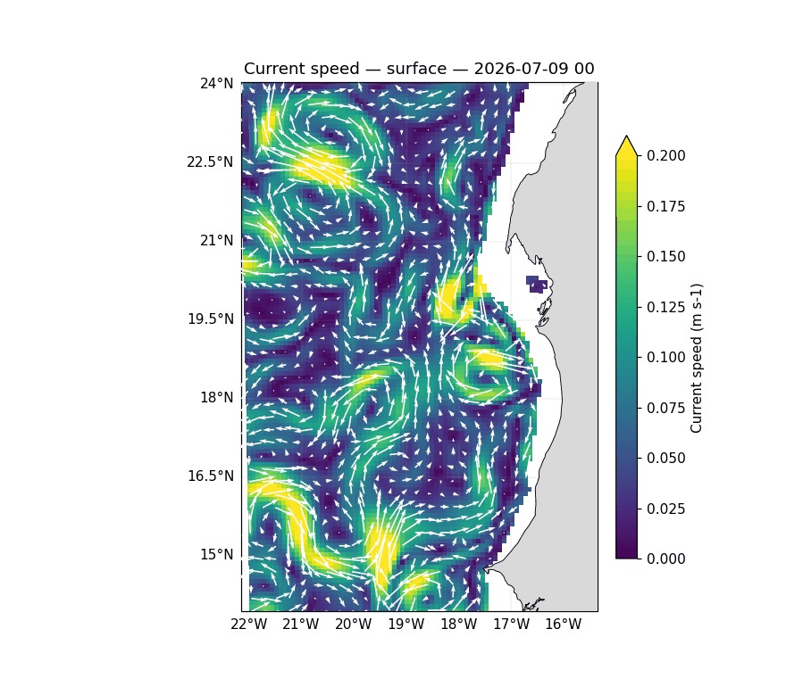

Leave `depth_m` out and the shading stays at the surface — which is worth knowing,
because a surface-shaded field with 200 m arrows over it is misleading rather than
informative.

The same call works for any field:

```python
anim.animate(ds, "u")     # zonal current alone
anim.animate(ds, "v")     # meridional current alone
```

!!! note
    **Depth animations are slow.** Every frame interpolates the whole grid from sigma levels to the requested depth, so a 29-frame animation means 29 full-grid interpolations. Expect minutes rather than seconds, and use `tindex_range` to test on a few frames first.

**Options.** `depth_m` sets the shaded field's depth, `overlay` takes `"wind"`
(surface wind stress, from the model's own `sustr`/`svstr`), `"uv"` (currents, at
`uv_depth` metres or the surface), or `None`. `isobaths=[200, 1000]` adds bathymetry
contours, `scale` sets arrow length, `skip` thins them, `tindex_range=(0, 20)` limits
the frames, `interval` sets the inline frame delay and `fps` the written one.

## Reproducing these figures

```python
import matplotlib; matplotlib.use("Agg")
import sftools.postprocess as pp, sftools.plotting as pl, sftools.animation as anim

D  = "docs/img/phase5/"
ds = pp.open_history("forecast/scratch/Canary_12/CROCO_FILES/croco_his.nc",
                     Yorig=2000)
plon, plat = -19.0, 21.0

for var, name in [("temp", "Temperature"), ("salt", "Salinity")]:
    fig = pl.plot(pp.hovmoller(ds, var, kind="time_depth", lon0=plon, lat0=plat),
                  title=name + " — time vs depth")
    fig.axes[0].set_ylim(-1500, 0)
    fig.savefig(D + "g_hov_" + var + ".png", dpi=110, bbox_inches="tight")

    pl.plot(pp.hovmoller(ds, var, kind="time_lat", lon0=plon),
            title=name + " — time vs latitude",
            out=D + "g_hovlat_" + var + ".png")

for var, name in [("temp", "Surface temperature"), ("zeta", "Sea surface height")]:
    pl.plot(pp.timeseries(ds, var, lon0=plon, lat0=plat), title=name,
            out=D + "g_ts_" + var + ".png")

for var, name in [("temp", "Temperature at 50 m"), ("salt", "Salinity at 50 m"),
                  ("speed", "Speed at 50 m")]:
    pl.plot(pp.timeseries(ds, var, lon0=plon, lat0=plat, depth_m=50), title=name,
            out=D + "g_ts_" + var + "50.png")

# the animations take minutes, not seconds — the two at depth interpolate
# the whole grid on every frame
anim.animate(ds, "temp", overlay="wind", vmin=20, vmax=26,
             out=D + "anim_1.gif")

anim.animate(ds, "zeta", overlay="uv", uv_depth=200, scale=2, skip=3,
             vmin=-0.25, vmax=-0.05, cmap="Spectral_r",
             out=D + "anim_2.gif")

anim.animate(ds, "speed", depth_m=200, overlay="uv", uv_depth=200,
             scale=2, skip=3, vmin=0, vmax=0.2,
             out=D + "anim_3.gif")
```