# Vertical structure

Two ways to look below the surface: a **section**, which slices the ocean along a
line and shows the water column across it, and a **profile**, which takes a single
point from surface to sea floor.

```python
import sftools.postprocess as pp
import sftools.plotting    as pl

ds = pp.open_history("forecast/scratch/Canary_12/CROCO_FILES/croco_his.nc",
                     Yorig=2000)

lon0, lat0, lon1, lat1 = -21.0, 21.0, -17.2, 21.0   # a cross-shelf transect at 21°N
plon, plat = -19.0, 21.0                             # the profile point
```

!!! note
    **Stop the section before the coast.** Running the transect all the way to −16° puts its last points on land, which shows up as a thin spike of nonsense at the end of the figure. Ending at −17.2° keeps it in water the whole way.

## Maps at depth

The simplest way below the surface is the same map you drew in Surface fields, with
a depth. The difference between the surface and 100 m is often striking — the surface
carries the atmosphere's imprint, while 100 m shows the thermocline structure:

```python
fig = pl.plot(pp.field(ds, "temp", depth_m=100), ds=ds, isobaths=isobaths)
```

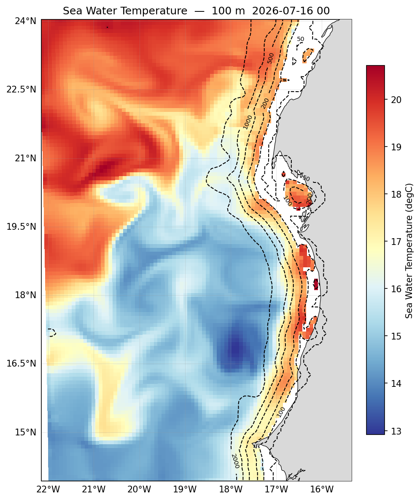

Points where the sea floor is shallower than the requested depth come back blank —
the physically correct "no water here".

## Sections

A section interpolates a field along a straight lon/lat transect and returns it on
`(s_rho, points)`, with a `distance_km` coordinate and a two-dimensional `depth`
coordinate — so it plots against the real bathymetry, with land and coastal edge
cells left blank.

```python
pp.section(ds, var, lon0, lat0, lon1, lat1, tindex=-1, npts=200)
```

!!! warning
    **The order is `lon0, lat0, lon1, lat1`** — start point, then end point. Not all the longitudes followed by all the latitudes. Getting it wrong gives a transect somewhere unintended, usually without any error.

### Temperature

This is where stratification becomes visible: the thermocline's depth, how it tilts
across the shelf, and the cold water drawn up at the coast.

```python
fig = pl.plot(pp.section(ds, "temp", lon0, lat0, lon1, lat1),
              title="Temperature — section")
```

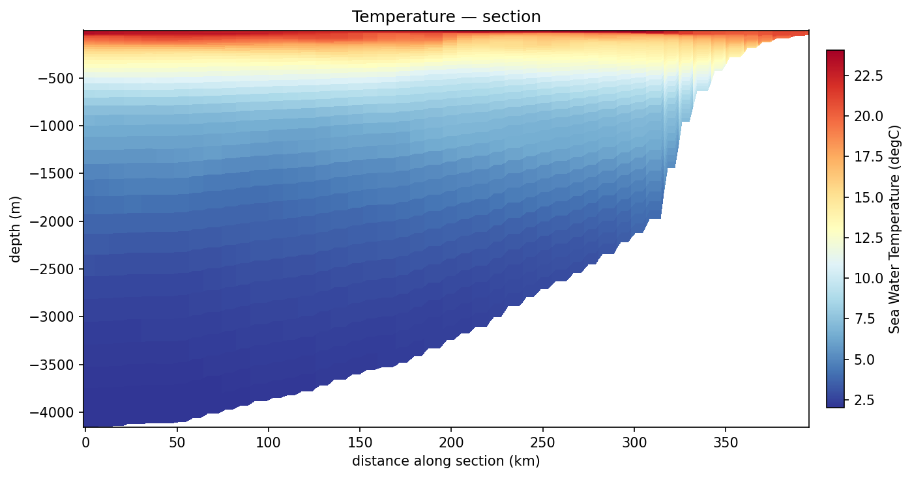

### Salinity

The same transect in salinity separates water masses that share a temperature.

```python
fig = pl.plot(pp.section(ds, "salt", lon0, lat0, lon1, lat1),
              title="Salinity — section")
```

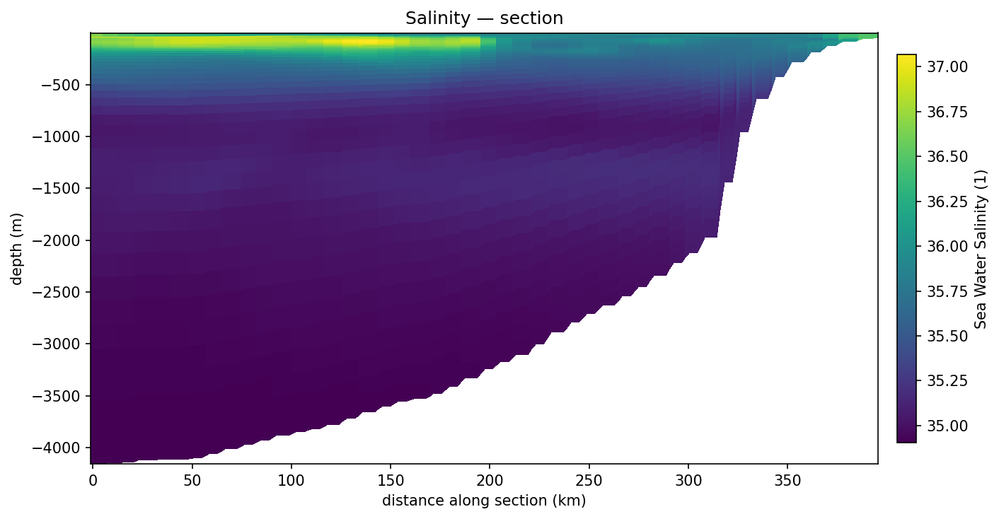

### Speed

Where the jets sit in the vertical — surface-intensified flow, or a subsurface core
over the slope.

```python
fig = pl.plot(pp.section(ds, "speed", lon0, lat0, lon1, lat1),
              title="Current speed — section")
```

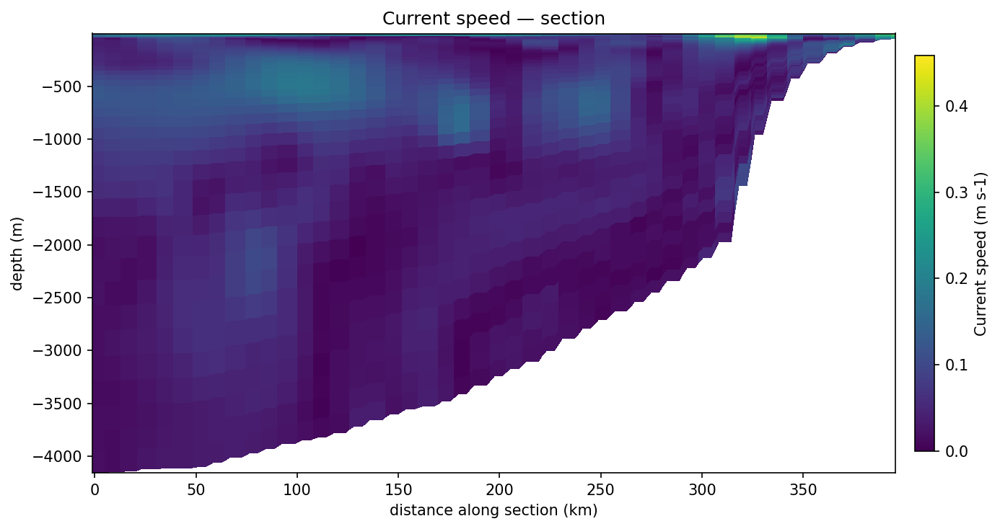

### The velocity components

Splitting the flow into its zonal and meridional parts shows direction as well as
magnitude — which matters on a coast like this one, where the along-shore and
cross-shore components behave quite differently.

```python
fig = pl.plot(pp.section(ds, "u", lon0, lat0, lon1, lat1),
              title="Zonal current — section")
```

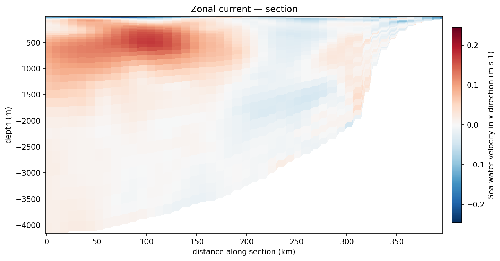

```python
fig = pl.plot(pp.section(ds, "v", lon0, lat0, lon1, lat1),
              title="Meridional current — section")
```

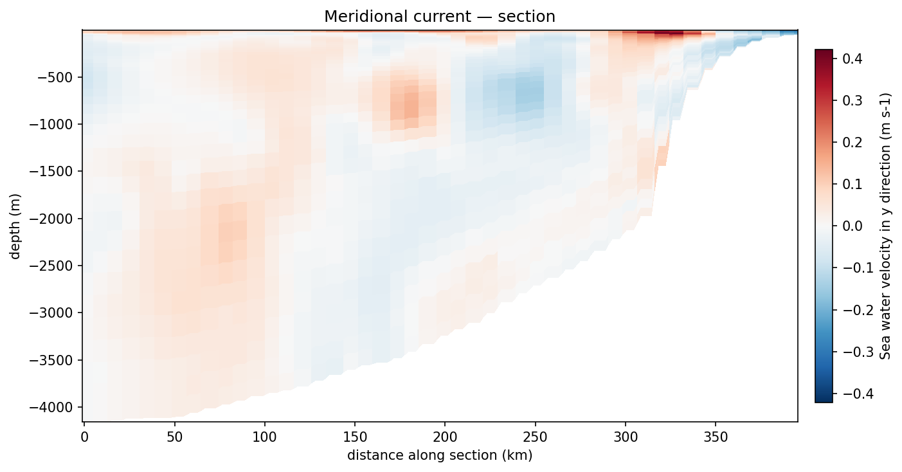

Sections work for raw fields (`temp`, `salt`, `u`, `v`) and derived ones (`speed`,
`ke`, `vort`, `vort_f`). SSH is two-dimensional and has no section.

## Profiles

A profile is the water column at one point — the quickest way to see stratification,
mixed-layer depth and where the gradients sit.

```python
pp.profile(ds, var, lon0, lat0, tindex=-1)
```

### Temperature

```python
fig = pl.plot(pp.profile(ds, "temp", plon, plat), title="Temperature")
fig.axes[0].set_ylim(-1500, 0)
```

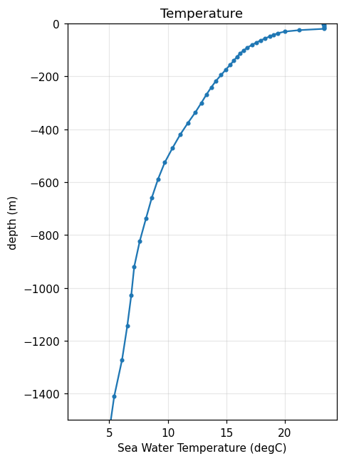

The shape tells you the structure: a near-uniform layer at the top is the mixed
layer, the sharp gradient below it the thermocline, and the slow decrease beneath
that the deep water.

Two things worth doing on every profile. **Crop the depth range** — over 4000 m of
water the interesting structure is in the top kilometre and the rest is a flat line.
And **set the title** — without it the plotter stamps the coordinates into the
title, which on a narrow figure runs wider than the plot itself.

### Salinity

```python
fig = pl.plot(pp.profile(ds, "salt", plon, plat), title="Salinity")
fig.axes[0].set_ylim(-1500, 0)
```

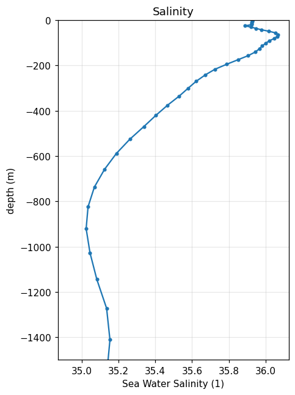

### Speed and its components

```python
fig = pl.plot(pp.profile(ds, "speed", plon, plat), title="Current speed")
fig.axes[0].set_ylim(-1500, 0)
```

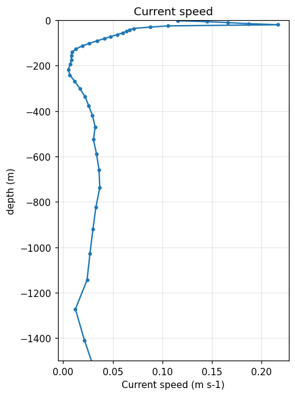

```python
fig = pl.plot(pp.profile(ds, "u", plon, plat), title="Zonal current")
fig.axes[0].set_ylim(-1500, 0)
```

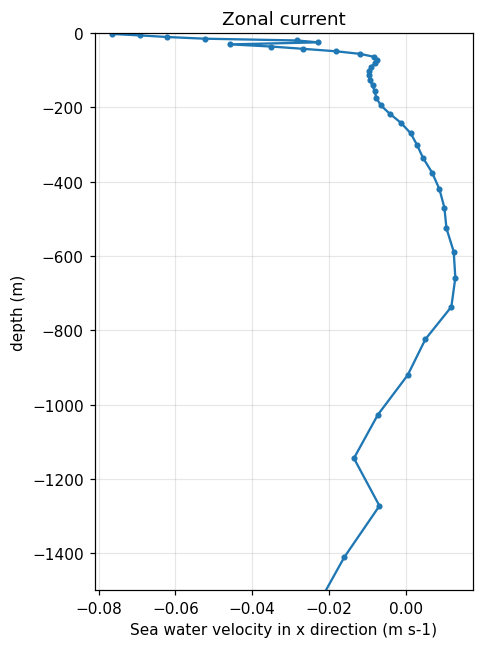

```python
fig = pl.plot(pp.profile(ds, "v", plon, plat), title="Meridional current")
fig.axes[0].set_ylim(-1500, 0)
```

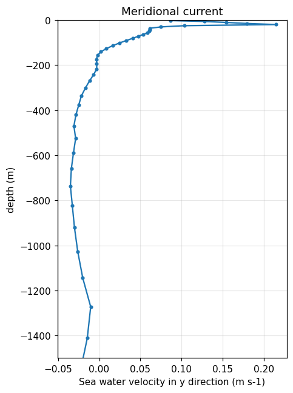

## Reproducing these figures

```python
import matplotlib; matplotlib.use("Agg")
import sftools.postprocess as pp, sftools.plotting as pl

D  = "docs/img/phase5/"
ds = pp.open_history("forecast/scratch/Canary_12/CROCO_FILES/croco_his.nc",
                     Yorig=2000)

lon0, lat0, lon1, lat1 = -21.0, 21.0, -17.2, 21.0
plon, plat = -19.0, 21.0

fields = [("temp",  "Temperature"),
          ("salt",  "Salinity"),
          ("speed", "Current speed"),
          ("u",     "Zonal current"),
          ("v",     "Meridional current")]

for var, name in fields:
    pl.plot(pp.section(ds, var, lon0, lat0, lon1, lat1),
            title=name + " — section", out=D + "g_sec_" + var + ".png")

for var, name in fields:
    fig = pl.plot(pp.profile(ds, var, plon, plat), title=name)
    fig.axes[0].set_ylim(-1500, 0)
    fig.savefig(D + "g_prof_" + var + ".png", dpi=110, bbox_inches="tight")
```