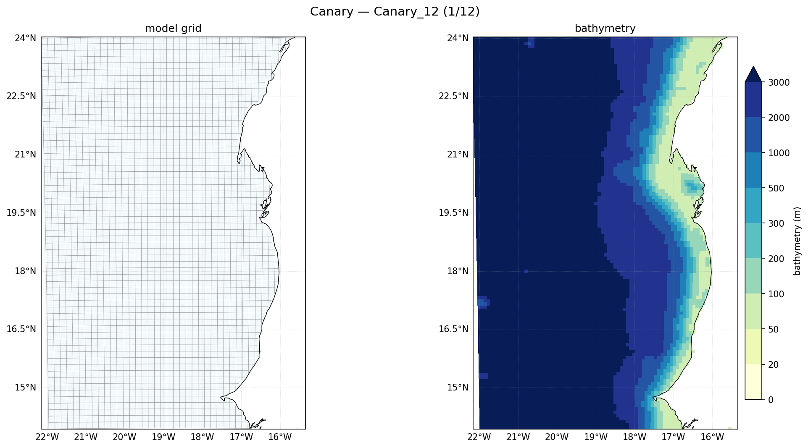

The worked example throughout the docs: an eastern-boundary upwelling system off
North-West Africa, and the parent for the nesting chapter (Phase 7).

| | |
|---|---|
| **Box** | 22°W–15.5°W, 14°N–24°N |
| **Resolution** | 1/12° (≈ 9 km), 50 σ-levels |
| **Grid** | 81 × 123 (LLm0=79, MMm0=121) |
| **Boundaries** | South, West, North **open**; East **closed** (African coast) |
| **Hemisphere** | Western → `FIX_GFS_LON=1` |
| **Distinctive** | Coastal upwelling, filaments and the Canary eddy corridor; the parent for the 1/25° nest (Phase 7) |
| **Build** | `make_grid_config.py "Canary_12" -22 -15.5 14 24 1/12 1/12` |

**Physical notes.** Canary is a classic **eastern-boundary upwelling** region:
equatorward trade winds drive offshore Ekman transport, cold nutrient-rich water
upwells along the coast, and the front sheds filaments and eddies westward. The east
boundary is the African coast (closed); the other three are open ocean where the
model reads Mercator data. This is the region used end-to-end in Phases 2–6.