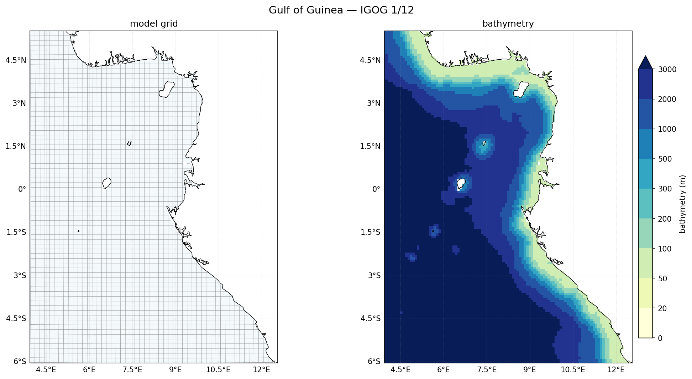

An equatorial domain in the Bight of Biafra, wrapping the corner of the West-African
coast. Physically distinct from Canary: it straddles the equator and includes the
Cameroon-Line volcanic islands.

| | |
|---|---|
| **Box** | 4°E–12.5°E, 6°S–5.5°N |
| **Resolution** | 1/12° (≈ 9 km), 50 σ-levels |
| **Grid** | 105 × 141 (LLm0=103, MMm0=139) |
| **Boundaries** | South, West **open**; North, East **closed** (coast wraps the NE corner) |
| **Hemisphere** | Eastern → `FIX_GFS_LON=0` |
| **Distinctive** | Straddles the equator (f→0); includes the volcanic islands Bioko, Príncipe, São Tomé, Annobón; download box stays in the eastern hemisphere |
| **Build** | `make_grid_config.py "IGOG_12" 4 12.5 -6 5.5 1/12 1/12` |

**Physical notes.** IGOG sits on the **equator**, so the Coriolis parameter goes to
zero through the middle of the domain — a genuinely different dynamical regime from
Canary's mid-latitude, geostrophic upwelling. Expect equatorial features (the
Guinea Current along the north, seasonal upwelling, equatorial wave dynamics) rather
than a classic upwelling front. The **coast wraps the north and east** (the Niger
Delta on the north, Cameroon/Gabon on the east), so both those boundaries are
**closed** — the mirror of Canary, whose coast is only on the east. The interior
holds the **Cameroon Volcanic Line islands** (Bioko near the coast, then Príncipe,
São Tomé and Annobón offshore), which appear as isolated masked cells ringed by
seamount bathymetry.

**Per-region gotchas.**

- **Eastern hemisphere.** All longitudes are positive, so the GFS 0–360 → −180..180
  fix is *not* needed: `FIX_GFS_LON=0`. (If you ever extend the box west of 0°E it
  would straddle the prime meridian and need `FIX_GFS_LON=1` plus a check that the
  converted longitudes stay monotonic.)
- **Download margin stays positive.** The download box (grid + 1.5° each side) is
  `2.5°E–14°E, 7.5°S–7°N` — still fully eastern-hemisphere, so no seam issues.
- **North boundary is only ~14% ocean.** The Niger-Delta coast fills most of the top
  edge, so the north is closed; the open west boundary handles the flow in that
  corner.

<!-- RESULT PANEL — add once the IGOG forecast has run:

A forecast SST snapshot: the Guinea Current along the north, the equatorial cold
tongue, and the shelf/coast structure the 1/12° grid resolves.
-->

---

<!-- ================================================================
     TEMPLATE for the next region card (copy, fill in from the build)
     ================================================================

## <Region name> — `<CONFIG>` (1/12°)

<one-line description>

| | |
|---|---|
| **Box** | <lon/lat extent> |
| **Resolution** | 1/12°, 50 σ-levels |
| **Grid** | <xi> × <eta> (LLm0=<xi-2>, MMm0=<eta-2>) |
| **Boundaries** | <which open / which closed, and why> |
| **Hemisphere** | <Eastern → FIX_GFS_LON=0 / Western → FIX_GFS_LON=1> |
| **Distinctive** | <what makes this region physically interesting> |
| **Build** | `make_grid_config.py "<CONFIG>" <lonmin> <lonmax> <latmin> <latmax> 1/12 1/12` |

**Physical notes.** <the dominant dynamics — currents, upwelling, retroflection, …>

**Per-region gotchas.** <CFL / dt, steep bathymetry, hemisphere, straddling 0°, …>
-->