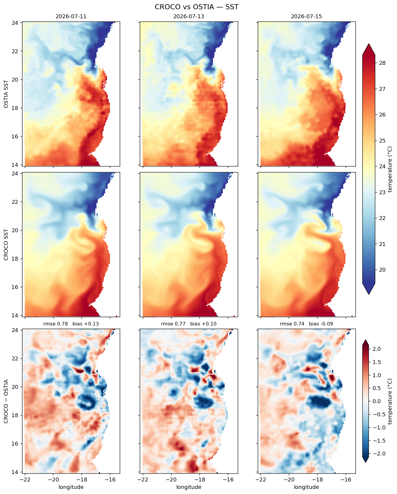

# Against an analysis

Phase 5 plots a run. This page plots a run *against* something — the same fields, side by
side with a reference, and the difference between them.

Statistics tell you how large the error is. A map tells you where it is, and that is often
the more useful thing: a bias spread evenly over the domain and a bias concentrated on one
front have the same RMSE and different causes.

This works with any gap-free reference. OSTIA is the natural one for SST.

```bash
cd ~/seaforward
python3 << 'PYEOF'
import matplotlib; matplotlib.use('Agg')
import sftools.validation_obs as vo

HIS = 'forecast/model-runs/Canary_12/20260711/fcst/CROCO_FILES/croco_his.nc'
OST = 'data/OBS/ostia_2026-07-08_2026-07-17.nc'

vo.compare_days(HIS, OST, 'temp',
                days=['2026-07-11', '2026-07-13', '2026-07-15'],
                daily_mean=True, Yorig=2000, out='days.png')
PYEOF
```

```text
SST  SEA-FORWARD vs OSTIA:
   2026-07-11   rmse  0.7845   bias +0.1316   corr  0.925
   2026-07-13   rmse  0.7742   bias +0.0982   corr  0.923
   2026-07-15   rmse  0.7391   bias -0.0949   corr  0.934
```



*OSTIA on top, SEA-FORWARD below it, the difference at the bottom. The two field rows
share one colour scale; the difference has its own.*

Sharing the colour scale between the field rows is the point. Scaled independently, each
panel fills its own range and two quite different fields look alike; shared, a difference
you can see between the rows is a real difference.

## Choosing what to show

```python
days=None                          # every record
days=5                             # the first five
days=(2, 7)                        # records 2 to 6
days=['2026-07-11', '2026-07-15']  # named dates
days=[0, 3, 6]                     # record indices
```

Named dates are matched to the nearest record and raise if the nearest is more than a day
away, so a typo produces an error rather than a quiet comparison against the wrong day.

The rows are configurable too:

```python
rows=('reference', 'croco', 'difference')   # the default
rows=('croco', 'difference')                # drop the reference row
rows=('reference', 'croco')                 # the two fields alone
```

## One day, three panels

For a single date:

```bash
cd ~/seaforward
python3 << 'PYEOF'
import matplotlib; matplotlib.use('Agg')
import sftools.validation_obs as vo

HIS = 'forecast/model-runs/Canary_12/20260711/fcst/CROCO_FILES/croco_his.nc'
OST = 'data/OBS/ostia_2026-07-08_2026-07-17.nc'

vo.compare(HIS, OST, 'temp', date='2026-07-14', daily_mean=True,
           Yorig=2000, out='one_day.png')
PYEOF
```

Same three panels, one column. `kind='stats'` returns the numbers without drawing
anything.

## Appearance

Every scale and colour can be set rather than inferred:

```bash
cd ~/seaforward
python3 << 'PYEOF'
import matplotlib; matplotlib.use('Agg')
import sftools.validation_obs as vo

HIS = 'forecast/model-runs/Canary_12/20260711/fcst/CROCO_FILES/croco_his.nc'
OST = 'data/OBS/ostia_2026-07-08_2026-07-17.nc'

vo.compare_days(HIS, OST, 'temp', days=3, Yorig=2000,
                vmin=18, vmax=26,          # the field rows
                dlim=1.5,                  # the difference row, symmetric
                cmap='RdYlBu_r', dcmap='RdBu_r',
                title='Canary_12, mid-July',
                out='days.png')
PYEOF
```

Left alone, the field limits come from the 1st and 99th percentiles of both fields together
and the difference limit from the 99th percentile of its absolute value. That is usually
right, but a percentile scale on a field that barely varies will amplify noise into
apparent structure — if a difference panel looks dramatic, check `dlim` before believing
it.

## Other variables

The same call, a different reference:

```bash
cd ~/seaforward
python3 << 'PYEOF'
import matplotlib; matplotlib.use('Agg')
import sftools.validation_obs as vo

HIS   = 'forecast/model-runs/Canary_12/20260711/fcst/CROCO_FILES/croco_his.nc'
DUACS = 'data/OBS/duacs_2026-07-07_2026-07-24.nc'
GC    = 'data/OBS/globcurrent_2026-07-07_2026-07-24.nc'
ARM   = 'data/OBS/armor3d_2026-07-08_2026-07-17.nc'
days  = ['2026-07-11', '2026-07-13', '2026-07-15']

vo.compare_days(HIS, DUACS, 'ssh',   days=days, Yorig=2000, out='days_ssh.png')
vo.compare_days(HIS, GC,    'speed', days=days, depth_m=15, Yorig=2000,
                out='days_speed.png')
vo.compare_days(HIS, ARM,   'salt',  days=days, depth_m=100, min_depth=500,
                Yorig=2000, out='days_salt.png')
PYEOF
```

Each reference carries only some variables — `vo.describe()` lists them. Asking for one a
product does not have raises and says which it does.

`min_depth=500` on the ARMOR3D call excludes the shelf, where that product is unreliable —
see the references page.

## What to look for

**Is the difference structured or scattered?** Thin filaments tracing fronts mean the model
has the features slightly displaced — a resolution or timing difference. Broad patches mean
a magnitude error. Speckle at the grid scale usually means noise rather than physics.

**Does it change between days?** A difference that appears on one day and not the next is
an event; one that persists is a bias.

**And is it where the model should be better?** The value of a downscaling is at the coast
and over the shelf. A difference concentrated in the open ocean, where the parent already
resolves everything, is worth a different explanation from one along the upwelling front.

Here the bias changes sign between 11 and 15 July — +0.13 to −0.09 — while the RMSE barely
moves. That is the initial warm offset washing out, leaving pattern error that the maps
show sitting along the front.