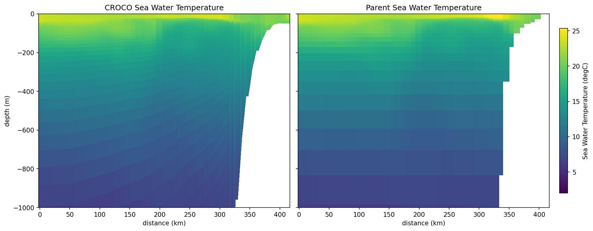
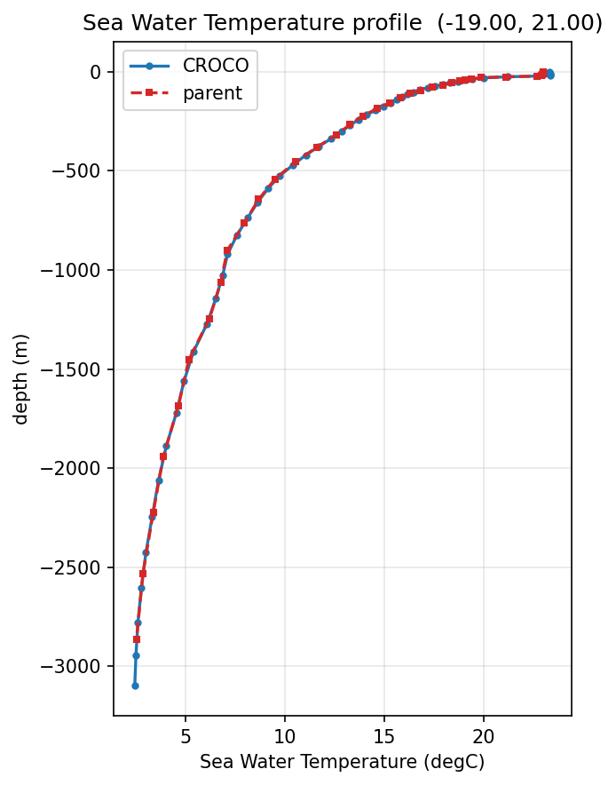
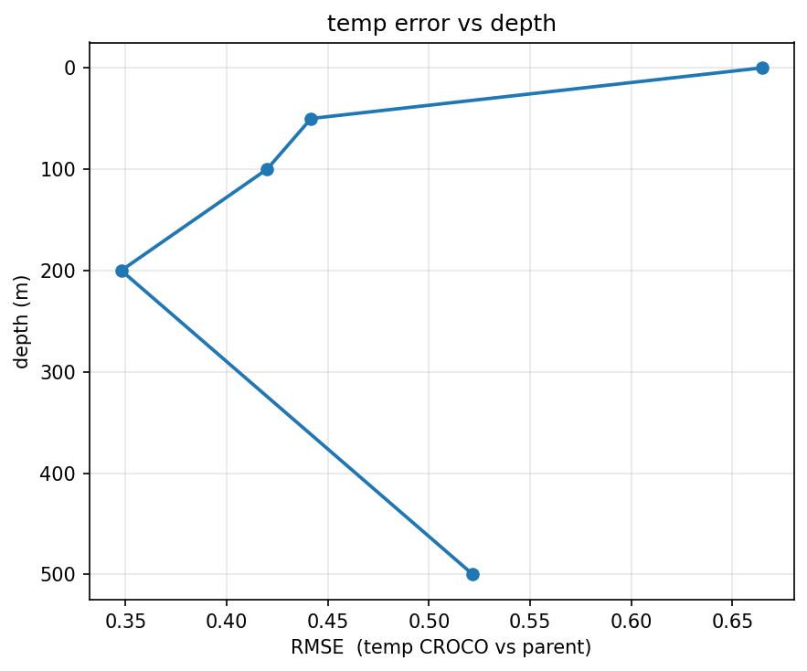

# Below the surface

Everything so far has been the surface, because that is where the observations are. The
interior is harder: no satellite sees it, and the only depth-resolved references are the
parent product and ARMOR3D, which is a reconstruction rather than a measurement.

Three views, all in `sftools.validation`.

## A section

```bash
cd ~/seaforward
python3 << 'PYEOF'
import matplotlib; matplotlib.use('Agg')
import sftools.validation as val

HIS  = 'forecast/model-runs/Canary_12/20260711/fcst/CROCO_FILES/croco_his.nc'
MERC = ('forecast/model-runs/Canary_12/20260711/downloaded_data/'
        'MERCATOR/MERCATOR_20260711_00.nc')

val.compare_section(HIS, MERC, 'temp', -21.0, 21.0, -17.0, 21.0,
                    date='2026-07-14', depth_max=1000, Yorig=2000,
                    out='section.png')
PYEOF
```



*A zonal transect at 21°N, the top 1000 m.*

The bathymetry is the thing to notice. SEA-FORWARD follows the slope smoothly on
terrain-following coordinates; the parent renders it as a staircase of z-levels. That
difference is most of why a downscaling exists, and it is visible here without any
statistics.

`depth_max` matters — without it the panel spans 5000 m and the thermocline, which is what
you want to see, occupies the top tenth of the figure.

## A profile

```bash
cd ~/seaforward
python3 << 'PYEOF'
import matplotlib; matplotlib.use('Agg')
import sftools.validation as val

HIS  = 'forecast/model-runs/Canary_12/20260711/fcst/CROCO_FILES/croco_his.nc'
MERC = ('forecast/model-runs/Canary_12/20260711/downloaded_data/'
        'MERCATOR/MERCATOR_20260711_00.nc')

val.compare_profile(HIS, MERC, 'temp', -19.0, 21.0, date='2026-07-14',
                    Yorig=2000, out='profile.png')
PYEOF
```



*At 19°W, 21°N.*

Offshore the two agree closely — the thermocline is at the same depth with the same shape,
which says the downscaling inherited its stratification faithfully. Differences appear
near the coast and near the surface, which is where the finer grid does its work.

## Error against depth

```bash
cd ~/seaforward
python3 << 'PYEOF'
import matplotlib; matplotlib.use('Agg')
import sftools.validation as val

HIS  = 'forecast/model-runs/Canary_12/20260711/fcst/CROCO_FILES/croco_his.nc'
MERC = ('forecast/model-runs/Canary_12/20260711/downloaded_data/'
        'MERCATOR/MERCATOR_20260711_00.nc')

val.error_vs_depth(HIS, MERC, field='temp', date='2026-07-14', Yorig=2000,
                   out='depth.png')
PYEOF
```



One number per level, so you can see whether a disagreement is a surface problem, a
thermocline problem, or throughout the water column.

## The reference is the difficulty here

ARMOR3D is the only depth-resolved reference that is not the parent, and it has a
limitation that matters. Comparing temperature at 100 m, split by the water depth beneath
each point:

```bash
cd ~/seaforward
python3 << 'PYEOF'
import numpy as np, glob
import sftools.postprocess as pp
import sftools.validation_obs as vo

HIS = 'forecast/model-runs/Canary_12/20260711/fcst/CROCO_FILES/croco_his.nc'
ARM = sorted(glob.glob('data/OBS/armor3d_*.nc'))[-1]

ds = pp.open_history(HIS, Yorig=2000)
m  = pp.field_at_depth(ds, 'temp', 100, tindex=-1).values
r  = vo.load_reference(ARM, 'temp', ds, date='2026-07-14', depth_m=100)
h  = ds.h.values
d  = m - r

for lo, hi in [(100, 200), (200, 500), (500, 1000), (1000, 9000)]:
    s = np.isfinite(d) & (h >= lo) & (h < hi)
    if s.sum():
        print('h %5d-%5d m: n=%5d  bias %+6.2f  rmse %5.2f'
              % (lo, hi, s.sum(), np.nanmean(d[s]), np.sqrt(np.nanmean(d[s]**2))))
PYEOF
```

```text
h   100-  200 m: n=  173  bias  +1.17  rmse  1.70
h   200-  500 m: n=  295  bias  +1.27  rmse  1.61
h   500- 1000 m: n=  234  bias  +0.79  rmse  1.10
h  1000- 9000 m: n= 7065  bias  -0.23  rmse  0.92
```

Over the shelf and slope SEA-FORWARD reads more than a degree warmer than ARMOR3D. In deep
water the bias is −0.23 and the RMSE below 1.

ARMOR3D reconstructs the subsurface by projecting altimetry downward using covariances
built from Argo profiles. Argo floats avoid shallow water, so those covariances are thin
over a shelf, and at 1/8° a narrow slope is barely resolved. The reconstruction there is
closer to an extrapolation.

Whether the +1.2 °C is the reference failing or the model's upwelling being too weak at
depth, this comparison cannot say. The deep-water numbers are the ones to quote, and
`min_depth=500` excludes the rest:

```python
vo.compare_days(HIS, ARM, 'temp', depth_m=100, min_depth=500, Yorig=2000)
```

!!! note
    The two products also disagree about *where* 100 m is. The model interpolates from its sigma layers to a true 100 m; ARMOR3D and Mercator each snap to their nearest level, which can be several metres away. In a sharp thermocline that mismatch is worth a fraction of a degree on its own.