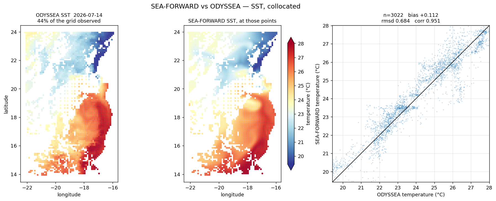

# Against observations

Comparing the forecast against what satellites actually measured.

The obvious approach — interpolate the observations onto the model grid and difference
them — fails for a product with gaps, because the interpolation fills the holes and the
statistics then score invented values as agreement. Collocation avoids that by going the
other way: sample the model at each observed point.

```bash
cd ~/seaforward
python3 << 'PYEOF'
import matplotlib; matplotlib.use('Agg')
import sftools.validation_obs as vo

HIS = 'forecast/model-runs/Canary_12/20260711/fcst/CROCO_FILES/croco_his.nc'
ODY = 'data/OBS/odyssea_2026-07-07_2026-07-24.nc'

vo.compare(HIS, ODY, 'temp', method='collocate', date='2026-07-14',
           daily_mean=True, Yorig=2000, out='collocation.png')
PYEOF
```



*The observations with their cloud gaps intact, the model sampled at those same points,
and the two against each other.*

`method='auto'` picks collocation for any product with gaps and regridding otherwise, so
in practice you rarely set it.

## The scorecard

Statistics per day, no figure:

```bash
cd ~/seaforward
python3 << 'PYEOF'
import sftools.validation_obs as vo

HIS = 'forecast/model-runs/Canary_12/20260711/fcst/CROCO_FILES/croco_his.nc'
ODY = 'data/OBS/odyssea_2026-07-07_2026-07-24.nc'

vo.scorecard(HIS, ODY, 'temp', days=5, Yorig=2000)
PYEOF
```

```text
SST  SEA-FORWARD vs ODYSSEA, collocated:
   date         cover     n     bias    rmsd   urmsd    corr
   2026-07-11   54.0%    3882  +0.398   0.816   0.712   0.925
   2026-07-12   61.4%    4301  +0.176   0.680   0.657   0.954
   2026-07-13   62.6%    4474  +0.111   0.728   0.720   0.941
   2026-07-14   44.2%    3022  +0.112   0.684   0.675   0.951
   2026-07-15   54.3%    3967  -0.122   0.886   0.877   0.916
```

| Column | |
|---|---|
| `cover` | how much of the grid was observed that day — cloud, for a satellite product |
| `n` | pairs actually compared |
| `bias` | mean difference; a systematic offset |
| `rmsd` | total error |
| `urmsd` | error after removing each field's mean, so pattern error alone. `rmsd² = bias² + urmsd²` |
| `corr` | correlation |

Splitting `rmsd` into `bias` and `urmsd` is worth doing. A forecast that is uniformly half
a degree warm and one that has the fronts in the wrong place can share an RMSE and need
different fixes.

Here the bias falls from +0.40 to near zero over five days while `urmsd` stays around 0.7
— the initial warm offset washes out, and what remains is pattern error.

## Two references, one answer

The reason to use both SST products is that they fail differently. OSTIA fills its gaps by
interpolation and assimilates in-situ data, some of which Mercator also uses. ODYSSEA
interpolates nothing and assimilates nothing, but sees only 44–63% of the domain.

If they disagreed about the model, neither could be trusted. They do not:

```bash
cd ~/seaforward
python3 << 'PYEOF'
import sftools.validation_obs as vo

HIS = 'forecast/model-runs/Canary_12/20260711/fcst/CROCO_FILES/croco_his.nc'
OST = 'data/OBS/ostia_2026-07-08_2026-07-17.nc'

vo.scorecard(HIS, OST, 'temp', days=5, Yorig=2000)
PYEOF
```

```text
SST  SEA-FORWARD vs OSTIA, collocated:
   date         cover     n     bias    rmsd   urmsd    corr
   2026-07-11   80.4%   22267  +0.138   0.722   0.708   0.935
   2026-07-12   80.4%   22267  +0.041   0.731   0.729   0.929
   2026-07-13   80.4%   22267  +0.102   0.698   0.690   0.934
   2026-07-14   80.4%   22267  +0.025   0.661   0.660   0.948
   2026-07-15   80.4%   22267  -0.085   0.674   0.668   0.944
```

RMSE 0.66–0.73 against 0.68–0.89, correlations 0.93–0.95 against 0.92–0.95, and the same
sign change in the bias around day 4. Two products built from different data by different
methods, agreeing.

That agreement is what makes the skill page's result — that SEA-FORWARD beats its parent
on SST — worth stating. A single reference could be flattering the model; two independent
ones agreeing is much harder to dismiss.

!!! note
    OSTIA's coverage is 80.4% every day, unchanging. That is land — the Canary domain has a substantial African coast, and OSTIA masks it rather than filling it. Gap-free means no cloud gaps over ocean, not a value in every cell.

## Two traps worth knowing

**Compare daily means.** These products are daily; a run carrying tides and a diurnal
cycle is not. Comparing raw sub-daily records makes the error oscillate once a day and
hides everything else. `daily_mean=True` is the default for the scorecard and should
almost always stay on.

**Watch the sampling.** The model field is complete over its domain, so sampling it at
observation points invents nothing — but only where the model has water. An observation
just past the model's edge, or in a bay the grid does not reach, would otherwise be given
a value interpolated from cells far away. The module tests the land mask at each point and
drops anything not properly surrounded by wet cells. Without that test, a single row of
such points doubled the RMSE in this configuration.