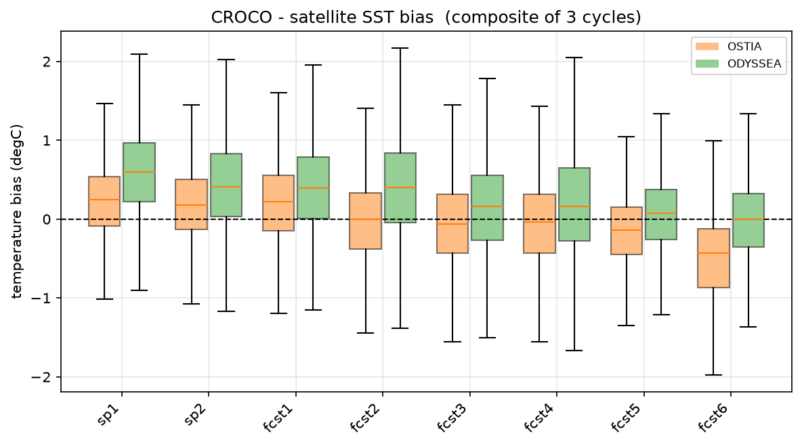
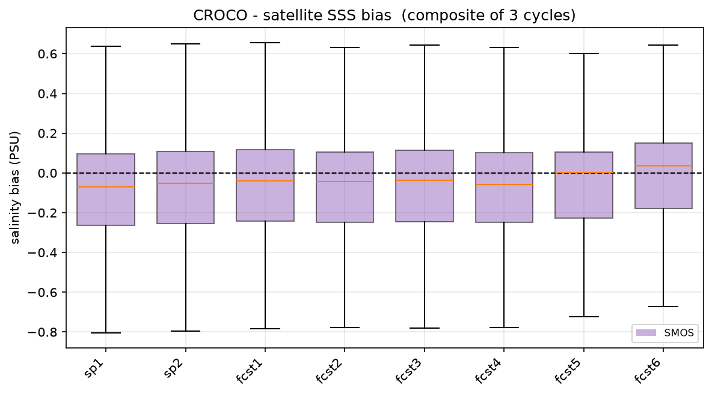

# Metrics Against Observation

Two baselines answer that:

- **The time series of the sngle pont (or domain) mean**: a model that's merely close to observations on day 1 and still close on day 5 has told you nothing about skill; what matters is whether its line stays nearer the observations than the parent's own line, as lead time grows. 

- **The bias/RMSE boxplots**: turn that same two-way comparison into a distribution instead of a single mean. One box per lead day, per baseline: where the box sits shows systematic bias (a box that drifts off zero as lead time grows is the model's error compounding, not just spreading), and how wide it is shows spatial or day-to-day inconsistency the mean alone can hide — the boxplot is what catches that; the time series above cannot.

The two latter are scored against the same independent observations, at the same points (or full domain), so the curves are directly comparable. See more `Section.6` in `02_validation.ipynb` for the full steps.

```python
sat_avail_key = {"OSTIA": "ostia_l4", "ODYSSEA": "odyssea_l3s", "SMOS": "smos_l4_sss"}
any_sat_avail = any(AVAIL.get(sat_avail_key[p], False) and SAT_FILES.get(p) for p in sat_avail_key)

if not any_sat_avail:
    print("No satellite product (OSTIA/ODYSSEA/SMOS) available/downloaded for this cycle - skipping.")
else:
    def _sat_diff_for_day(product, day):
        '''CROCO-minus-satellite difference for one product/day, built the
        same way Sections 7/7b regrid satellite onto the CROCO grid --
        val.domain_diff_satellite() just flattens/filters/subsamples the
        (croco, satellite) pair once it's been loaded+regridded here.'''
        files = SAT_FILES.get(product, {})
        fname = files.get(day)
        if not AVAIL.get(sat_avail_key[product], False) or not fname or not os.path.exists(fname):
            return np.array([])
        loaded = val.load_satellite_field(fname, product, date=day)
        if loaded is None:
            return np.array([])
        plon, plat, pfield = loaded
        pfield = np.squeeze(np.asarray(pfield))       # guard the same shape quirk as Section 5
        if pfield.shape != plon.shape:
            return np.array([])
        try:
            clon, clat, croco_field = val._croco_field_satellite(CROCO_HIS, product, day, Yorig=YORIG)
        except Exception:
            return np.array([])
        grid = xr.Dataset(
            {"mask_rho": (("eta_rho", "xi_rho"), np.where(np.isfinite(croco_field), 1.0, np.nan))},
            coords={"lon_rho": (("eta_rho", "xi_rho"), clon), "lat_rho": (("eta_rho", "xi_rho"), clat)})
        sat_on_croco = val.regrid_to_croco(plon, plat, pfield, grid)
        return val.domain_diff_satellite(croco_field, sat_on_croco)

    ostia_diffs   = [_sat_diff_for_day('OSTIA',   day) for day in CYCLE_DAYS]
    odyssea_diffs = [_sat_diff_for_day('ODYSSEA', day) for day in CYCLE_DAYS]
    smos_diffs    = [_sat_diff_for_day('SMOS',    day) for day in CYCLE_DAYS]

    sst_groups = {"OSTIA": ostia_diffs, "ODYSSEA": odyssea_diffs}
    sss_groups = {"SMOS": smos_diffs}

    ## bias
    val.bias_boxplot_multi(sst_groups, CYCLE_DAYS, 'temperature bias (degC)',
                           'CROCO - satellite SST bias', colors=['C1', 'C2'],
                           out=os.path.join(VALIDATION_DIR, 'boxplot_bias_sst_vs_satellite.png'))
    val.bias_boxplot_multi(sss_groups, CYCLE_DAYS, 'salinity bias (PSU)',
                           'CROCO - satellite SSS bias', colors=['C4'],
                           out=os.path.join(VALIDATION_DIR, 'boxplot_bias_sss_vs_satellite.png'))
    ## RMSE
    val.bias_boxplot_multi(sst_groups, CYCLE_DAYS, 'temperature |error| (degC)',
                           'CROCO - satellite SST RMSE-spread', colors=['C1', 'C2'], metric='rmse',
                           out=os.path.join(VALIDATION_DIR, 'boxplot_rmse_sst_vs_satellite.png'))
    val.bias_boxplot_multi(sss_groups, CYCLE_DAYS, 'salinity |error| (PSU)',
                           'CROCO - satellite SSS RMSE-spread', colors=['C4'], metric='rmse',
                           out=os.path.join(VALIDATION_DIR, 'boxplot_rmse_sss_vs_satellite.png'))
```




*SST, SSS, sea level anomaly, and the two velocity components at the surface. Three cycles pooled. sp1 and sp1 are the sprin-up days before the forecast.*

## Temperature


### OSTIA daily SST statistics

| n      | bias    | rmse    | crmse   | corr    | model_mean | ref_mean | model_min | model_max | ref_min  | ref_max  | date       |
|-------:|--------:|--------:|--------:|--------:|-----------:|---------:|----------:|----------:|---------:|---------:|:-----------|
| 8257.0 |  0.1460 | 0.7374  | 0.7228  | 0.9338  | 24.1506    | 24.0046  | 4.7713    | 28.8067   | 17.9328  | 28.8784  | 2026-07-11 |
| 8257.0 |  0.0581 | 0.7488  | 0.7465  | 0.9275  | 24.1954    | 24.1373  | 4.0208    | 28.8145   | 18.3635  | 28.8288  | 2026-07-12 |
| 8257.0 |  0.1019 | 0.7047  | 0.6973  | 0.9332  | 24.2154    | 24.1134  | 3.4174    | 28.8884   | 18.2732  | 28.5229  | 2026-07-13 |
| 8257.0 |  0.0316 | 0.6623  | 0.6616  | 0.9484  | 24.2334    | 24.2019  | 4.0564    | 29.0453   | 18.2947  | 28.9424  | 2026-07-14 |
| 8257.0 |  0.0474 | 0.6671  | 0.6654  | 0.9450  | 24.3071    | 24.2597  | 3.2882    | 29.1156   | 18.3952  | 29.4819  | 2026-07-15 |
| 8257.0 | -0.1202 | 0.8030  | 0.7939  | 0.9442  | 24.3255    | 24.4457  | 0.6397    | 29.2010   | 18.4452  | 29.6823  | 2026-07-16 |
| 8257.0 |  0.0441 | 0.7205  | 0.7146  | 0.9387  | 24.2379    | 24.1938  | 3.3656    | 28.9786   | 18.2841  | 29.0561  | **MEAN**   |


**SEA-FORWARD is closer to the observations at every lead**, and the gap remains very low day-by-day: > |0.15°C|. That is the downscaling doing something measurable.


## Salinty 

#### SMOS daily SSS statistics

|        n |      bias |     rmse |    crmse |     corr | model_mean |  ref_mean | model_min | model_max |   ref_min |   ref_max |       date |
|--------:|----------:|---------:|---------:|---------:|-----------:|----------:|----------:|----------:|----------:|----------:|:-----------|
| 8070.0  | -0.086222 | 0.300048 | 0.287392 | 0.587630 |  36.186294 | 36.272516 | 34.047318 | 37.110340 | 34.923186 | 36.991510 | 2026-07-11 |
| 8070.0  | -0.088323 | 0.274559 | 0.259965 | 0.601662 |  36.190068 | 36.278390 | 34.126732 | 37.045170 | 35.331547 | 36.957030 | 2026-07-12 |
| 8070.0  | -0.080861 | 0.303142 | 0.292159 | 0.456915 |  36.191047 | 36.271908 | 34.060242 | 36.977169 | 35.701803 | 36.947104 | 2026-07-13 |
| 8070.0  | -0.073077 | 0.287253 | 0.277802 | 0.526205 |  36.192856 | 36.265932 | 33.949394 | 36.954338 | 35.417026 | 36.993265 | 2026-07-14 |
| 8070.0  | -0.094546 | 0.274321 | 0.257513 | 0.570105 |  36.194858 | 36.289403 | 33.833569 | 36.908325 | 35.672804 | 37.130373 | 2026-07-15 |
| 8070.0  | -0.047226 | 0.293006 | 0.289175 | 0.611389 |  36.195230 | 36.242456 | 33.808666 | 36.892578 | 34.690588 | 37.229365 | 2026-07-16 |
| 8070.0  | -0.078376 | 0.288721 | 0.277334 | 0.558984 |  36.191725 | 36.270101 | 33.970987 | 36.981320 | 35.289492 | 37.041441 | MEAN       | 


!!! note
    `n = 8257` for OSTIA SST (0.05°) and `8070` for SMOS SSS (0.125°). This means that when the two are interpolated into the model grid, they don't have the same number of NaN and valid cells.

