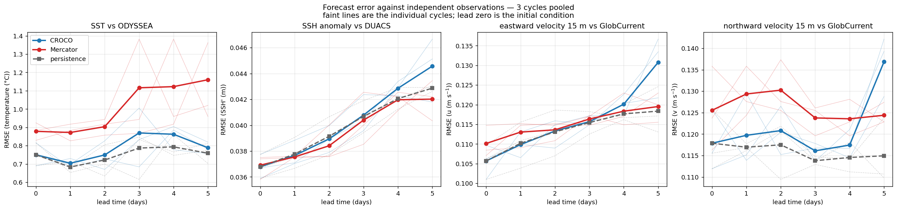

# Forecast skill

The pages before this measure how close the forecast is. This one asks whether running it
was worth the compute.

Two baselines answer that.

**Persistence** — assume nothing changes. Today's state is tomorrow's forecast. It costs
nothing, and a model that cannot beat it has not earned its place.

**The parent** — Mercator's own forecast for the same days. This is the comparison that
matters for a downscaling: not "is SEA-FORWARD close to Mercator", which measures whether
it tracked its own boundaries, but "is SEA-FORWARD closer to the observations than
Mercator is".

Both are scored against the same independent observations, at the same points, so the
three curves are directly comparable.

```bash
cd ~/seaforward
python3 << 'PYEOF'
import matplotlib; matplotlib.use('Agg')
import sftools.validation_obs as vo

runs = ['forecast/model-runs/Canary_12/%s/fcst/CROCO_FILES/croco_his.nc' % t
        for t in ('20260711', '20260712', '20260713')]

ODY   = 'data/OBS/odyssea_2026-07-07_2026-07-24.nc'
DUACS = 'data/OBS/duacs_2026-07-07_2026-07-24.nc'
GC    = 'data/OBS/globcurrent_2026-07-07_2026-07-24.nc'

vo.skill_panels(runs,
                {'temp': ODY, 'ssh': DUACS, 'u': GC, 'v': GC},
                variables=('temp', 'ssh', 'u', 'v'),
                depths={'u': 15, 'v': 15},
                Yorig=2000, out='skill.png')
PYEOF
```



*SST, sea level anomaly, and the two velocity components at 15 m. Three cycles pooled;
faint lines are the individual cycles. Lead zero is the initial condition.*

## Temperature

```text
SST  vs ODYSSEA, 3 cycles pooled:
   lead       n  SEA-FWD   parent  persist
    0.0    12657    0.750    0.879    0.750
    1.0    11797    0.704    0.872    0.684
    2.0    11463    0.750    0.904    0.722
    3.0    11360    0.870    1.116    0.787
    4.0    11818    0.863    1.123    0.794
    5.0    10301    0.789    1.160    0.759
```

**SEA-FORWARD is closer to the observations than Mercator at every lead**, and the gap
widens: 0.13 °C at day zero, 0.37 °C by day five. That is the downscaling doing something
measurable, against a reference independent of the boundaries both models were given.

It does not beat persistence. Over five days the SST field barely moves, so holding day
zero fixed is a strong baseline — and both models drift from the observations faster than
the ocean itself changes.

## Sea level

```text
SSH anomaly  vs DUACS, 3 cycles pooled:
   lead       n  SEA-FWD   parent  persist
    0.0    10611    0.037    0.037    0.037
    1.0    10611    0.038    0.038    0.038
    2.0    10611    0.039    0.039    0.039
    3.0    10611    0.041    0.040    0.041
    4.0    10611    0.043    0.042    0.042
    5.0    10611    0.045    0.042    0.043
```

Nothing: all three within a millimetre at every lead. DUACS at 0.125° is mapped from
along-track passes and smooths away most of what distinguishes a 1/12° model from a 1/4°
one, so this panel says more about the reference than about either model.

## Currents

```text
eastward velocity 15 m  vs GlobCurrent:      northward velocity 15 m:
   lead  SEA-FWD  parent  persist               lead  SEA-FWD  parent  persist
    0.0    0.106   0.110    0.106                0.0    0.118   0.126    0.118
    1.0    0.110   0.113    0.110                1.0    0.120   0.129    0.117
    2.0    0.113   0.114    0.113                2.0    0.121   0.130    0.117
    3.0    0.116   0.116    0.115                3.0    0.116   0.124    0.114
    4.0    0.120   0.118    0.118                4.0    0.117   0.124    0.115
    5.0    0.131   0.120    0.118                5.0    0.137   0.124    0.115
```

The two components behave differently, and the difference is physical.

**Eastward** — SEA-FORWARD and Mercator are within a thousandth of each other through
day 3. No advantage either way.

**Northward** — SEA-FORWARD is better at every lead except the last, by a consistent
0.008 m/s.

Along this coast the upwelling jet runs roughly north–south, so the meridional flow is
where the resolved coastal dynamics live; the zonal component is more open-ocean, where
1/12° buys less over 1/4°. Three cycles and 0.008 m/s make that an observation rather than
a result, but it is the kind of thing worth watching as more cycles accumulate.

Both components lose to persistence from day 1, and both jump sharply at day 5.

!!! note
    `n = 2643` for the currents against `12657` for SST. GlobCurrent is 0.25°, so it has roughly a fifth as many cells over this domain — the current numbers rest on far less data and should be read more cautiously.

## Reading it honestly

**The parent comparison is the result.** SEA-FORWARD improves on Mercator for SST at every
lead and for the northward current throughout, measured against observations neither model
assimilated. That is the case for downscaling, made rather than asserted.

**The persistence comparison is a caution.** A free-running regional model has no data
assimilation: it starts from an analysed state and evolves under its own dynamics, so its
errors grow while persistence's do not. At these lead times, for these fields, that growth
is fast enough to cancel the advantage. Assimilation is what would change that, and this
configuration has none.

**And the day-five collapse is real.** Every variable turns upward at the end of the
window, in all three cycles. The boundary and atmospheric forcing both extend past the
run's end, so it is not the inputs running out — it is the model's own error growth
reaching the point where the initial state no longer constrains it.

!!! note
    Three cycles. Enough to see that a result repeats, not enough to average confidently — which is why the individual cycles are drawn rather than a confidence band. A verification figure in the literature would pool dozens.