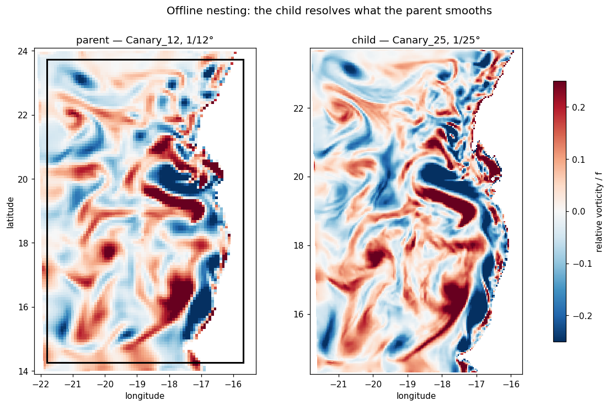
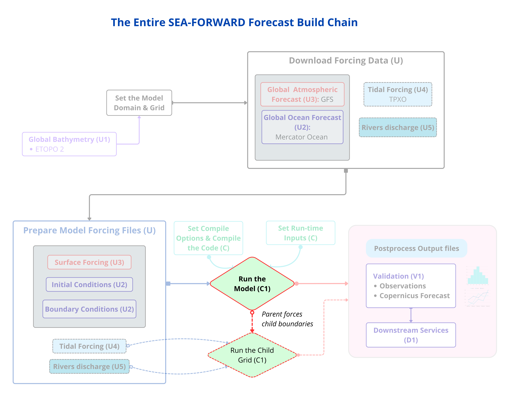

# Phase 7 — Nesting (offline)

This phase teaches **offline nesting**: running a finer-resolution "child" model
inside the domain of a coarser "parent" you already built. It's how you climb the
resolution ladder — **1/12° → 1/25° → 1/50°** — over the same region, resolving
finer eddies, filaments and coastal structure at each step.

The worked example refines **Canary_12** (1/12°, 50 levels) into **Canary_25**
(1/25°, 75 levels) over the same box. This is the *manual* route, where you do every
step by hand so you understand what nesting actually is; the last two steps wrap it
into an on-demand driver.

!!! important
    **Prerequisite:** you have a working parent (Phases 2 and 3) — a Canary_12 forecast that runs to `MAIN: DONE` and produces `croco_his.nc`. Nesting takes that output as its input, so the parent must exist first.

## The idea behind nesting

Your forecast already **downscales a global product**: it takes Mercator (1/12°
global ocean) and adds fine detail over your region. Nesting is the *same idea, one
level down*:

```text
Mercator (global)  →  Canary_12 (1/12°)  →  Canary_25 (1/25°)
   the parent of         the parent of          the child
   Canary_12             Canary_25
```



*The child's footprint outlined on the parent (left), and the same box run at 1/25°
(right). Relative vorticity, normalised by f — the child resolves filaments and small
eddies that the parent smooths into broad patches. That difference is the whole point
of nesting.*

**A nested child is just a forecast whose "global product" is your own coarser run.**
Everything you learned in Phase 2 applies — you build a grid, decide boundaries, make
ini and bry, edit the config, compile, run. The *only* thing that changes is **where
the ocean data comes from**: instead of Mercator, it comes from your 1/12° CROCO
output.

That is the whole lesson. Nesting is Phase 2 with the parent's output as the ocean
source.

!!! note
    **Offline nesting lets the child have its own vertical grid.** Canary_25 uses 75 levels against the parent's 50 — worth doing when the child resolves a shelf where the parent had only a few layers. An AGRIF child (Phase 8) cannot: the two grids exchange data column by column every timestep, so they must share the vertical. That freedom is the main reason to nest offline rather than online.

### The one new tool: the converter

There's a small wrinkle. `make_ini` and `make_bry` expect the ocean data in
**Mercator format** — z-levels, with variables `thetao/so/uo/vo/zos`. But CROCO
output is on **sigma levels** with names `temp/salt/u/v/zeta`. So we first
**translate** the parent's output into a Mercator-looking file. That translator is
`sftools/nesting.py`, the only genuinely new piece in this whole phase.

```text
1/12° croco_his.nc  ──(nesting.py)──►  parent_<date>.nc  ──(make_ini/bry)──►  child ini/bry
  sigma, temp/salt      "looks like        z-levels,           child sigma
  /u/v/zeta              Mercator"          thetao/so/...       N=75
```

Once the parent output *looks like* Mercator, the standard Phase-2 machinery builds
the child inputs without knowing — or caring — that the "global product" is actually
your own model.



*Offline nesting: the parent runs to completion first, then its saved output becomes
the child's ocean.*