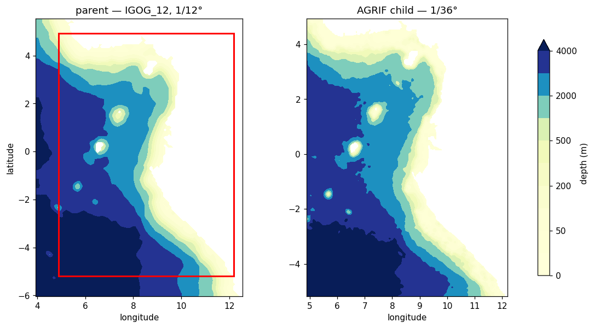

### 2a — Why this doesn't use the tool you already know

Phase 2 built IGOG_12's grid with `make_grid.py` and a `grid.ini`. That script
**cannot build a zoom grid** — it has no notion of a parent. The AGRIF logic lives in
a Python class, `CROCO`, in `code/croco_pytools/prepro/Modules/croco_class.py`, and
the only thing shipped that drives it is a Jupyter notebook,
`nb_make_grid_zoom.ipynb`.

Most of that notebook is `edit_section_widget(...)` calls — interactive widgets for
editing config values by clicking. The actual work is four method calls:

```python
croco = CROCO("some_zoom.ini")   # read the config
croco.create_grid()              # build the child's lon/lat as a 3x refinement
croco.create_mask_and_topo()     # interpolate bathymetry, build the mask, merge edges
croco.save_grid_nc()             # write croco_grd.nc.1 + AGRIF_FixedGrids.in
```

The widgets exist only to write values into the `.ini`. Write the `.ini` yourself and
you don't need Jupyter — you can call those four methods from an ordinary script,
which is what this step does.

### 2b — Set up the working directory

Don't build the AGRIF child inside `scratch/IGOG_12/`. That directory holds a working,
compiled forecast configuration; the AGRIF setup needs parent and child files side by
side and will clutter it. Make a separate one:

```bash
mkdir -p ~/seaforward/forecast/scratch/IGOG_AGRIF/CROCO_FILES
# the child grid is built FROM the parent, so the parent must be there first
cp ~/seaforward/forecast/scratch/IGOG_12/CROCO_FILES/croco_grd.nc \
   ~/seaforward/forecast/scratch/IGOG_AGRIF/CROCO_FILES/croco_grd.nc
ls -la ~/seaforward/forecast/scratch/IGOG_AGRIF/CROCO_FILES/
```

That's a **copy**, deliberately. The zoom config points at it as `parent_grid`, and
the child gets written beside it as `croco_grd.nc.1`. Both grids end up in one place,
which is what the model needs at run time.

### 2c — Write the zoom config

The config goes in the **prepro directory**, because that's where you'll run the
script from:

```bash
nano ~/seaforward/code/croco_pytools/prepro/igog_zoom_agrif.ini
```

Substitute your own username and your `imin/imax/jmin/jmax` from Step 1:

```ini
[Croco_Files]
croco_files_dir = /home/you/seaforward/forecast/scratch/IGOG_AGRIF/CROCO_FILES
croco_grd_prefix = croco_grd

[Zoom_Options]
is_zoom = True
is_agrif = True
agrif_level = 1
parent_grid = /home/you/seaforward/forecast/scratch/IGOG_AGRIF/CROCO_FILES/croco_grd.nc

[Grid_Zoom_Params]
north_obc = False
south_obc = True
west_obc = True
east_obc = False
merging_area = 5

[Grid_Zoom_Agrif]
coef = 3
imin = 11
imax = 90
jmin = 11
jmax = 126

[Grid_Smoothing_Params]
hmin = 50.0
hmax = 6000.0
interp_rad = 2
rfact = 0.2
smooth_meth = lsmooth

[Grid_Isolated_Waterbodies]
mask_isolated_waterbodies = False
main_water_body_x_idx = 20
main_water_body_y_idx = 20

[Grid_Input_Files]
topo_file_reader = etopo2
topo_file = /home/you/seaforward/data/DATASETS_CROCOTOOLS/Topo/etopo2.nc
shp_file = /home/you/seaforward/data/DATASETS_CROCOTOOLS/gshhs/GSHHS_shp/i/GSHHS_i_L1.shp
```

`Ctrl+O` `Enter`, `Ctrl+X`.

The two closed edges come straight from the parent's mask: IGOG's coast wraps the
north and east, so `north_obc` and `east_obc` are `False` here exactly as they are in
the parent's own `cppdefs.h`. Set yours from your Step 1 check, not from this example.

!!! warning
    **Pasting long heredocs into a terminal is unreliable.** A `cat > file << 'EOF'` block can collide with whatever you paste after it and truncate the file without saying so. Use nano as above, or a Python block. Either way, check the result with `wc -l` and `tail`.

**Section by section:**

| Section | Key | Meaning |
|---|---|---|
| `[Croco_Files]` | `croco_files_dir` | where the child grid gets written |
| | `croco_grd_prefix` | base name; `agrif_level` appends the `.1` |
| `[Zoom_Options]` | `is_zoom` / `is_agrif` | both True — a zoom grid, AGRIF-style |
| | `agrif_level = 1` | first-level child, so it writes `croco_grd.nc.1` |
| | `parent_grid` | must already exist, from 2b |
| `[Grid_Zoom_Params]` | `*_obc` | which edges are open, from your Step 1 mask check |
| | `merging_area = 5` | blend the child's bathymetry into the parent's over 5 child cells at each open edge, so the two agree on depth where they exchange data |
| `[Grid_Zoom_Agrif]` | `coef = 3` | the refinement ratio |
| | `imin/imax/jmin/jmax` | the box, in parent indices, from Step 1 |
| `[Grid_Smoothing_Params]` | `hmin` | minimum depth in metres — shallower cells are raised to this |
| | `hmax` | maximum depth |
| | `rfact` | bathymetry smoothing target; lower is smoother and more stable, but less faithful |
| | `smooth_meth` | the smoothing algorithm |
| `[Grid_Input_Files]` | `topo_file` | the bathymetry dataset |
| | `shp_file` | the coastline shapefile |

**Two things are absent, and both are constraints in disguise:**

- **No `[Sigma_Params]`.** No `N`, no `theta_s`, no `hc`. The child inherits the
  parent's vertical grid, enforced by giving you nowhere to type a different number.
- **No lon/lat.** No `central_lon`, no `size_x_km`. The child's position comes
  entirely from `parent_grid` plus the index box — which is why Step 1 converts your
  lon/lat box to indices.

**Reuse the paths from the parent's config** rather than typing them fresh.
`topo_file` and `shp_file` should be exactly what built the parent:

```bash
grep -iE "shp_file|topo_file|topo_file_reader" ~/seaforward/forecast/configs/IGOG_12/grid.ini
```

**Verify the config parses** before running anything:

```bash
cd ~/seaforward/code/croco_pytools/prepro
python3 << 'PYEOF'
import configparser
c = configparser.ConfigParser(); c.read('igog_zoom_agrif.ini')
print('sections:', c.sections())
z = c['Grid_Zoom_Agrif']
print('box: imin=%s imax=%s jmin=%s jmax=%s coef=%s'
      % (z['imin'], z['imax'], z['jmin'], z['jmax'], z['coef']))
print('agrif:', c['Zoom_Options']['is_agrif'], 'level', c['Zoom_Options']['agrif_level'])
PYEOF
```

```text
sections: ['Croco_Files', 'Zoom_Options', 'Grid_Zoom_Params', 'Grid_Zoom_Agrif',
           'Grid_Smoothing_Params', 'Grid_Isolated_Waterbodies', 'Grid_Input_Files']
box: imin=11 imax=90 jmin=11 jmax=126 coef=3
agrif: True level 1
```

Seven sections. Fewer means the file was truncated — rewrite it.

### 2d — Write the build script

Same directory:

```bash
nano ~/seaforward/code/croco_pytools/prepro/build_igog_agrif.py
```

```python
import matplotlib
matplotlib.use("Agg")            # save figures instead of opening a window
import matplotlib.pyplot as plt
from Modules.croco_class import CROCO

INI = "igog_zoom_agrif.ini"

print(f"=== loading {INI}")
croco = CROCO(INI)

# 1. the child's lon/lat, as a 3x refinement of the parent's index box
print("=== create_grid()")
croco.create_grid()
croco.plot_grid_outline_zoom()
plt.savefig("/tmp/agrif_outline.png", dpi=110, bbox_inches="tight")
plt.close("all")

# 2. bathymetry + land mask, merged into the parent at the open edges
print("=== create_mask_and_topo()")
croco.create_mask_and_topo()
croco.plot_h_zoom()
plt.savefig("/tmp/agrif_bathy.png", dpi=110, bbox_inches="tight")
plt.close("all")

# 3. write croco_grd.nc.1 + AGRIF_FixedGrids.in
print("=== save_grid_nc()")
croco.save_grid_nc()

print("\nDONE — check /tmp/agrif_outline.png and /tmp/agrif_bathy.png")
```

`Ctrl+O` `Enter`, `Ctrl+X`.

Three things in that script are load-bearing:

1. **`matplotlib.use("Agg")` must come before `import matplotlib.pyplot`.** The
   notebook uses `%matplotlib widget`, which needs a browser. A script has no display,
   so plotting would fail; `Agg` renders to a file instead. The order matters — set
   the backend before pyplot is imported.
2. **`from Modules.croco_class import CROCO`** is a relative package import. It
   resolves only if your working directory is `prepro/`. Anywhere else gives
   `ModuleNotFoundError: No module named 'Modules'`.
3. **The plot calls** are your only check that the child landed where you intended,
   before you spend time on initial conditions and compiling.

### 2e — Run it

Two requirements: the right directory, and the right conda environment.

```bash
cd ~/seaforward/code/croco_pytools/prepro     # required for the Modules import
conda activate seaforward                     # the env that built the parent's grid
python build_igog_agrif.py 2>&1 | tail -20
```

```text
=== loading igog_zoom_agrif.ini
=== create_grid()
Reading CROCO grid: .../IGOG_AGRIF/CROCO_FILES/croco_grd.nc
=== create_mask_and_topo()
Reading topography file: .../DATASETS_CROCOTOOLS/Topo/etopo2.nc
Interpolating topography to CROCO grid
Finished interpolating
Matching Parent and Child mask close to boundary
Processing mask to close narrow bay and narrow land (1 point wide)
=== save_grid_nc()
Writting .../IGOG_AGRIF/CROCO_FILES/croco_grd.nc.1 done
Create an AGRIF_FixedGrids.in file
DONE — check /tmp/agrif_outline.png and /tmp/agrif_bathy.png
```

Two lines there are AGRIF-specific:

- **`Matching Parent and Child mask close to boundary`** — the `merging_area` at work,
  reconciling the two grids' land and sea at the interface.
- **`Create an AGRIF_FixedGrids.in file`** — the tool writes this for you. You do not
  hand-author it.

### 2f — What you should now have

```bash
ls -la ~/seaforward/forecast/scratch/IGOG_AGRIF/CROCO_FILES/
```

```text
AGRIF_FixedGrids.in    <- the child-in-parent definition
croco_grd.nc           <- the parent (you copied it)
croco_grd.nc.1         <- the child grid
```

Note the naming: **`croco_grd.nc.1`**, the `.1` from `agrif_level = 1`. This is
CROCO's AGRIF convention and it carries through everything — `croco_ini.nc.1`,
`croco.in.1`, `croco_his.nc.1`. It is not `1_croco_grd.nc`.



*The child's footprint on the parent (left) and the child grid itself (right). At
`coef=3` the child covers most of the parent domain — a deliberate choice here.*

### `AGRIF_FixedGrids.in`

```bash
cat ~/seaforward/forecast/scratch/IGOG_AGRIF/CROCO_FILES/AGRIF_FixedGrids.in
```

```text
    1
    12    100    11    133    3    3    3    3
    0
# number of children per parent
# imin imax jmin jmax spacerefx spacerefy timerefx timerefy
# [all coordinates are relative to each parent grid!]
```

One child, refined 3× in space and taking 3 sub-steps per parent step. The format
supports several children off one parent — more rows, each with its own box and ratio.

**Compare that with what was requested:** `11 90 11 126`. Fortran is 1-based, so
`imin` and `jmin` gaining 1 is expected. But `imax` went from 90 to **100** and `jmax`
from 126 to **133**. The tool moved two edges by ten and seven parent cells.

### The displacement loop

`easygrid.py` **moves your box** and says so only in passing:

```text
==> East limits displacement +1
==> North limits displacement +1
```

The rule (`Modules/easygrid.py`, around line 490) compares the outermost two rows or
columns of the child's mask:

```python
northchk = abs(maskr_coarse[-2, :] - maskr_coarse[-1, :])
if sum(northchk) != 0:
    inputs.jmax = inputs.jmax + 1
    print("==> North limits displacement +1")
```

If a coastline crosses near the edge, it shifts the edge outward and retries, looking
for an edge whose mask is uniform in the boundary-normal direction. In this build it
pushed the east edge until it was entirely land and the north edge until it was nearly
so — which is what you want for edges you intended to close, and why the result is
fine here.

**It does not check whether the destination makes sense**, though. A solid-land edge
is perfectly uniform, so it passes the test whether or not you meant that edge to be
open. Setting `north_obc = False` does not stop the loop either: it runs on mask
geometry, before the obc flags are considered.

Always compare what you asked for against what `AGRIF_FixedGrids.in` says, and check
the resulting edges.

### Verify the child grid

```bash
cd ~/seaforward/forecast/scratch/IGOG_AGRIF/CROCO_FILES
python3 << 'PYEOF'
import xarray as xr, numpy as np
g = xr.open_dataset('croco_grd.nc.1')
print('grid: %d x %d' % (g.sizes['xi_rho'], g.sizes['eta_rho']))
print('lon: %.3f to %.3f E'   % (float(g.lon_rho.min()), float(g.lon_rho.max())))
print('lat: %.3f to %.3f N'   % (float(g.lat_rho.min()), float(g.lat_rho.max())))
print('depth: %.0f to %.0f m' % (float(g.h.min()), float(g.h.max())))
print('ocean: %.1f%%'         % (float(g.mask_rho.mean()) * 100))
dx = 1 / g.pm.values          # pm, pn are INVERSE grid spacings
dy = 1 / g.pn.values
print('dx: %.2f - %.2f km' % (dx.min()/1000, dx.max()/1000))
m = g.mask_rho.values
for n, r in [('south', m[0,:]), ('north', m[-1,:]), ('west', m[:,0]), ('east', m[:,-1])]:
    print('  %-6s %4d/%4d ocean' % (n, int(r.sum()), len(r)))
PYEOF
```

```text
grid: 266 x 368
lon: 4.883 to 12.196 E
lat: -5.187 to 4.935 N
depth: 49 to 5089 m
ocean: 65.4%
dx: 3.05 - 3.06 km
  south   262/ 266 ocean
  north    22/ 266 ocean
  west    368/ 368 ocean
  east      0/ 368 ocean
```

The spacing is exactly 1/36°, three times the parent's 1/12° (≈9.2 km), with the small
spread coming from cos(lat) convergence. The edges match the config: east is solid
land and correctly closed, north is nearly so, and south and west are open water.

| | Parent IGOG_12 | AGRIF child |
|---|---|---|
| Resolution | 1/12° ≈ 9.2 km | **1/36° ≈ 3.06 km** |
| Grid | 105 × 141 × 50 | 266 × 368 × 50 |
| dt | 300 s | 100 s |

!!! note
    **This child is large, and that costs.** It covers 89 × 123 of the parent's 105 × 141 cells — about 85% of the domain — so the run costs roughly 27× the parent for most of the same water. A third of its cells are land (65.4% ocean), refined at 3 km for no return.

### Grid stiffness

When the model runs it reports, for each grid:

```text
Maximum grid stiffness ratios:   rx0 =  0.2001   rx1 =  14.816     <- parent
Maximum grid stiffness ratios:   rx0 =  0.2331   rx1 =  15.781     <- child
```

`rx1`, the Haney number, measures how steeply the sigma layers tilt. Above about 10
you start getting spurious pressure-gradient forces; these are high but the run is
stable throughout.

The child's `rx1` is **higher than its parent's** — 15.78 against 14.82 — which is
what you would expect: refining resolves the same slopes with thinner layers, so the
tilt per layer thickness rises. Both grids used `rfact = 0.2`.

That is not inevitable. Phase 9's Agulhas child comes out *lower* than its parent —
13.42 against 14.84 — and it was built with `rfact = 0.15` rather than 0.2. The two
cases differ in more than `rfact`, so this isn't a controlled comparison, but lowering
`rfact` on the child is the first thing to try if its `rx1` comes back too high.

`rx0 = 0.233` sits above the requested `rfact = 0.2` because `merging_area` blends the
parent's bathymetry back in at the edges, partly undoing the smoothing.