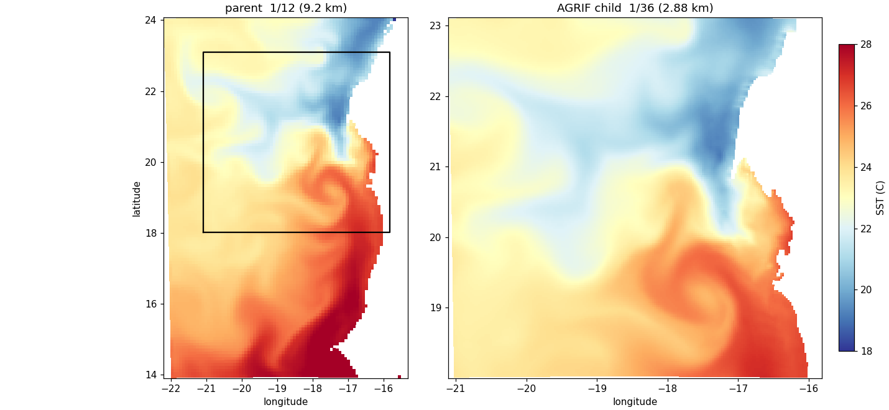

This is the first milestone: a working AGRIF nest, parent and child stepping together,
no feedback yet. Get here before touching `AGRIF_2WAY`.

### 7a — Launch

```bash
cd ~/seaforward/forecast/scratch/IGOG_AGRIF
conda deactivate                       # the model needs the compiler env, not python
source ./config.sh
nohup ./croco croco.in > run_agrif.log 2>&1 &
```

**You launch only the parent's `croco.in`.** AGRIF reads it, finds
`AGRIF_FixedGrids.in` in the current directory, sees there is one child, and pulls in
`croco.in.1` by itself. No second command, no second executable, no MPI ranks to split
— one process integrates both grids.

`nohup … &` puts it in the background so you keep your terminal. Watch it with:

```bash
tail -f run_agrif.log
```

`Ctrl+C` stops watching, not the run. To stop the run:

```bash
pkill -f "croco croco.in"
```

!!! warning
    **Run one instance at a time.** Two `croco` processes in the same directory write over each other's output and produce nonsense that looks like a physics problem.

### 7b — What the startup tells you

Early in the log, CROCO lists the CPP options it was compiled with:

```text
 Activated C-preprocessing Options:
          REGIONAL
          IGOG_12
          AGRIF                 <- the binary really is AGRIF-enabled
```

Further down, the child's boundary conditions appear:

```text
          AGRIF_OBC_WEST
          AGRIF_OBC_NORTH
          AGRIF_OBC_SOUTH
          AGRIF_FLUX_BC
          AGRIF_OBC_M2SPECIFIED
          AGRIF_OBC_M3ORLANSKI
          AGRIF_OBC_TORLANSKI
```

These are the child receiving boundaries **from the parent** — the coupling, named.
There is no `AGRIF_OBC_EAST`: the defaults in `cppdefs_dev.h` define all four, but
they are filtered by the parent's own `OBC_*` settings.

You will also see a wall of warnings. Most are harmless:

```text
 WARNING: Unrecognized keyword: start_date  --> DISREGARDED.
 WARNING: Unrecognized keyword: end_date  --> DISREGARDED.
 WARNING: Unrecognized keyword: bulk_forcing  --> DISREGARDED.
```

`start_date` and `end_date` are disregarded because this build has `USE_CALENDAR`
undefined — time comes from `NTIMES × dt` only, so the dates in `croco.in` are
cosmetic. `bulk_forcing` is unused because `ONLINE` is defined and CROCO reads GFS
directly. Neither is a problem, but knowing why saves you chasing them.

The forcing confirmation is worth checking:

```text
 Online forcing: datasets in /home/you/.../GFS/for_croco/ with 24 records per day.
```

And each grid announces itself:

```text
 IGOG_12 FORECAST                       <- parent (croco.in)
       288  ntimes
    300.00  dt
...
 IGOG_12 AGRIF ZOOM LEVEL 1             <- child (croco.in.1)
       288  ntimes
    100.00  dt                          <- parent's dt / timeref
```

That `100.00` is the edit from Step 5b. If it says `300.00`, stop the run — see the
dt and NTIMES section on that page.

Look for the child's grid stiffness too:

```text
 Maximum grid stiffness ratios:   rx0 = 0.233   rx1 = 15.78
```

And confirm the child is writing its own output:

```text
 DEF_HIS/AVG - Created new netCDF file 'CROCO_FILES/croco_his.nc.1'.
 WRT_GRID -- wrote grid data into file 'CROCO_FILES/croco_his.nc.1'.
```

If `croco_his.nc.1` never appears, the child is not running at all — check that
`AGRIF_FixedGrids.in` is in the run directory, as Step 4c describes.

### Reading the step tables

Both grids print their own step tables, interleaved:

```text
25  9688.08681 2.469078679E-03 ... 2.1948671E+15  0    <- parent
75  9688.08681 2.874230499E-03 ... 1.7790849E+14  0    <- child
76  9688.08796 2.878546270E-03 ...
77  9688.08912 2.882053564E-03 ...
26  9688.09028 2.470478997E-03 ... 2.1948646E+15  0    <- parent
78  9688.09028 2.885023770E-03 ...
```

The columns are `STEP  time[DAYS]  KINETIC_ENRG  POTEN_ENRG  TOTAL_ENRG NET_VOLUME
trd`.

Two grids share one stream, so tell them apart by the step number and the volume: the
parent's steps advance slowly (25, 26, …) with `NET_VOLUME ≈ 2.19e+15`; the child's
advance three times faster (75, 76, 77, 78, …) with `NET_VOLUME ≈ 1.78e+14`.

**Three child steps per parent step, meeting at identical times.** Parent 25 and child
75 both read `9688.08681`; parent 26 and child 78 both read `9688.09028`. That
lock-step is the single best evidence the nest is correctly configured.

| Check | Good | Bad, and what it means |
|---|---|---|
| **step zero, both grids** | same time, KE ~1e-3 | child KE `1e+71` → broken IC (fill values, Step 3), not instability |
| **clock lock** | parent 25 = child 75 = same time | child racing ahead → child `dt` not divided (Step 5b) |
| **child KE vs parent** | child **higher** | expected: a finer grid resolves more flow |
| **child NET_VOLUME** | smaller, in proportion | a box-size artefact, not a symptom |
| **`trd`, last column** | `0` | non-zero is a blowup counter |
| **volume drift** | conserved to ~5 s.f. | steady loss or gain is a boundary problem |

The child's KE being higher (2.87e-3 against 2.47e-3) and its volume being much
smaller are both expected. Neither is a warning.

### 7c — Finishing

Success is **two** `MAIN: DONE`, one per grid:

```text
 MAIN - number of records written into history  file(s):    5
 MAIN: DONE                                                    <- parent
 MAIN - number of records written into history  file(s):   13
 MAIN: DONE                                                    <- child
```

```bash
grep -c "MAIN: DONE" run_agrif.log      # want 2
ls -lh CROCO_FILES/croco_his.nc CROCO_FILES/croco_his.nc.1
```

!!! note
    **Five parent records against thirteen child records** is the output-interval mismatch: `NWRT` is in *steps*, and the child takes three times as many. Multiply the child's output intervals by `timeref` and both grids write at the same times. The operational driver does this — `NWRT_CHD=$(( NWRT * COEF ))` in `run_forecast_cycle.sh`.

If the parent says `DONE` and the child says `Abnormal termination: BLOWUP`, that is
**one-way isolation working as designed** — the child died without poisoning the
parent, and it tells you exactly where to look.

```text
 MAIN: DONE                              <- parent finished all its steps
 MAIN: Abnormal termination: BLOWUP      <- child died
```

Diagnose it by *when* it died:

- **step zero** — the IC, from fill values or a wrong clock
- **mid-run** — stability: high `rx1`, or the timestep
- **at a specific time** — forcing or boundary data running out

### Looking at the result

```bash
cd ~/seaforward
python3 << 'PYEOF'
import matplotlib; matplotlib.use('Agg')
import matplotlib.pyplot as plt, xarray as xr

B = 'forecast/scratch/IGOG_AGRIF/CROCO_FILES/'
p = xr.open_dataset(B + 'croco_his.nc',   decode_times=False)
c = xr.open_dataset(B + 'croco_his.nc.1', decode_times=False)

ps = p.temp.isel(time=-1, s_rho=-1).where(p.mask_rho == 1)
cs = c.temp.isel(time=-1, s_rho=-1).where(c.mask_rho == 1)
vmin, vmax = float(cs.min()), float(cs.max())

fig, ax = plt.subplots(1, 2, figsize=(13, 5), constrained_layout=True)
ax[0].pcolormesh(p.lon_rho, p.lat_rho, ps, cmap='RdYlBu_r', vmin=vmin, vmax=vmax)
ax[0].set_title('parent  1/12 (9.2 km)')
ax[0].plot([float(c.lon_rho.min()), float(c.lon_rho.max()), float(c.lon_rho.max()),
            float(c.lon_rho.min()), float(c.lon_rho.min())],
           [float(c.lat_rho.min()), float(c.lat_rho.min()), float(c.lat_rho.max()),
            float(c.lat_rho.max()), float(c.lat_rho.min())], 'k-', lw=1.5)
m1 = ax[1].pcolormesh(c.lon_rho, c.lat_rho, cs, cmap='RdYlBu_r', vmin=vmin, vmax=vmax)
ax[1].set_title('AGRIF child  1/36 (3.06 km)')
fig.colorbar(m1, ax=ax, label='SST (C)')
fig.savefig('docs/img/agrif_sst.png', dpi=110)
PYEOF
```



*The same water at 9.2 km (left) and 3.06 km (right), with the child's footprint
outlined on the parent. The equatorial front near 0°N is a smooth gradient in the
parent and resolves into filaments and small eddies in the child — that structure is
what the refinement buys.*
