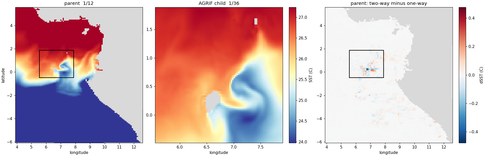

Second milestone. Attempt this only once Step 7 gives you two clean `MAIN: DONE` —
otherwise you are debugging the nest and the feedback at once.

### 8a — Save the baseline first

The two-way run overwrites `CROCO_FILES/croco_his.nc`. Without a copy of the one-way
result you have nothing to compare against, and the exercise has no point.

```bash
cd ~/seaforward/forecast/scratch/IGOG_AGRIF
mkdir -p oneway
cp CROCO_FILES/croco_his.nc   oneway/
cp CROCO_FILES/croco_his.nc.1 oneway/
ls -lh oneway/
```

### 8b — Flip the flag

```bash
nano cppdefs.h
```

`Ctrl+W` `AGRIF_2WAY` `Enter` — again the **first** match, near line 81:

```text
# define AGRIF
# undef  AGRIF_2WAY        <- change to "# define AGRIF_2WAY"
```

becomes

```text
# define AGRIF
# define AGRIF_2WAY
```

`Ctrl+O` `Enter`, `Ctrl+X`. Verify:

```bash
grep -n "AGRIF" cppdefs.h | head -2
```

```text
80:# define AGRIF
81:# define AGRIF_2WAY      <- feedback on
```

That one word is the entire difference between one-way and two-way.

### 8c — Recompile and rerun

A `cppdefs.h` change means a **full rebuild** — the flag changes which code is
compiled, not a runtime setting.

```bash
conda deactivate
source ./config.sh
./jobcomp 2>&1 | tail -3
# ... CROCO is OK
cp croco croco_2way

nohup ./croco croco.in > run_agrif_2way.log 2>&1 &
```

Keep the binary under its own name. You now have `croco_1way` and `croco_2way`, which
is what the operational driver expects — it selects between them by name, so both
modes stay available without recompiling.

Nothing else changes: same grids, same ICs, same `croco.in` and `croco.in.1`. That is
what makes it a clean experiment — one variable.

### 8d — Check the feedback is engaging

```bash
sleep 60
grep -E "^ +576 +9702\." run_agrif_2way.log
```

Compare the parent's kinetic energy against the one-way run at the same step. **If
two-way gives a bit-identical number the feedback is not doing anything**, and
something is wrong — the parent should begin diverging within a few steps of
receiving the child's solution.

Watch for instability too. Two-way injects fine-grid values into a coarse grid every
step; if the grids disagree at the interface it can ring. The blowup counter and the
kinetic energy are the early warning.

### 8e — The difference plot

This is the whole point of running both: the parent's solution with and without the
child feeding back.

```bash
cd ~/seaforward
python3 << 'PYEOF'
import matplotlib; matplotlib.use('Agg')
import matplotlib.pyplot as plt, xarray as xr, numpy as np
from matplotlib.colors import ListedColormap

B = 'forecast/scratch/IGOG_AGRIF/'
p1 = xr.open_dataset(B + 'oneway/croco_his.nc',        decode_times=False)
p2 = xr.open_dataset(B + 'CROCO_FILES/croco_his.nc',   decode_times=False)
c  = xr.open_dataset(B + 'CROCO_FILES/croco_his.nc.1', decode_times=False)

land = ListedColormap(['0.85'])
def shade(ax, ds):
    ax.pcolormesh(ds.lon_rho, ds.lat_rho,
                  np.where(ds.mask_rho.values == 0, 1, np.nan),
                  cmap=land, vmin=0, vmax=1, zorder=0)

ps = p1.temp.isel(time=-1, s_rho=-1).where(p1.mask_rho == 1)
cs = c.temp.isel(time=-1, s_rho=-1).where(c.mask_rho == 1)
s2 = p2.temp.isel(time=-1, s_rho=-1).where(p2.mask_rho == 1)
d  = s2 - ps
lim = float(np.nanmax(np.abs(d)))
vmin, vmax = float(ps.min()), float(ps.max())

x0, x1 = float(c.lon_rho.min()), float(c.lon_rho.max())
y0, y1 = float(c.lat_rho.min()), float(c.lat_rho.max())

fig, ax = plt.subplots(1, 3, figsize=(17, 5.5), constrained_layout=True)

shade(ax[0], p1)
ax[0].pcolormesh(p1.lon_rho, p1.lat_rho, ps, cmap='RdYlBu_r', vmin=vmin, vmax=vmax)
ax[0].plot([x0,x1,x1,x0,x0], [y0,y0,y1,y1,y0], 'k-', lw=1.5)
ax[0].set_title('parent  1/12')

shade(ax[1], c)
m1 = ax[1].pcolormesh(c.lon_rho, c.lat_rho, cs, cmap='RdYlBu_r', vmin=vmin, vmax=vmax)
ax[1].set_title('AGRIF child  1/36')
fig.colorbar(m1, ax=ax[1], label='SST (C)')

shade(ax[2], p1)
m2 = ax[2].pcolormesh(p1.lon_rho, p1.lat_rho, d, cmap='RdBu_r', vmin=-lim, vmax=lim)
ax[2].plot([x0,x1,x1,x0,x0], [y0,y0,y1,y1,y0], 'k-', lw=1.5)
ax[2].set_title('parent: two-way minus one-way')
fig.colorbar(m2, ax=ax[2], label='dSST (C)')

for a in ax:
    a.set_xlabel('longitude')
ax[0].set_ylabel('latitude')
fig.savefig('docs/img/agrif_2way_diff.png', dpi=110)
print('max |diff| = %.4f C' % lim)
PYEOF
```



*Left, the parent at 1/12° with the child's box outlined. Centre, the child at 1/36°,
resolving a cyclonic spiral around São Tomé that the parent renders as a kink. Right,
the parent's SST with two-way feedback minus without — the correction concentrates
inside the box and trails south-west with the flow.*

*From an earlier, smaller nest over São Tomé and Príncipe. The current child covers
most of the parent, which makes a less legible picture of the same effect.*

**What to look for.** The strongest signal should sit **inside the child's box** —
that is the child correcting the parent directly. Outside it, expect smaller
differences trailing downstream: water the child never touched, carried there by the
parent's own advection. Direct correction inside, indirect propagation beyond.
