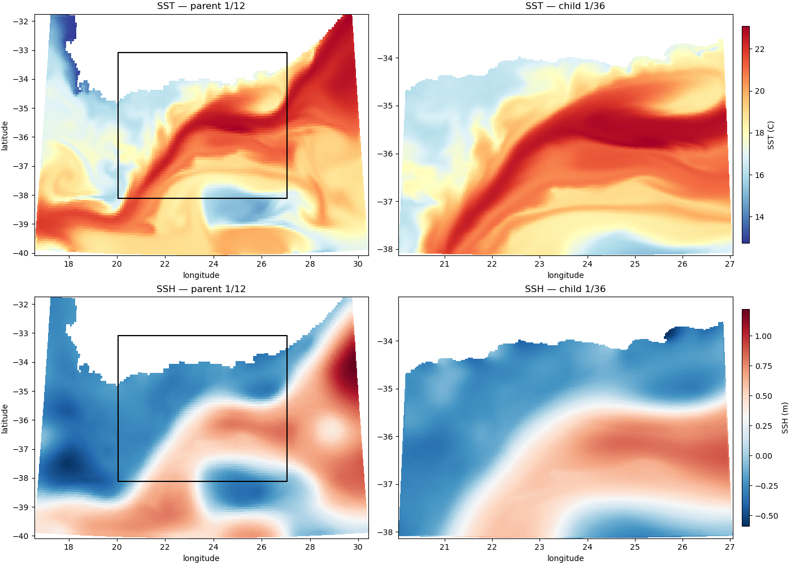
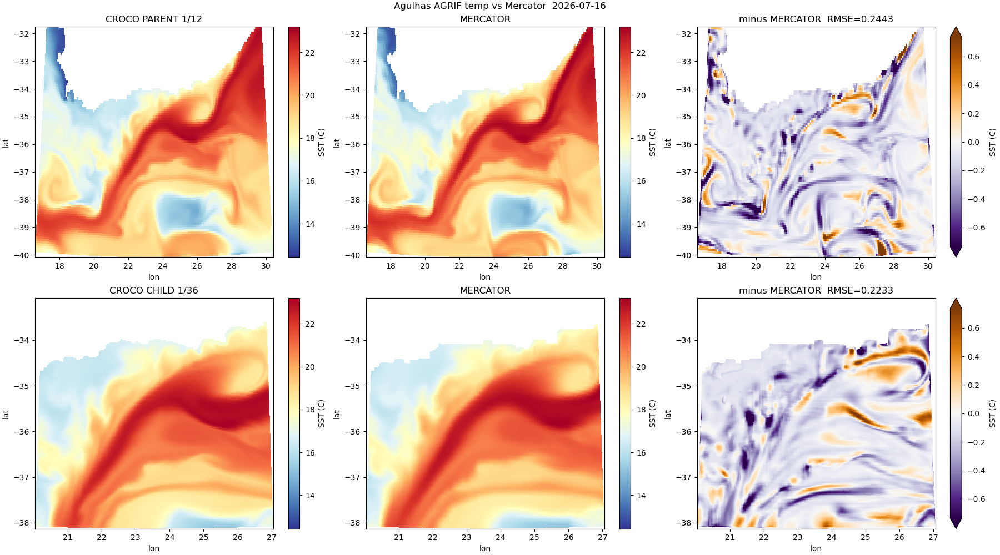
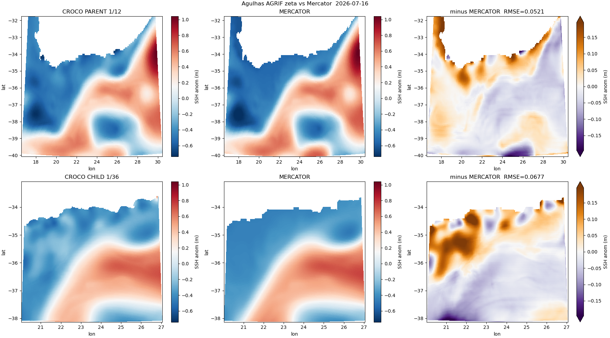

Once the driver's spin-up is producing output, the same comparison as A13 — but now for
**both grids at once**.

## Parent and child, side by side

Copy the files first if the run is still going — reading a netCDF mid-write can give
you a truncated last record.

```bash
D=~/seaforward/forecast/model-runs/Agulhas_AGRIF/20260717_1way/spinup/CROCO_FILES
cp $D/croco_his.nc   /tmp/ag_p.nc
cp $D/croco_his.nc.1 /tmp/ag_c.nc

python3 << 'PYEOF'
import xarray as xr
for f, l in [('/tmp/ag_p.nc', 'parent'), ('/tmp/ag_c.nc', 'child ')]:
    d = xr.open_dataset(f, decode_times=False)
    print(l, d.sizes['time'], 'records, t =',
          [round(float(t)/86400, 3) for t in d.scrum_time.values])
PYEOF
```

```text
parent 6 records, t = [9692.0, 9692.25, 9692.5, 9692.75, 9693.0, 9693.25]
child  6 records, t = [9692.0, 9692.25, 9692.5, 9692.75, 9693.0, 9693.25]
```

**Six records each, at identical times.** That is the driver's `NWRT * COEF` scaling
working. Without it the child writes three times as often as the parent, and every
comparison needs interpolating.

```bash
cd ~/seaforward
python3 << 'PYEOF'
import matplotlib; matplotlib.use('Agg')
import matplotlib.pyplot as plt, xarray as xr, numpy as np

p = xr.open_dataset('/tmp/ag_p.nc', decode_times=False)
c = xr.open_dataset('/tmp/ag_c.nc', decode_times=False)
x0, x1 = float(c.lon_rho.min()), float(c.lon_rho.max())
y0, y1 = float(c.lat_rho.min()), float(c.lat_rho.max())

def fld(ds, v):
    f = (ds.temp.isel(time=-1, s_rho=-1) if v == 'temp' else ds.zeta.isel(time=-1))
    return f.where(ds.mask_rho == 1)

fig, ax = plt.subplots(2, 2, figsize=(14, 10), constrained_layout=True)
fig.get_layout_engine().set(w_pad=0.02, wspace=0.02)

for row, (v, cmap, unit) in enumerate([('temp', 'RdYlBu_r', 'SST (C)'),
                                       ('zeta', 'RdBu_r',   'SSH (m)')]):
    fp, fc = fld(p, v), fld(c, v)
    vmin = min(float(fp.min()), float(fc.min()))     # shared scale across the row
    vmax = max(float(fp.max()), float(fc.max()))
    for col, (ds, f, tag) in enumerate([(p, fp, 'parent 1/12'), (c, fc, 'child 1/36')]):
        h = ax[row, col].pcolormesh(ds.lon_rho, ds.lat_rho, f,
                                    cmap=cmap, vmin=vmin, vmax=vmax)
        ax[row, col].set_title('%s — %s' % (unit.split()[0], tag))
        ax[row, col].set_xlabel('longitude')
    ax[row, 0].set_ylabel('latitude')
    ax[row, 0].plot([x0, x1, x1, x0, x0], [y0, y0, y1, y1, y0], 'k-', lw=1.5)
    fig.colorbar(h, ax=ax[row, :], label=unit, shrink=0.9, pad=0.01, aspect=30)

fig.savefig('docs/img/agulhas_parent_child.png', dpi=100)
PYEOF
```



*Surface temperature and sea-surface height, both grids, 1.25 days into the spin-up.
The box on the parent panels is the child's footprint. Each row shares a colour scale,
so the two panels are directly comparable.*

Two things to read here:
**Temperature** — same water masses, but the child resolves filaments the parent
smooths: the frontal structure at 21–22°E, and the retroflection eddy at 25.5°E, 35°S.
That is 2.5 km against 9 km, doing what it was built for.

**Sea-surface height** — this is the one that tells you the nest is healthy. The zeta
field is a **smooth, coherent tongue following exactly where the warm current is**,
high on the warm side, low on the cold side. That is the Agulhas in thermal-wind
balance: a geostrophic jet tilts the sea surface across itself. **And the child matches
the parent through the overlap** — same tongue, same position, same magnitude.

A nest that isn't healthy looks quite different: blotchy ±0.5 m lobes, no coherent
structure, child disagreeing with parent in the same place. Zeta is where a bad nest
confesses.

## Against Mercator — and how to do it fairly

```bash
cd ~/seaforward
python3 << 'PYEOF'
import matplotlib; matplotlib.use('Agg')
import matplotlib.pyplot as plt
import xarray as xr, numpy as np, pandas as pd

MERC = ('forecast/model-runs/Agulhas_AGRIF/20260717_1way/'
        'downloaded_data/MERCATOR/MERCATOR_20260717_00.nc')
YORIG = 2000
m = xr.open_dataset(MERC)
p = xr.open_dataset('/tmp/ag_p.nc', decode_times=False)
c = xr.open_dataset('/tmp/ag_c.nc', decode_times=False)

# nearest Mercator record -- find it, don't hardcode it
t  = pd.Timestamp('%d-01-01' % YORIG) + pd.Timedelta(days=float(p.scrum_time[-1])/86400)
dt = np.abs(m.time.values - np.datetime64(t)); k = int(dt.argmin())
print('croco t = %s -> mercator idx %d (%s), offset %s' % (t, k, m.time.values[k], dt[k]))

sst_m = m.thetao.isel(time=k, depth=0)
zos_m = m.zos.isel(time=k)

def cmp(ds, var, src, name):
    lo, la = ds.lon_rho.values, ds.lat_rho.values
    f = (ds.temp.isel(time=-1, s_rho=-1) if var == 'temp' else ds.zeta.isel(time=-1))
    f = f.where(ds.mask_rho == 1).values
    mi = src.interp(longitude=xr.DataArray(lo, dims=['eta','xi']),
                    latitude =xr.DataArray(la, dims=['eta','xi'])).values
    mi = np.where(ds.mask_rho.values == 1, mi, np.nan)
    if var == 'zeta':                # CROCO zeta and Mercator zos have DIFFERENT
        f  = f  - np.nanmean(f)      # reference levels. Compare anomalies, or you
        mi = mi - np.nanmean(mi)     # are just measuring a constant offset.
    d = f - mi
    r = float(np.sqrt(np.nanmean(d**2)))
    print('%-7s %-5s bias=%+.4f RMSE=%.4f max|d|=%.4f' %
          (name, var, np.nanmean(d), r, np.nanmax(np.abs(d))))
    return lo, la, f, mi, d, r

for var, cmap, unit in [('temp','RdYlBu_r','SST (C)'), ('zeta','RdBu_r','SSH anom (m)')]:
    src = sst_m if var == 'temp' else zos_m
    P = cmp(p, var, src, 'parent'); C = cmp(c, var, src, 'child')
    vmin = min(np.nanmin(P[2]), np.nanmin(C[2])); vmax = max(np.nanmax(P[2]), np.nanmax(C[2]))
    ld = float(np.nanpercentile(np.abs(np.concatenate([P[4].ravel(), C[4].ravel()])), 99))
    fig, ax = plt.subplots(2, 3, figsize=(18, 10), constrained_layout=True)
    for row, (S, tag) in enumerate([(P, 'PARENT 1/12'), (C, 'CHILD 1/36')]):
        lo, la, f, mi, d, r = S
        a = ax[row,0].pcolormesh(lo, la, f, cmap=cmap, vmin=vmin, vmax=vmax)
        ax[row,0].set_title('CROCO %s' % tag);  fig.colorbar(a, ax=ax[row,0], label=unit)
        b = ax[row,1].pcolormesh(lo, la, mi, cmap=cmap, vmin=vmin, vmax=vmax)
        ax[row,1].set_title('MERCATOR');        fig.colorbar(b, ax=ax[row,1], label=unit)
        e = ax[row,2].pcolormesh(lo, la, d, cmap='PuOr_r', vmin=-ld, vmax=ld)
        ax[row,2].set_title('minus MERCATOR  RMSE=%.4f' % r)
        fig.colorbar(e, ax=ax[row,2], label=unit, extend='both')
    for x in ax.ravel():
        x.set_xlabel('lon'); x.set_ylabel('lat')
    fig.suptitle('Agulhas AGRIF %s vs Mercator  %s' % (var, t.date()))
    fig.savefig('docs/img/agulhas_agrif_%s_vs_merc.png' % var, dpi=100)
PYEOF
```

Note the printed offset: CROCO's last record is at **06:00** and Mercator is daily at
**00:00**, so there is a 6-hour gap. Small, but state it rather than hide it.

Note also the mean subtraction on `zeta`. CROCO's sea surface is measured from the
model's own reference level and Mercator's from a different one, so comparing them
directly measures a constant offset. Removing each field's mean compares the structure,
which is what matters.



*Both grids against Mercator, surface temperature.*

```text
parent RMSE = 0.2443     child RMSE = 0.2233
```

The differences are **thin filaments tracing fronts**, not patches — front displacement,
not magnitude error. Both panels run slightly **cool**, predominantly purple at about
0.1–0.2 °C, worth watching across the forecast but unremarkable 1.5 days into a
spin-up.



*Both grids against Mercator, sea-surface height anomaly.*

```text
parent RMSE = 0.0521     child RMSE = 0.0677
```

### Those numbers are not comparable, and the trap is worth understanding

Read as they stand, they say the child wins on temperature and loses on SSH. **Both
readings are wrong**, because the two RMSEs are computed over **different water**.

The parent's covers the whole 17–30°E domain — mostly deep open ocean, where everything
agrees. The child's covers only the Agulhas Bank: shallow shelf, steep break, the
hardest part of the region. That is not a like-for-like test; it measures which domain
contains more easy ocean.

**Subset the parent to the child's footprint:**

```bash
cd ~/seaforward
python3 << 'PYEOF'
import xarray as xr, numpy as np, pandas as pd
MERC = ('forecast/model-runs/Agulhas_AGRIF/20260717_1way/'
        'downloaded_data/MERCATOR/MERCATOR_20260717_00.nc')
m = xr.open_dataset(MERC)
p = xr.open_dataset('/tmp/ag_p.nc', decode_times=False)
c = xr.open_dataset('/tmp/ag_c.nc', decode_times=False)
t = pd.Timestamp('2000-01-01') + pd.Timedelta(days=float(p.scrum_time[-1])/86400)
k = int(np.abs(m.time.values - np.datetime64(t)).argmin())

lo0, lo1 = float(c.lon_rho.min()), float(c.lon_rho.max())
la0, la1 = float(c.lat_rho.min()), float(c.lat_rho.max())

def rmse(ds, var, src, mask=None):
    lo, la = ds.lon_rho.values, ds.lat_rho.values
    f = (ds.temp.isel(time=-1, s_rho=-1) if var == 'temp' else ds.zeta.isel(time=-1))
    f = f.where(ds.mask_rho == 1).values
    mi = src.interp(longitude=xr.DataArray(lo, dims=['eta','xi']),
                    latitude =xr.DataArray(la, dims=['eta','xi'])).values
    mi = np.where(ds.mask_rho.values == 1, mi, np.nan)
    if mask is not None:
        f = np.where(mask, f, np.nan); mi = np.where(mask, mi, np.nan)
    if var == 'zeta':
        f = f - np.nanmean(f); mi = mi - np.nanmean(mi)
    return float(np.sqrt(np.nanmean((f - mi)**2)))

inbox = ((p.lon_rho.values >= lo0) & (p.lon_rho.values <= lo1) &
         (p.lat_rho.values >= la0) & (p.lat_rho.values <= la1))
print('parent cells inside the child box:', int(inbox.sum()))
for var, src in [('temp', m.thetao.isel(time=k, depth=0)), ('zeta', m.zos.isel(time=k))]:
    print('\n%s' % var.upper())
    print('  parent, WHOLE domain   RMSE = %.4f' % rmse(p, var, src))
    print('  parent, child box only RMSE = %.4f   <- the fair comparison' % rmse(p, var, src, inbox))
    print('  child                  RMSE = %.4f' % rmse(c, var, src))
PYEOF
```

```text
parent cells inside the child box: 5177

TEMP
  parent, WHOLE domain   RMSE = 0.2443
  parent, child box only RMSE = 0.2207   <- the fair comparison
  child                  RMSE = 0.2233

ZETA
  parent, WHOLE domain   RMSE = 0.0521
  parent, child box only RMSE = 0.0514   <- the fair comparison
  child                  RMSE = 0.0677
```

The picture changes completely:

- **Temperature: a dead heat.** The child's apparent 9% win was entirely the parent's
  score being diluted by easy deep water outside the box.
- **SSH: the child is worse** over the same water — 0.0677 against 0.0514.

Whether that means the child's SSH is wrong, or that a 1/12° reference cannot see what
a 2.5 km grid resolves, this comparison cannot tell you.

!!! note
    **The honest limit of all of this.** Every comparison in this chapter is against Mercator, which supplied the initial and boundary conditions. It tests **consistency**, not skill. Real assessment needs independent, high-resolution data: along-track satellite altimetry, L2 SST, drifters, Argo. That is a different chapter.

Both are from 1.5 days of spin-up. Redo them on the finished forecast.