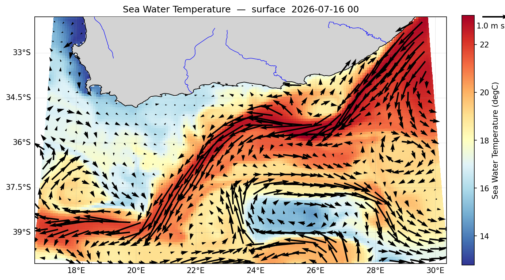
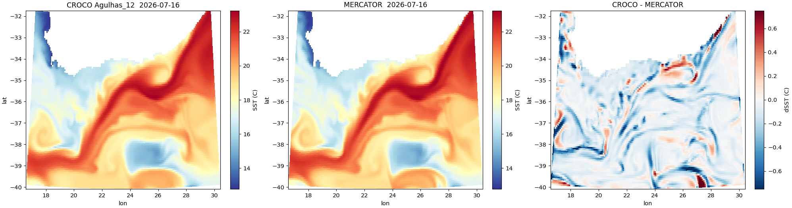

Follow **Phase 2**. What follows is that workflow with Agulhas' numbers, and notes
where the region forced a decision.

## A0 — session setup

```bash
source ~/seaforward/env.sh
source ~/seaforward/forecast/track.sh
conda activate seaforward

export CONFIG_NAME=Agulhas_12
export LON_MIN=17.0;  export LON_MAX=30.0
export LAT_MIN=-40.0; export LAT_MAX=-32.0
export RES=$(echo "1/12" | bc -l)
export EXTENTS=15.5,31.5,-41.5,-30.5        # grid box + 1.5 deg every side
export HDAYS=2; export FDAYS=5
export YORIG=2000

export CONFIG_DIR=${CROCO_CONFIGS_ROOT}/${CONFIG_NAME}
export FCAST=${CROCO_RUNS_ROOT}/${CONFIG_NAME}
export CF=${FCAST}/CROCO_FILES
mkdir -p ${CONFIG_DIR} ${CF} \
         ${FCAST}/downloaded_data/MERCATOR \
         ${FCAST}/downloaded_data/GFS/for_croco
```

`EXTENTS` is all-positive, being eastern hemisphere, so the `--domain=` quoting trouble
that bites western regions does not apply — and **Phase 2's GFS longitude fix is
skipped entirely**.

## A1 — grid definition

Generated, not hand-written:

```bash
cd ${SEAFORWARD}/config
python3 make_grid_config.py "${CONFIG_NAME}" \
        ${LON_MIN} ${LON_MAX} ${LAT_MIN} ${LAT_MAX} ${RES} ${RES}
nano ${CONFIG_DIR}/grid.ini      # read it; check lon/lat and dlon = dlat = 0.083333
```

## A2 — build the grid

```bash
cd ${CROCO_PYTOOLS_DIR}/prepro
python3 make_grid.py ${CONFIG_DIR}/grid.ini 2>&1 | tail -20
ncdump -h ${CF}/croco_grd.nc | grep -E "xi_rho|eta_rho"
```

```text
xi_rho = 159 ;
eta_rho = 99 ;
```

!!! important
    **Read the file, don't trust the arithmetic.** 13° ÷ (1/12°) + 2 predicts 158. The generator produced **159** — it rounds to whole cells, and it is the authority. The same lesson applies to the grid's north edge landing at **31.79°S** rather than the 32.0 requested.

Carry these forward:

```text
LLm0 = xi_rho  - 2 = 157
MMm0 = eta_rho - 2 =  97
N                  =  50
```

## A3 — the mask decides the boundaries

```bash
python3 << 'PYEOF'
import xarray as xr
g = xr.open_dataset('${CF}/croco_grd.nc'); m = g.mask_rho.values
strip = lambda r: ''.join('O' if v == 1 else '.' for v in r)
print('south:', int(m[0,:].sum()),  '/', m.shape[1]); print('   W', strip(m[0,:]),  'E')
print('north:', int(m[-1,:].sum()), '/', m.shape[1]); print('   W', strip(m[-1,:]), 'E')
print('west :', int(m[:,0].sum()),  '/', m.shape[0]); print('   S', strip(m[:,0]),  'N')
print('east :', int(m[:,-1].sum()), '/', m.shape[0]); print('   S', strip(m[:,-1]), 'N')
PYEOF
```

```text
south: 159 / 159   OOOOOOOO...(all)...OOOOOOOO
north:  18 / 159   OOOOOOOOOOOOO....(140 land)....OOOOO
west :  99 / 99    OOOOOOOO...(all)...OOOOOOOO
east :  99 / 99    OOOOOOOO...(all)...OOOOOOOO
```

South, west and east are 100% ocean — open, no argument.

**The north edge is the decision.** At 31.79°S it is 11% ocean: 13 water cells at the
west end, **140 land cells of South Africa**, 5 water cells at the east end.

Phase 2's rule of thumb — mostly land, so close it — says close. **We opened it
anyway.** The reasoning:

- The 18 water cells are not noise. The **west group** (16.6–17.7°E) is the Benguela
  and South Atlantic; the **east group** (30.0–30.4°E) is where the **Agulhas Current
  enters the domain**. Close the north and you sever the current the domain exists to
  model.
- Both groups sit in the corners, directly against west and east edges that are 99/99
  open. Closing the north puts a wall in the corner of an open boundary, right where
  flow enters.
- Opening costs nothing: CROCO masks the 140 land cells and feeds Mercator to the 18
  water ones.

Contrast Canary, which closed its east edge at about 1/123 ocean — one cell of a
genuine coastline, not two open-ocean corners.

**Could the north edge move south instead?** A scan says no:

```text
-32.0N:  23/159 ocean
-32.5N:  30/159
-33.0N:  37/159
-33.5N:  54/159
-34.0N: 112/159
-34.5N: 147/159      <- the first mostly-clean edge
```

Reaching a clean north edge means dropping to **34.5°S**, which throws away the entire
South African shelf and the current's inshore path. That is the domain, not a detail.

**Decision: all four boundaries open.**

## A4 — `crocotools_param.py`

```bash
nano ${CF}/crocotools_param.py
```

```python
inputdata    = 'mercator'
Nzgoodmin    = 4
multi_files  = False
tracers      = ['temp', 'salt']
croco_grd    = 'croco_grd.nc'
sigma_params = dict(theta_s=7, theta_b=2, N=50, hc=200)
ini_prefix   = 'croco_ini_MERCATOR'
bry_prefix   = 'croco_bry_MERCATOR'
obc_dict     = dict(south=1, west=1, east=1, north=1)
cycle_bry    = 0
```

```bash
cp ${CF}/crocotools_param.py ${CONFIG_DIR}/     # keep it with the recipe
```

## A5 — data

```bash
cd ${SEAFORWARD}
export RUN_DT="$(date -u +'%Y-%m-%d') 00:00:00"

python seaforward.py download_ocean      --domain="${EXTENTS}" --run_date "${RUN_DT}" \
    --hdays ${HDAYS} --fdays ${FDAYS} --outputDir ${FCAST}/downloaded_data/MERCATOR
python seaforward.py download_atmosphere --domain="${EXTENTS}" --run_date "${RUN_DT}" \
    --hdays ${HDAYS} --fdays ${FDAYS} --outputDir ${FCAST}/downloaded_data/GFS
python seaforward.py make_forcing --gfsDir ${FCAST}/downloaded_data/GFS \
    --outputDir ${FCAST}/downloaded_data/GFS/for_croco --Yorig ${YORIG}

export MERC=${FCAST}/downloaded_data/MERCATOR/MERCATOR_$(date -u +'%Y%m%d')_00.nc
python seaforward.py make_ini --input_file ${MERC} --output_dir ${CF} \
    --run_date "${RUN_DT}" --hdays ${HDAYS} --Yorig ${YORIG}
python seaforward.py make_bry --input_file ${MERC} --output_dir ${CF} \
    --run_date "${RUN_DT}" --hdays ${HDAYS} --fdays ${FDAYS} --Yorig ${YORIG}
```

Check what you have:

```bash
ls -lh ${CF}/croco_ini_MERCATOR_*.nc ${CF}/croco_bry_MERCATOR_*.nc
du -sh ${FCAST}/downloaded_data/MERCATOR ${FCAST}/downloaded_data/GFS
ls ${FCAST}/downloaded_data/GFS/for_croco/
```

```text
croco_ini_MERCATOR_20260717_00.nc     16 MB    (159x99x50)
croco_bry_MERCATOR_20260717_00.nc    4.9 MB

206M    downloaded_data/MERCATOR
 51M    downloaded_data/GFS          (11 MB raw GRIB + 41 MB converted)

DOWNWARD_LONG-WAVE_RAD_FLUX_Y9999M01.nc
DOWNWARD_SHORT-WAVE_RAD_FLUX_SURFACE_Y9999M01.nc
PATM_Y9999M01.nc
PRECIPITATION_RATE_Y9999M01.nc
SPECIFIC_HUMIDITY_Y9999M01.nc
TEMPERATURE_HEIGHT_ABOVE_GROUND_Y9999M01.nc
U-COMPONENT_OF_WIND_Y9999M01.nc
UPWARD_LONG-WAVE_RAD_FLUX_SURFACE_Y9999M01.nc
UPWARD_SHORT-WAVE_RAD_FLUX_SURFACE_Y9999M01.nc
V-COMPONENT_OF_WIND_Y9999M01.nc
```
The atmosphere goes through two stages. `download_atmosphere` fetches hourly GRIB files
(`2026071500_f001.grb` and so on); `make_forcing` converts them into the ten netCDF
files above, one per variable — wind components, air temperature, humidity, pressure,
precipitation and the four radiation fluxes. The `Y9999M01` is the dummy-date
convention CROCO's `ONLINE` reader expects, and only `for_croco/` is read at run time.

## A6–A11 — the four files, by hand

```bash
cd ${CONFIG_DIR}
cp ${CROCO_MODEL_DIR}/OCEAN/{cppdefs.h,param.h,croco.in,jobcomp} .
```

**`cppdefs.h`** — two edits, not three:

| | edit |
|---|---|
| name | `# define BENGUELA_LR` → `# define AGULHAS_12` |
| forcing | `#  undef  ONLINE` → `#  define ONLINE` |
| boundaries | **nothing** — all four `OBC_*` stay defined |

That third row is the difference from Canary and IGOG, which both closed edges. Verify:

```bash
grep -nE "define AGULHAS_12|OBC_EAST|OBC_WEST|OBC_NORTH|OBC_SOUTH" cppdefs.h | head
sed -n '185,192p' cppdefs.h        # ONLINE on, AROME and ERA_ECMWF off
```

!!! warning
    `grep -n "define ONLINE"` finds nothing even when it is correct — the file has `# define  ONLINE` with **two** spaces. Grep for `ONLINE` alone.

**`param.h`** — add a branch **above `# else`**:

```fortran
# elif defined  AGULHAS_12
      parameter (LLm0=157,  MMm0=97,   N=50)   ! Agulhas_12  159x99
```

Verify with the preprocessor, not by eye:

```bash
cpp -DREGIONAL -DAGULHAS_12 param.h 2>/dev/null | grep "parameter (LLm0"
```

```text
parameter (LLm0=157, MMm0=97, N=50) ! Agulhas_12 159x99
```

**`croco.in`** — title to `AGULHAS_12 FORECAST`; check the S-coord is
`7.0d0 2.0d0 200.0d0`, matching `sigma_params`; sponge to `0. 0.`

```bash
grep -n "XXX" croco.in && echo "STILL HAS XXX" || echo "no XXX left"
```

**`jobcomp`** — `SOURCE1=/home/you/seaforward/code/croco/OCEAN`

The `time_stepping`, `initial`, `boundary` and `online` lines stay as placeholders —
the driver sets them per run.

## A12 — compile

```bash
cd ${FCAST}
cp ${CONFIG_DIR}/{cppdefs.h,param.h,croco.in,jobcomp} .
conda deactivate
source ~/seaforward/env.sh
which nf-config          # must be .../opt_seq/bin/nf-config, not conda's
./jobcomp 2>&1 | tee compile.log | tail -40
```

Ends with `CROCO is OK`.

## A13 — prove it runs

**One day is enough.** 288 steps catches an instability as well as 2016 would, in a
seventh of the time.

```bash
cd ${FCAST}
TODAY=$(date -u +%Y%m%d)
sed -i '/^time_stepping:/{n; s/.*/                 288     300       60      1/}' croco.in
sed -i "/^initial:/{n; n; s|.*|    CROCO_FILES/croco_ini_MERCATOR_${TODAY}_00.nc|}" croco.in
sed -i "/^boundary:/{n;   s|.*|    CROCO_FILES/croco_bry_MERCATOR_${TODAY}_00.nc|}" croco.in
sed -i '/^online:/{n;     s/.*/           9999   1      24            9999     1/}' croco.in
sed -i "/^online:/{n; n;  s|.*|    ${FCAST}/downloaded_data/GFS/for_croco/|}" croco.in

conda deactivate; source ~/seaforward/env.sh
./croco croco.in 2>&1 | tee run.log | tail -40
```

### The result, and what it told us

```text
288  9693.00000 2.609597096E-02 4.3049518E+01 4.3075614E+01 2.6352238E+15  0
MAIN: DONE
```

```bash
grep -i stiffness run.log
```

```text
Maximum grid stiffness ratios:   rx0 = 0.20009909855131378   rx1 = 14.835722451244909
```

Three numbers worth recording, because they shaped every later decision.

**`KE = 2.6e-2`** — an order of magnitude above IGOG's 2.4e-3. That is the Agulhas
Current, and it is the correct answer. A quiet KE here would mean the current was
missing.

**`rx0 = 0.2001`** — exactly the `rfact = 0.2` requested. The smoother hit its target.
An AGRIF child will not: `merging_area` blends the parent's rougher bathymetry back in
at the edges, so IGOG's child came out at 0.233 from the same 0.2.

**`rx1 = 14.84`** — the Haney number, measuring how steeply the sigma layers tilt.
High values risk spurious pressure-gradient forces, and this is the Agulhas shelf
break: 100 m to 4000 m over a short distance, with 50 sigma layers stretched across
the tilt. **It ran stably** — KE steady, `trd = 0` throughout — so 14.84 is
demonstrably survivable at 1/12°. The AGRIF child in Phase 8 sits at 15.78, also stable.

It also set up the open question for Phase B: **would the child's `rx1` be worse?** The
reasoning was that a 3× refinement resolves the same slope with thinner layers, so the
tilt per layer thickness should rise. See B6 — the answer was not what that reasoning
predicted.

**And `dt = 300` survived 2 m/s.** That was the other worry, since CFL scales with
velocity and the Agulhas is fast. It did not blink — good news for the child, which
gets `dt = 100` and therefore even more headroom.

### Looking at it

```bash
cd ~/seaforward
python3 << 'PYEOF'
import sftools.postprocess as pp
import sftools.plotting as pl

ds = pp.open_history('forecast/scratch/Agulhas_12/CROCO_FILES/croco_his.nc',
                     Yorig=2000)
ur, vr = pp.surface_uv(ds, tindex=-1)
u, v   = pp.rotate_uv(ds, ur, vr)

pl.plot_map(pp.field(ds, 'temp'), ds=ds, uv=(u, v),
            uv_skip=4, uv_ref=1.0, cmap='RdYlBu_r', figsize=(10, 6),
            out='docs/img/agulhas_12_sst.png')
PYEOF
```



*Surface temperature and currents after the one-day proof run. The Agulhas enters at
30°E, runs south-west along the shelf edge, and turns back east near 17°E — the
retroflection, visible in the arrows.*

This one figure tells you the config is right:

- **The Agulhas Current** — warm water entering top right against the coast, then
  running south-west along the shelf edge as a narrow, fast jet.
- **The retroflection** — the current leaves the shelf near 21°E, runs west along the
  bottom of the domain, and turns back east below 39.5°S. The vectors show the loop
  directly, and the warm tongue along the southern edge is Agulhas Return Current
  water.
- **An eddy** sits in the middle, the vectors circling a cold core beneath the
  current's path.
- **Benguela upwelling** — cold water pinned against the west coast, top left, with the
  flow running offshore and north. 

The figure also settles the north-boundary decision from A3. The current enters
through the eastern corner of the north edge — those 5 water cells the rule of thumb
said to close. Closed, it would have had nowhere to come from.

!!! note
    This is one day from a Mercator cold start, so most of this structure is Mercator's, lightly adjusted. That is what a proof run should show: the interpolation, boundaries and forcing all work together. Judging the model's own dynamics needs a spun-up run.

### Comparing against Mercator

The picture looks right, but that is not a check. Compare it against the source
directly.

**Get the times to line up first.** This is where mistakes happen:

```bash
cd ~/seaforward
python3 << 'PYEOF'
import xarray as xr
import sftools.postprocess as pp
d = xr.open_dataset('forecast/scratch/Agulhas_12/downloaded_data/MERCATOR/MERCATOR_20260717_00.nc')
print('mercator records:', len(d.time))
for i, t in enumerate(d.time.values):
    print(' ', i, t)
ds = pp.open_history('forecast/scratch/Agulhas_12/CROCO_FILES/croco_his.nc', Yorig=2000)
print('croco his times:', ds.time.values)
PYEOF
```

```text
mercator records: 10
   0 2026-07-14      2 2026-07-16   <-- this one
   1 2026-07-15      3 2026-07-17   ...
croco his times: ['2026-07-15T00' '2026-07-15T06' '2026-07-15T12'
                  '2026-07-15T18' '2026-07-16T00']    <-- last record
```

CROCO's last record, 2026-07-16, matches **Mercator index 2**. Not index 0, not the
cycle date. Check rather than assume.

```bash
cd ~/seaforward
python3 << 'PYEOF'
import matplotlib; matplotlib.use('Agg')
import matplotlib.pyplot as plt
import xarray as xr, numpy as np

# CROCO: last record, surface sigma layer
c = xr.open_dataset('forecast/scratch/Agulhas_12/CROCO_FILES/croco_his.nc',
                    decode_times=False)
sst_c = c.temp.isel(time=-1, s_rho=-1).where(c.mask_rho == 1)
lon2d = c.lon_rho.values; lat2d = c.lat_rho.values

# MERCATOR: the matching date, surface level
m = xr.open_dataset('forecast/scratch/Agulhas_12/downloaded_data/MERCATOR/MERCATOR_20260717_00.nc')
sst_m = m.thetao.isel(time=2, depth=0)

# regrid Mercator onto CROCO's curvilinear grid
tgt_lon = xr.DataArray(lon2d, dims=['eta', 'xi'])
tgt_lat = xr.DataArray(lat2d, dims=['eta', 'xi'])
sst_m_on_c = sst_m.interp(longitude=tgt_lon, latitude=tgt_lat).values
sst_m_on_c = np.where(c.mask_rho.values == 1, sst_m_on_c, np.nan)

d = sst_c.values - sst_m_on_c
vmin, vmax = float(np.nanmin(sst_c)), float(np.nanmax(sst_c))
lim = float(np.nanpercentile(np.abs(d), 99))   # 99th pct, not max: one bad cell
                                               # would flatten the colour scale

fig, ax = plt.subplots(1, 3, figsize=(19, 5), constrained_layout=True)
a = ax[0].pcolormesh(lon2d, lat2d, sst_c, cmap='RdYlBu_r', vmin=vmin, vmax=vmax)
ax[0].set_title('CROCO Agulhas_12  2026-07-16'); fig.colorbar(a, ax=ax[0], label='SST (C)')
b = ax[1].pcolormesh(lon2d, lat2d, sst_m_on_c, cmap='RdYlBu_r', vmin=vmin, vmax=vmax)
ax[1].set_title('MERCATOR  2026-07-16');         fig.colorbar(b, ax=ax[1], label='SST (C)')
e = ax[2].pcolormesh(lon2d, lat2d, d, cmap='RdBu_r', vmin=-lim, vmax=lim)
ax[2].set_title('CROCO - MERCATOR');             fig.colorbar(e, ax=ax[2], label='dSST (C)')
for x in ax:
    x.set_xlabel('lon'); x.set_ylabel('lat')
fig.savefig('docs/img/agulhas_12_vs_mercator.png', dpi=105)

print('bias      %+.3f C' % np.nanmean(d))
print('RMSE       %.3f C' % np.sqrt(np.nanmean(d**2)))
print('max |diff| %.3f C' % np.nanmax(np.abs(d)))
PYEOF
```



*CROCO, Mercator, and their difference at the same instant, 2026-07-16 00:00.*

**How to read the difference panel — the shape matters more than the size:**

- **The water masses agree.** The interior of every feature is white. Current,
  retroflection, eddies, Benguela upwelling: same water, same temperatures.
- **The differences trace the fronts**, and come as **blue/red dipoles** — a warm streak
  beside a cold streak along every frontal boundary. That is the signature of a front
  being **displaced by a cell or two**, not a magnitude error. Both fields agree the
  front exists; they disagree slightly about exactly where. After 24 hours with
  different numerics, that is the expected outcome.
- **±0.7 °C maximum, in thin filaments only.** No broad patches, no drift, no runaway.

What *would* be a problem:

| Where the difference sits | Meaning |
|---|---|
| thin dipoles on fronts | normal — front displacement |
| **broad patches** in a water mass | the model is drifting; check the forcing |
| **banding along a domain edge** | boundary condition trouble |
| growing with each record | instability |
| in the upwelling, responding to wind | good — the model reacting to GFS |

There is faint banding along the **west edge**, 17–18°E, worth watching in a longer
run. At one day it is most likely the boundary still adjusting.

!!! important
    **What this does and does not prove.** The model's IC *came from* Mercator at 07-15, so after 24 hours they cannot have diverged much. This is a **consistency** check, not a skill test: it proves the interpolation did not corrupt anything, the boundaries feed sensible water, and the forcing is being read. Real skill assessment needs a spun-up run compared against **independent** data — satellite SST, drifters, Argo — not against the model's own initial condition.
